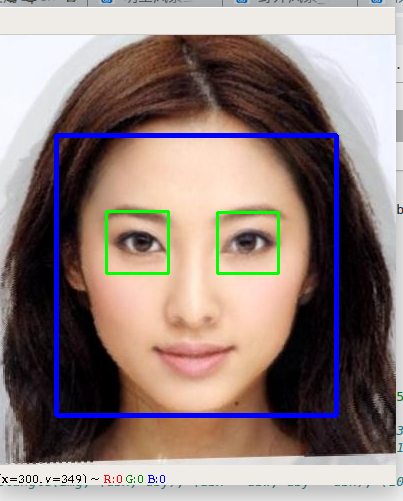
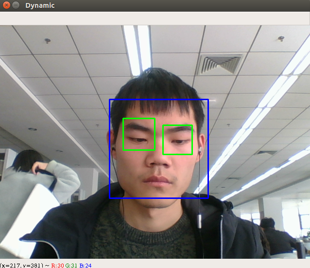

# 摘要

本文记录了opencv 中haar检测器的使用过程，haar检测器是一个十分经典也十分古老的检测器，最成功的应用莫过于人脸检测


<center>



</center>

- [x] Edit By Porter, 积水成渊,蛟龙生焉。

<!-- more -->

## 一、Haar检测器简介

目前人脸检测的方法主要有两大类：基于知识和基于统计。

基于知识的方法：主要利用先验知识将人脸看作器官特征的组合，根据眼睛、眉毛、嘴巴、鼻子等器官的特征以及相互之间的几何位置关系来检测人脸。主要包括模板匹配、人脸特征、形状与边缘、纹理特性、颜色特征等方法。

基于统计的方法：将人脸看作一个整体的模式——二维像素矩阵，从统计的观点通过大量人脸图像样本构造人脸模式空间，根据相似度量来判断人脸是否存在。主要包括主成分分析与特征脸、神经网络方法、支持向量机、隐马尔可夫模型、Adaboost算法等。

### 1.1 Haar(哈尔)特征介绍

Haar分类器实际上是Boosting算法的一个应用，Haar分类器用到了Boosting算法中的AdaBoost算法，只是把AdaBoost算法训练出的强分类器进行了级联，并且在底层的特征提取中采用了高效率的矩形特征和积分图方法，这里涉及到的几个名词接下来会具体讨论。

Haar分类器 = Haar-like特征 + 积分图方法 + AdaBoost +级联；

Haar分类器算法的要点如下：

- 使用Haar-like特征做检测。
- 使用积分图（Integral Image）对Haar-like特征求值进行加速。
- 使用AdaBoost算法训练区分人脸和非人脸的强分类器。
- 使用筛选式级联把强分类器级联到一起，提高准确率。

### 1.2 Haar-like特征

Haar(哈尔)特征分为三类：边缘特征、线性特征、中心特征和对角线特征，组合成特征模板。

特征模板内有白色和黑色两种矩形，并定义该模板的特征值为白色矩形像素和减去黑色矩形像素和。

Haar特征值反映了图像的灰度变化情况。例如：脸部的一些特征能由矩形特征简单的描述，如：眼睛要比脸颊颜色要深，鼻梁两侧比鼻梁颜色要深，嘴巴比周围颜色要深等。

> 但矩形特征只对一些简单的图形结构，如边缘、线段较敏感，所以只能描述特定走向（水平、垂直、对角）的结构。


---

## 二、Haar检测器的使用

### 2.1 代码文件调用过程

调用opencv训练好的分类器和自带的检测函数检测人脸人眼等的步骤简单直接：

- 1.加载分类器，当然分类器事先要放在工程目录中去。分类器本来的位置是在*\opencv\sources\data\haarcascades（harr分类器，也有其他的可以用，也可以自己训练）

- 2.调用detectMultiScale()函数检测，调整函数的参数可以使检测结果更加精确。

- 3.把检测到的人脸等用矩形（或者圆形等其他图形）画出来。

建立haar分类器对象，需要读取一个xml文件，这个文件也就是训练好的分类器。

然后利用该分类器检测目标图像（灰度图）

### 1.1 CascadeClassifier::detectMultiScale

Python: cv2.CascadeClassifier.detectMultiScale(image[, scaleFactor[, minNeighbors[, flags[, minSize[, maxSize]]]]]) → objects

#### 1.1.1 detectMultiScale参数：

- 1.image表示的是要检测的输入图像
- 2.objects表示检测到的人脸目标序列
- 3.scaleFactor表示每次图像尺寸减小的比例
- 4.minNeighbors表示每一个目标至少要被检测到3次才算是真的目标(因为周围的像素和不同的窗口大小都可以检测到人脸)。
- 5.minSize为目标的最小尺寸
- 6.minSize为目标的最大尺寸

### 1.2 cv2.rectangle

Python: cv2.rectangle(img, pt1, pt2, color[, thickness[, lineType[, shift]]]) → None

#### Parameters:	

- img – Image.将要绘制矩形框的待显示图片
- pt1 – Vertex of the rectangle.（绘制矩形框的左上角顶点）
- pt2 – Vertex of the recangle opposite to pt1 .（顶点的对角顶点的点，最右下角的顶点坐标）
- color – Rectangle color or brightness (grayscale image).（RGB颜色）
- thickness – Thickness of lines that make up the rectangle. Negative values, like CV_FILLED , mean that the function has to draw a filled rectangle.（绘制线的粗细）
- lineType – Type of the line. See the line() description.
- shift – Number of fractional bits in the point coordinates.

```python
# -*- coding: utf-8 -*-
"""
Created on Thu Aug 16 10:32:55 2018

@author: lenovo
"""

'''
人脸检测
'''
import cv2
import numpy as np

path = '/home/porter/opencv-3.4.3/data'

#1.静态图像中的人脸检测
def StaticDetect(filename):
    #创建一个级联分类器 加载一个 .xml 分类器文件. 它既可以是Haar特征也可以是LBP特征的分类器.
    face_cascade = cv2.CascadeClassifier(path + '/haarcascades/haarcascade_frontalface_default.xml')
    
    #加载图像
    img = cv2.imread(filename)
    #转换为灰度图
    gray_img = cv2.cvtColor(img,cv2.COLOR_BGR2GRAY)
    #进行人脸检测，传入scaleFactor，minNegihbors，分别表示人脸检测过程中每次迭代时图像的压缩率以及
    #每个人脸矩形保留近似数目的最小值
    #返回人脸矩形数组
    faces = face_cascade.detectMultiScale(gray_img,1.3,5)
    for (x,y,w,h) in faces:
        #在原图像上绘制矩形
        img = cv2.rectangle(img,(x,y),(x+w,y+h),(255,0,0),2)
    cv2.namedWindow('Face Detected！')
    cv2.imshow('Face Detected！',img)
    cv2.waitKey(0)
    cv2.destroyAllWindows()
    

#2、视频中的人脸检测
def DynamicDetect():
    '''
    打开摄像头，读取帧，检测帧中的人脸，扫描检测到的人脸中的眼睛，对人脸绘制蓝色的矩形框，对人眼绘制绿色的矩形框
    '''
    #创建一个级联分类器 加载一个 .xml 分类器文件. 它既可以是Haar特征也可以是LBP特征的分类器.
    face_cascade = cv2.CascadeClassifier(path + '/haarcascades/haarcascade_frontalface_default.xml')
    eye_cascade = cv2.CascadeClassifier(path + '/haarcascades/haarcascade_eye.xml')
    
    #打开摄像头    
    camera = cv2.VideoCapture(0)
    cv2.namedWindow('Dynamic')
    
    while(True):
        #读取一帧图像
        ret,frame = camera.read()
        #判断图片读取成功？
        if ret:
            gray_img = cv2.cvtColor(frame,cv2.COLOR_BGR2GRAY)
            #人脸检测
            faces = face_cascade.detectMultiScale(gray_img,1.3,5)
            for (x,y,w,h) in faces:
                #在原图像上绘制矩形
                cv2.rectangle(frame,(x,y),(x+w,y+h),(255,0,0),2)
                roi_gray = gray_img[y:y+h,x:x+w]
                #眼睛检测
                eyes = eye_cascade.detectMultiScale(roi_gray,1.03,5,0,(50,50))
                for (ex,ey,ew,eh) in eyes:
                    cv2.rectangle(frame,(ex+x,ey+y),(x+ex+ew,y+ey+eh),(0,255,0),2)
                    
            cv2.imshow('Dynamic',frame)            
            #如果按下q键则退出
            if cv2.waitKey(100) & 0xff == ord('q') :
                break
            
    camera.release()
    cv2.destroyAllWindows()
            

if __name__=='__main__':
    #filename = './image/img23.jpg'
    #StaticDetect(filename)
    DynamicDetect()
```




