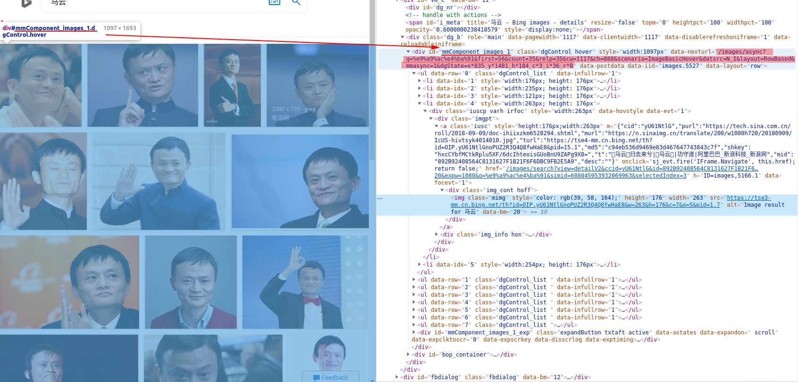

# 摘要

本文主要记录自己动手做人脸识别数据集的整个过程，识别的过程主要分别使用了3中方法实现。

- 1. 通过摄像头采集现实中的人脸
- 2. 从某些明星写真网站，通过爬虫手机明星写真的照片，然后进行人脸定位裁剪和保存
- 2. 通过爬虫手段从互联网上**搜索引擎**中获取名人的照片，然后对名人照片进行人脸定位裁剪保存到本地


- [x] Edit By Porter, 积水成渊,蛟龙生焉。

<!-- more -->


## 方法一、通过摄像头实时采集

### 1.1 通过摄像头获取自己的头像

流程如下：

- 加载HAAR检测其中的人脸检测训练好的模型
- 开启摄像头
- detectMultiScale函数检测人脸
- 获取人脸部分的像素
- 保存人脸像素的照片

```python
#-*- coding: utf-8 -*-
 
import cv2
import time

path = '/home/porter/opencv-3.4.3/data/haarcascades/'

def CatchPICFromVideo(window_name, camera_idx, catch_pic_num, path_name):
    cv2.namedWindow(window_name)
 
    #视频来源，可以来自一段已存好的视频，也可以直接来自USB摄像头
    cap = cv2.VideoCapture(camera_idx)
 
    #告诉OpenCV使用人脸识别分类器
    classfier = cv2.CascadeClassifier(path + "haarcascade_frontalface_alt2.xml")
 
    #识别出人脸后要画的边框的颜色，RGB格式
    color = (0, 255, 0)
 
    num = 0
    while cap.isOpened():
        ok, frame = cap.read() #读取一帧数据
        if not ok:
            break
 
        grey = cv2.cvtColor(frame, cv2.COLOR_BGR2GRAY)  #将当前桢图像转换成灰度图像
 
        #人脸检测，1.2和2分别为图片缩放比例和需要检测的有效点数
        faceRects = classfier.detectMultiScale(grey, scaleFactor = 1.2, minNeighbors = 3, minSize = (32, 32))
        if len(faceRects) > 0:          #大于0则检测到人脸
            for faceRect in faceRects:  #单独框出每一张人脸
                x, y, w, h = faceRect
 
                #将当前帧保存为图片
                img_name = '%s/%d.jpg'%(path_name, num)
                image = frame[y - 10: y + h + 10, x - 10: x + w + 10]
                cv2.imwrite(img_name, image)
 
                num += 1
                if num > (catch_pic_num):   #如果超过指定最大保存数量退出循环
                    break
 
                #画出矩形框
                cv2.rectangle(frame, (x - 10, y - 10), (x + w + 10, y + h + 10), color, 2)
 
                #显示当前捕捉到了多少人脸图片了，这样站在那里被拍摄时心里有个数，不用两眼一抹黑傻等着
                font = cv2.FONT_HERSHEY_SIMPLEX
                cv2.putText(frame,'num:%d' % (num),(x + 30, y + 30), font, 1, (255,0,255),4)
 
                #超过指定最大保存数量结束程序
        if num > (catch_pic_num): break
 
        #显示图像
        cv2.imshow(window_name, frame)
        c = cv2.waitKey(10)
        if c & 0xFF == ord('q'):
            break
        time.sleep(0.3)
            #释放摄像头并销毁所有窗口
    cap.release()
    cv2.destroyAllWindows()


if __name__ == '__main__':
    save_path = "../dataset/porter.pan"
    CatchPICFromVideo("get face", 0, 150, save_path)
```


## 方法二、爬虫专业写真网站

### 2.1 [优美图官网](http://www.umei.cc)高清图片爬虫


如上图，TypeList类代表整个页面的元素。

而颜色加深的这个 href="http://www.umei.cc/p/gaoqing/cn/203488.htm" 表示红框中的第一张图片对应的高清照片的地址。而下面的那个链接只是当前显示的非高清的图片缩略图，我们这里只爬取高清的图片，并保存到我们本地文件夹中。

接下来我们转到高清的原图页面，也就是代开这个网址 http://www.umei.cc/p/gaoqing/cn/203488.htm

我们得到如下图的源码对照的界面，途中我加深颜色的链接才是真正的高清原图，我们需要的正是这个高清原图，接着我们就就行request请求，然后下载图片保存下来，就好了。


### 2.2 爬虫技巧

爬虫的工具如下：

- requests
- pyquery

> [requests 官方帮助文档地址](https://cn.python-requests.org/zh_CN/latest/)
> [pyquery官方帮助文档地址](https://pythonhosted.org/pyquery/#)

#### 测试一：爬取[优美图库](http://www.umei.cc/)网站的美女图片

步骤如下：

- requests.get 请求获取网页信息
- pq(html) 解析网页文本内容


解析网页内容[示例代码](https://www.cnblogs.com/gj5379/p/8514535.html)：

```python
from pyquery import PyQuery as pq
html = '''
    <div id="wrap">
        <ul class="s_from">
            asdasd
            <link href="http://asda.com">asdadasdad12312</link>
            <link href="http://asda1.com">asdadasdad12312</link>
            <link href="http://asda2.com">asdadasdad12312</link>
        </ul>
    </div>
'''
doc = pq(html)
# #是查找id的标签  .是查找class 的标签  link 是查找link 标签 中间的空格表示里层
print doc("#wrap .s_from link")
```

运行结果：

```python
<link href="http://asda.com">asdadasdad12312</link>
            <link href="http://asda1.com">asdadasdad12312</link>
            <link href="http://asda2.com">asdadasdad12312</link>
```

### 2.3 爬取他人的写真照片代码

```python
# -*- coding: utf-8 -*-
"""
爬取优美图库网站的图片

"""

import requests
import os
import time
from requests.packages import urllib3
from pyquery import PyQuery as pq

save_path = '../dataset/other.image/'# 将要保存的图片路径
def get_url1(url):
    headers = {
                'User-Agent': 'Mozilla/5.0 (Macintosh; Intel Mac OS X 10_12_3) '
                              'AppleWebKit/537.36 (KHTML, like Gecko)'
                              ' Chrome/58.0.3029.110 Safari/537.36'
                              }
    urllib3.disable_warnings()
    html = requests.get(url, headers=headers, verify=False).content.decode('utf-8')
    doc = pq(html)
    a = doc('.wrap .TypeList .TypeBigPics')
#     print(a)
    
#     print('-----------------------------')

    
    for item in a.items():
        b = item.attr('href') 
#         print(b,'\n','\n')
#         continue
        html2 = requests.get(b,headers = headers,verify = False).text
        doc2 = pq(html2)# 获取网页元素
        c = doc2('.ImageBody img')
        for item2 in c.items():
            d = item2.attr('src')
            print(d, end='\r')

            root = save_path   # 根目录
            path=root+d.split('/')[-1] 
            # 根目录加上url中以反斜杠分割的最后一部分，即可以以图片原来的名字存储在本地
            try:
                if not os.path.exists(root):    # 判断当前根目录是否存在
                    os.mkdir(root)              # 创建根目录
                if not os.path.exists(path):    # 判断文件是否存在
                    r=requests.get(d)
                    with open(path,'wb')as f:
                        f.write(r.content)
                        f.close()
                        print("文件保存成功",'\n','\n',end='\r')
                        time.sleep(0.3)
                else:
                    print("文件已存在",end='\r')
            except:
                print("爬取失败",end='\r')


if __name__ == '__main__':
    z = 1
    page_num = 10# 需要爬取多少个页面的图片，每个页面有20张高清图片
    url = 'http://www.umei.cc/p/gaoqing/cn/'
    for i in range(z, z+page_num):
        url1 = url+str(i)+'.htm'
        print(url1)
        get_url1(url1)
```

运行代码后就可以看到我们待保存的文件路径中存在了很多张高清美女照片。

（待见高清宅男福利）

下图是我自己爬虫的文件夹中的部分高清照片，仅仅供参考。


## 方法三、利用专业的搜索引擎

### 3.1 爬虫爬取必应图片搜索的关键词

[关键词爬虫，获取关键图片](https://blog.csdn.net/qq_37482202/article/details/82352870)

#### urllib.request.urlretrieve(url, filename=None, reporthook=None, data=None)

- url：外部或者本地url
- filename：指定了保存到本地的路径（如果未指定该参数，urllib会生成一个临时文件来保存数据）
- reporthook：是一个回调函数，当连接上服务器、以及相应的数据块传输完毕的时候会触发该回调。我们可以利用这个回调函数来显示当前的下载进度。
- data：指post到服务器的数据。该方法返回一个包含两个元素的元组(filename, headers)，filename表示保存到本地的路径，header表示服务器的响应头。


### 3.2 爬虫过程介绍

如下图所示，我们进入必应搜索官网，输入关键词，查看网站源码，可以看到下图的内容。

用浅色笔记涂深的链接就是我们需要拿到的链接地址。

```python
url = 'http://cn.bing.com/images/async?q={0}&first={1}&count=35&relp=35&scenario=ImageBasicHover&datsrc=N_I&layout=RowBased_Landscape&mmasync=1&dgState=x*188_y*1308_h*176_c*1_i*106_r*24'
```



其中{0} 和 {1}关键字是我们后面方便调节参数的占位符，我们在浏览器中打开，比如搜索关键词为steve jobs.则需要打开下面的链接

```python
https://cn.bing.com/images/async?q=steve+jobs&first=195&count=35&relp=35&scenario=ImageBasicHover&datsrc=N_I&layout=RowBased_Landscape&mmasync=1&dgState=x*188_y*1308_h*176_c*1_i*106_r*24
```

接下来我们在打开的页面中再次查看源代码，如下图所示：


这个源码页面比之前的页面要精简的多了，如图，每个li都代表一张图片，每个图片的真实链接地址，如下图：


途中浅颜色描出的就是这个图片的真实地址。


我们就需要这个图片，分析到这就差不多了，所以如下代码直接进行爬虫。


### 3.2 实现的代码如下

```python
import urllib
import os
import sys
import time
from bs4 import BeautifulSoup

save_path = '../dataset/ma.yun/'
search_keyword='马云'
#从得到的图片链接下载图片，并保存
def SaveImage(link,search_keyword,count):
    try:
        time.sleep(0.4)
        urllib.request.urlretrieve(link,save_path+search_keyword+str(count)+'.jpg')
    except Exception :
        time.sleep(1)
        print("产生未知错误，放弃保存", end='\r')
    else:
        print("图+1,已有" + str(count) + "张图", end='\r')
        
        
#找到图片的链接
def FindLink(PageNum,search_keyword_converted,search_keyword):
    for i in range(PageNum):
        num_disp_k = 0
        print(i)
        try:
            url = 'http://cn.bing.com/images/async?q={0}&first={1}&count=35&relp=35&scenario=ImageBasicHover&datsrc=N_I&layout=RowBased_Landscape&mmasync=1&dgState=x*188_y*1308_h*176_c*1_i*106_r*24'
    #         url = 'http://cn.bing.com/images/async?q={0}&first={1}&count=35&relp=35&lostate=r&mmasync=1&dgState=x*175_y*848_h*199_c*1_i*106_r*0'
            #定义请求头
            agent = {
                'User-Agent': "Mozilla/5.0 (X11; Linux x86_64) AppleWebKit/537.36 (KHTML, like Gecko) Chrome/77.0.3865.120 Safari/537.36"
            }
            page1 = urllib.request.Request(url.format(search_keyword_converted, i*35+1), headers=agent)
            page = urllib.request.urlopen(page1)
    #             使用beautifulSoup进行解析网页
            soup = BeautifulSoup(page.read(), 'html.parser')
    #         print(urllib.request.urlopen(page1).read().decode('utf-8'))
    #         创建文件夹
            if not os.path.exists(save_path):
                os.mkdir(save_path)

            for StepOne in soup.select('.mimg'):
                num_disp_k = num_disp_k+1
                link=StepOne.attrs['src']
                count = len(os.listdir(save_path)) + 1
                link = 'http://tse2-mm.cn.bing.net/th?'+link.split('?')[1]
                print(link,'\t',search_keyword,'\t',count, end='\r')
                SaveImage(link,search_keyword,count)
            print("输出一轮：%d 张图片"%num_disp_k)
        except:
            print('URL OPENING ERROR !', end='\r')

            
if __name__=='__main__':
    #输入需要加载的页数，每页35幅图像
    PageNum = 50 # 需要加载多少页
    #输入需要搜索的关键字
    #UTF-8编码
    search_keyword_converted=urllib.parse.quote(search_keyword)# 关键子转换编码
    print(search_keyword_converted)
    FindLink(PageNum,search_keyword_converted,search_keyword)
#     https://tse1-mm.cn.bing.net/th?id=OIP.KOl8leTXPzz7WmN2t0Jt4wHaHa&w=155&h=160&c=7&o=5&pid=1.7
# http://tse2.mm.cn.bing.net/th?id=OIP.KOl8leTXPzz7WmN2t0Jt4wHaHa&w=181&h=176&c=7&o=5&pid=1.7 
```

下面是我爬虫到马云的照片

