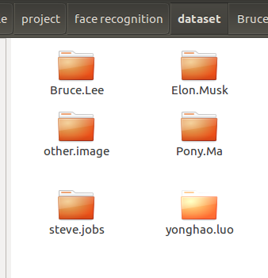
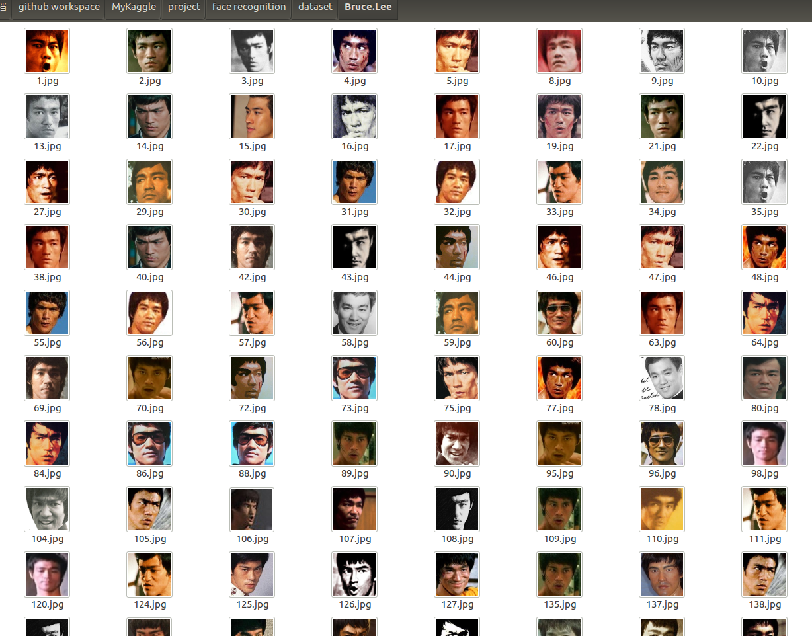

# 摘要

本文主要记录自己动手做人脸识别数据集的整个过程，识别的过程主要分别使用了3中方法实现。

- 1. 爬虫必应
- 2. 根据关键词爬取关键词对应的人名
- 3. 跳转必应显示的人物缩略图到高清原图链接地址
- 4. 透过opencv的HAAR检测器，定位人脸
- 5. 保存人脸部分的像素图片

> 这个代码较之前的一个版本代码的不同之处在于，这个代码，爬虫的是高清的原图，并且本次代码只保存有用的人脸像素部分，没有把所有的高清原图直接下载下来，避免浪费硬盘资源，也便于后面做人脸识别中人脸有用信息的提取。


- [x] Edit By Porter, 积水成渊,蛟龙生焉。

<!-- more -->

## 一、爬虫高清图片


```python
# 找到图片的链接
    def FindLink(self, PageNum):
        for i in range(3, PageNum):
            num_disp_k = 0
            # print("当前读取图片第： %d 页"%i)
            # try:
            if True:
                url = 'http://cn.bing.com/images/async?q={0}&first={1}&count=35&relp=35&scenario=ImageBasicHover&datsrc=N_I&layout=RowBased_Landscape&mmasync=1&dgState=x*188_y*1308_h*176_c*1_i*106_r*24'
                # 定义请求头
                agent = {
                    'User-Agent': "Mozilla/5.0 (X11; Linux x86_64) AppleWebKit/537.36 (KHTML, like Gecko) Chrome/77.0.3865.120 Safari/537.36"
                }
                page1 = urllib.request.Request(url.format(self.search_keyword, i * 35 + 1), headers=agent)
                page = urllib.request.urlopen(page1)
                # 使用beautifulSoup进行解析网页
                soup = BeautifulSoup(page.read(), 'html.parser')
                #  print(urllib.request.urlopen(page1).read().decode('utf-8'))
                #  创建文件夹
                if not os.path.exists(self.save_path):
                    os.mkdir(self.save_path)

                # print(soup.select('.iusc'))

                for StepOne in soup.select('.iusc'):
                    link = eval(StepOne.attrs['m'])['murl']# 这个链接地址就是高清图片的链接地址。
                    num_disp_k = len(os.listdir(self.save_path)) + 1 
                    self.get_head_image(link, num_disp_k) ## 这个函数是后面通过OPENCV提取人脸部分后，保存到电脑的头像图片
                    print("输出第 %d 轮：%d 张图片" %(i, num_disp_k), '\n', self.search_keyword, '\t', num_disp_k, link, end='\n')
```


## 二、提取高清头像图片并保存

```python
    def get_head_image(self, urlimage, num_disp_k):
        cap = cv2.VideoCapture(urlimage)
        ok, origin_image = cap.read()
        if ok:
            path = '/home/porter/opencv-3.4.3/data/haarcascades/'
            # 告诉OpenCV使用人脸识别分类器
            classfier = cv2.CascadeClassifier(path + "haarcascade_frontalface_alt2.xml")
            grey = cv2.cvtColor(origin_image, cv2.COLOR_BGR2GRAY)  # 将当前桢图像转换成灰度图像

            # 人脸检测，1.2和2分别为图片缩放比例和需要检测的有效点数
            faceRects = classfier.detectMultiScale(grey, scaleFactor=1.2, minNeighbors=3, minSize=(32, 32))

            if len(faceRects) > 0:  # 大于0则检测到人脸
                for faceRect in faceRects:  # 单独框出每一张人脸
                    x, y, w, h = faceRect
                    # 将当前帧保存为图片
                    img_name = '%s/%d.jpg' % (self.save_path, num_disp_k)
                    image = origin_image[y - 10: y + h + 10, x - 10: x + w + 10]
                    cv2.imwrite(img_name, image)
                    time.sleep(0.2)
            cap.release()
        else:
            print("urlimage错误:", urlimage)
```




## 三、完整的程序代码

```python
import urllib
import requests
import os
import sys
import time
from bs4 import BeautifulSoup
import cv2

## 获取高清的关键人图片，然后抠出头像的部分，保存到本地路径。

save_path_S = '../dataset/yonghao.luo/' # 设置图片保存的路径
search_keyword_S = '罗永浩' # 设置需要从必应网站检索的关键词

class CrawlersExtractiveImage:
    def __init__(self, save_path, search_keyword):
        self.save_path = save_path # 图片保存的本地路径
        self.search_keyword = urllib.parse.quote(search_keyword) #从必应搜索图片的关键词
        self.save_people_name = self.save_path.split('/')[-2]
        # 识别出人脸后要画的边框的颜色，RGB格式
        self.rectanglecolor = (0, 255, 0)
        print("web spider for same of people's picture!", end='\r')

    # 从得到的图片链接下载图片，并保存
    def SaveImage(self, image_link, image_cout):
        '''

        :param image_link:  将要存储的图片链接
        :param search_keyword: 图片的关名字
        :param image_name: 图片的id编号
        :return:
        '''
        try:
            urllib.request.urlretrieve(image_link, self.save_path + self.save_people_name + str(image_cout) + '.jpg')
            time.sleep(1)
        except Exception:
            time.sleep(1)
            print("产生未知错误，放弃保存", end='\r')
        else:
            print("图+1,已有" + str(image_cout) + "张图", end='\r')
    def Save_image_2(self, image_link, image_cout):
        s = requests.session()
        headers = {
            'Accept': 'text/html,application/xhtml+xml,application/xml;q=0.9,image/webp,image/apng,*/*;q=0.8,application/signed-exchange;v=b3',
            'User-Agent': 'Mozilla/5.0 (X11; Linux x86_64) AppleWebKit/537.36 (KHTML, like Gecko) Chrome/77.0.3865.120 Safari/537.36'
        }
        s.headers.update(headers)
        # image_link = 'http://www.gstatic.com/tv/thumb/persons/487130/487130_v9_ba.jpg'
        html = s.get(url=image_link, timeout=20)
        # print(html.text)
        path = self.save_path + self.save_people_name + str(image_cout) + '-.' + image_link.split('.')[-1]
        with open(path, 'wb') as file:
            file.write(html.content)
            file.close()
            print("文件保存成功", '\n', '\n', end='\r')
            time.sleep(3)


    # 找到图片的链接
    def FindLink(self, PageNum):
        for i in range(3, PageNum):
            num_disp_k = 0
            # print("当前读取图片第： %d 页"%i)
            # try:
            if True:
                url = 'http://cn.bing.com/images/async?q={0}&first={1}&count=35&relp=35&scenario=ImageBasicHover&datsrc=N_I&layout=RowBased_Landscape&mmasync=1&dgState=x*188_y*1308_h*176_c*1_i*106_r*24'
                # 定义请求头
                agent = {
                    'User-Agent': "Mozilla/5.0 (X11; Linux x86_64) AppleWebKit/537.36 (KHTML, like Gecko) Chrome/77.0.3865.120 Safari/537.36"
                }
                page1 = urllib.request.Request(url.format(self.search_keyword, i * 35 + 1), headers=agent)
                page = urllib.request.urlopen(page1)
                # 使用beautifulSoup进行解析网页
                soup = BeautifulSoup(page.read(), 'html.parser')
                #  print(urllib.request.urlopen(page1).read().decode('utf-8'))
                #  创建文件夹
                if not os.path.exists(self.save_path):
                    os.mkdir(self.save_path)

                # print(soup.select('.iusc'))

                for StepOne in soup.select('.iusc'):
                    link = eval(StepOne.attrs['m'])['murl']
                    num_disp_k = len(os.listdir(self.save_path)) + 1
                    # link = 'http://tse2-mm.cn.bing.net/th?' + link.split('?')[1]
                    self.get_head_image(link, num_disp_k)
                    # try:
                    #     self.get_head_image(link, str(num_disp_k))
                    # except:
                    #     print("存储错误：",link)
                    print("输出第 %d 轮：%d 张图片" %(i, num_disp_k), '\n', self.search_keyword, '\t', num_disp_k, link, end='\n')
            # except:
            #     print('URL OPENING ERROR !', end='\r')
    def get_head_image(self, urlimage, num_disp_k):
        cap = cv2.VideoCapture(urlimage)
        ok, origin_image = cap.read()
        if ok:
            path = '/home/porter/opencv-3.4.3/data/haarcascades/'
            # 告诉OpenCV使用人脸识别分类器
            classfier = cv2.CascadeClassifier(path + "haarcascade_frontalface_alt2.xml")
            grey = cv2.cvtColor(origin_image, cv2.COLOR_BGR2GRAY)  # 将当前桢图像转换成灰度图像

            # 人脸检测，1.2和2分别为图片缩放比例和需要检测的有效点数
            faceRects = classfier.detectMultiScale(grey, scaleFactor=1.2, minNeighbors=3, minSize=(32, 32))

            if len(faceRects) > 0:  # 大于0则检测到人脸
                for faceRect in faceRects:  # 单独框出每一张人脸
                    x, y, w, h = faceRect
                    # 将当前帧保存为图片
                    img_name = '%s/%d.jpg' % (self.save_path, num_disp_k)
                    image = origin_image[y - 10: y + h + 10, x - 10: x + w + 10]
                    cv2.imwrite(img_name, image)
                    time.sleep(0.2)

            # # 画出矩形框
            # cv2.rectangle(origin_image, (x - 10, y - 10), (x + w + 10, y + h + 10), self.rectanglecolor, 2)
            #
            # # 显示当前捕捉到了多少人脸图片了，这样站在那里被拍摄时心里有个数，不用两眼一抹黑傻等着
            # font = cv2.FONT_HERSHEY_SIMPLEX
            # cv2.putText(origin_image, 'num:%d' % (num_disp_k), (x + 30, y + 30), font, 1, (255, 0, 255), 4)
            # 显示图像
            # cv2.imshow("get head image", origin_image)
            cap.release()
            # time.sleep(5)
            cv2.destroyAllWindows()
            # c = cv2.waitKey(10)
            # if c & 0xFF == ord('q'):
            #     time.sleep(0.3)
            #     cap.release()
            #     cv2.destroyAllWindows()
            #     return
        else:
            print("urlimage错误:", urlimage)


if __name__=='__main__':
    #输入需要加载的页数，每页35幅图像
    PageNum = 15 # 需要加载多少页
    app = CrawlersExtractiveImage(save_path_S, search_keyword_S)
    app.FindLink(PageNum)

```

下面这个是爬虫李小龙的高清，面部图像



