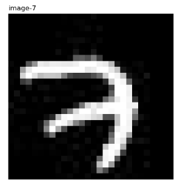

# 摘要

本文记录tensorflow的学习入门过程，主要是MNIST在tensorflow中完成的整个过程进行笔记的记录。

<!-- more -->

## 读取数据

```python
# coding: utf-8
import tensorflow as tf
import os
# 在不使用keras的情况下
from tensorflow.examples.tutorials.mnist import input_data
import scipy.misc
import matplotlib.pyplot as plt
import matplotlib.image as mpimg # mpimg 用于读取图片

import numpy as np
# 从MNIST_data/中读取数据，如果不存在就会自动下载
# 这个input_data在mnist文件夹下
mnist = input_data.read_data_sets("MNIST_data/", one_hot=True)

# print(mnist.train.images.shape)
# print(mnist.train.labels.shape)
# print(mnist.validation.images.shape)
# print(mnist.validation.labels.shape)
# print(mnist.test.images.shape)
# print(mnist.test.labels.shape)
# 查看
print(mnist.__dir__())
# print(dir(mnist))

# 把原始图片存在这个路径下
save_dir = 'MNIST_data/raw/'
if os.path.exists(save_dir) is False:
	os.makedirs(save_dir)

# 保存图片
for i in range(20):
	# 请注意，mnist.train.images[i, :]就表示第i张图片
	image_arry = mnist.train.images[i, :]
	image_arry = image_arry.reshape(28, 28)
	# 保存文件的格式为:
	# mnist_train_0.jpg, mnist_train_1.jpg, ..., mnist_train_19.jpg
	filename = save_dir + 'mnist_train_%d.jpg' % i
	# 将iamge_array 保存为图片
	scipy.misc.toimage(image_arry, cmin=0.0, cmax=1.0).save(filename)

# 看前10张图片的样子
fig = plt.figure()
plotwindow = fig.add_subplot(111)
plt.axis('off')
for i in range(10):
	# 得到的都是one-hot 表示
	one_hot_label = mnist.train.labels[i, :]
	label = np.argmax(one_hot_label)
	print('mnist_train_%d.jpg label:%d' % (i, label))
	file = mpimg.imread('MNIST_data/raw/mnist_train_%d.jpg' % i)
	plt.imshow(file, cmap='gray')
	plt.title(u'image-%i' % label, loc='left')
	plt.show()
	plt.clf()
	plt.close()

```

> 一般国内上google是上不了的，所以如果你先前没在MNIST_data/ 文件路径下放好这四个压缩包，一般会提示网络连接超时。此时自己去百度下载好这四个训练样本。

结果出来想问下这个数字到底是几啊，我没看出来，但是标签里写的是7



