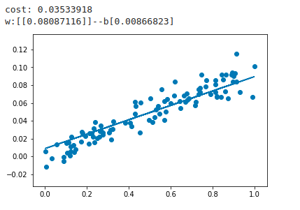
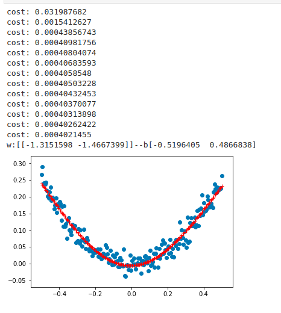

# 摘要

本节主要是学习keras的相关模型搭建，通过几个简单的例子进行入门级的学习。

- keras的线性回归模型
- keras的非线性模型预测
- keras的手写字识别

- [x] Edit By Porter, 积水成渊,蛟龙生焉。

<!-- more -->

## 一、keras实现现行回归


```python
import keras
import numpy as np
import matplotlib.pyplot as plt

# 导入顺序堆栈
from keras.models import Sequential
# 导入全连接Dense
from keras.layers import Dense

x_data = np.random.rand(100)
noise = np.random.normal(0,0.01,x_data.shape)

y_data = x_data*0.1 + noise

plt.scatter(x_data,y_data)
# plt.show()


model = Sequential()
# 添加全连接层的栈，输出units=1，输入维度也是为1
model.add(Dense(units=1, input_dim=1))
# 编译模型，使用sgd随机梯度下降的方法进行回归，使用均方误差的方法实现
model.compile(optimizer='sgd',loss='mse')

for step in range(3000):
    # 使用批次的训练方法
    cost = model.train_on_batch(x_data,y_data)
    if step == 100:
        print('cost:',cost)
# 获得模型第一层的权值和偏置
w,b = model.layers[0].get_weights()
print('w:{0}--b{1}'.format(w,b))

# 使用模型预测得到结果
y_predict = model.predict(x_data)

plt.plot(x_data,y_predict)
plt.show()
```

运行效果如下所示：




代码注解：

- model = Sequential() 

用来构建序列模型

- model.add()

用来添加神经网络的下一层结构

- Dense()

类似于穿件全连接的模型结构

- model.compile()

对建立的模型进行编译，激活模型

- model.train_on_batch(x_data,y_data)

开始对输入的数据和标签进行模型的训练

对于线性模型，我们只用了一层全连接的操作，默认使用了权值和偏置进行训练。


## 第二部分 Keras 实现非线性回归


```python
import keras 
import numpy as np 
import matplotlib.pyplot as plt
from keras.layers import Dense,Activation
from keras.models import Sequential
from keras.optimizers import SGD

nx_data = np.linspace(-0.5,0.5,200)
noise = np.random.normal(0,0.02,nx_data.shape)
ny_data = np.square(nx_data)+noise

plt.scatter(nx_data,ny_data)
# plt.show()


model = Sequential()
# 添加全连接层的栈，输出units=1，输入维度也是为1
model.add(Dense(units=2, input_dim=1))
model.add(Activation('tanh'))
model.add(Dense(units=1, input_dim=2))
model.add(Activation('tanh'))
# 编译模型，使用sgd随机梯度下降的方法进行回归，使用均方误差的方法实现
sgd = SGD(learning_rate=0.3)

model.compile(optimizer=sgd,loss='mse')


for step in range(6001):
    # 使用批次的训练方法
    cost = model.train_on_batch(nx_data,ny_data)
    if step % 500 == 0:
        print('cost:',cost)
# 获得模型第一层的权值和偏置
w,b = model.layers[0].get_weights()
print('w:{0}--b{1}'.format(w,b))

# 使用模型预测得到结果
y_predict = model.predict(nx_data)

plt.plot(nx_data,y_predict,'r+')
plt.show()

```




对于上面的非线性模型，我们使用了两层神经网络结构，使用的非线性函数为tanh作为激活函数，提示，非线性网络中必须使用，非线性激活函数，否则，模型输出只是线性的表达。