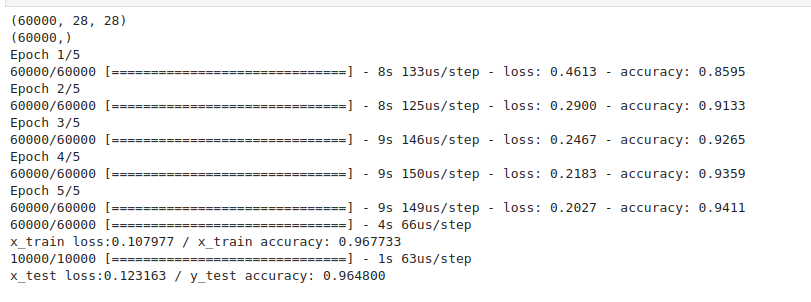
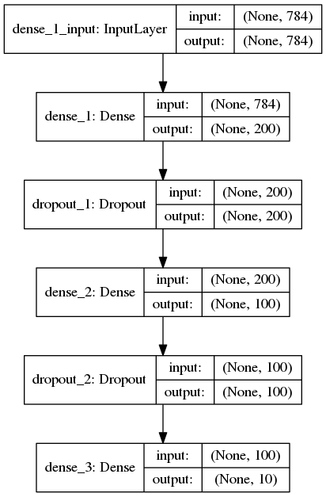
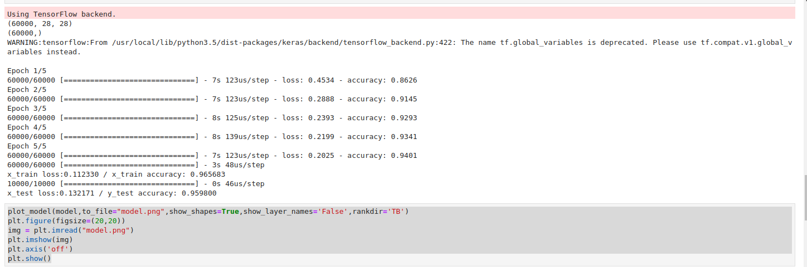
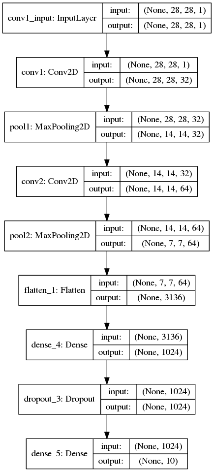

# 摘要

本节主要是学习keras的相关模型搭建，通过几个简单的例子进行入门级的学习。

- keras的三层全连接实现手写字的识别
- keras的卷积神经网络实现手写字的识别

- [x] Edit By Porter, 积水成渊,蛟龙生焉。

<!-- more -->

## 第一部分 三层全连接实现手写字识别


```python
import keras 
import numpy as np 
from keras.layers import Dense,Dropout
from keras.models import Sequential
from keras.optimizers import SGD
from keras.utils import np_utils
from keras.datasets import mnist

(x_train,y_train),(x_test,y_test) = mnist.load_data()
print(x_train.shape)
print(y_train.shape)
x_train = x_train.reshape(x_train.shape[0],-1)/255.0
x_test = x_test.reshape(x_test.shape[0],-1)/255.0

y_train = np_utils.to_categorical(y_train,num_classes=10)
y_test = np_utils.to_categorical(y_test,num_classes=10)

model = Sequential([
    Dense(units=200,input_dim=784,bias_initializer='one',activation='tanh'),
    Dropout(0.4),
    Dense(units=100,bias_initializer='one',activation='tanh'),
    Dropout(0.4),
    Dense(units=10,bias_initializer='one',activation='softmax')
])

sgd = SGD(learning_rate=0.2)
model.compile(optimizer=sgd,loss='categorical_crossentropy',metrics=['accuracy'])
model.fit(x_train,y_train,batch_size=32,epochs=5)

loss,accuracy = model.evaluate(x_train,y_train)
print('x_train loss:%f / x_train accuracy: %f'%(loss,accuracy))

loss,accuracy = model.evaluate(x_test,y_test)
print('x_test loss:%f / y_test accuracy: %f'%(loss,accuracy))

```




### 上面代码的注解：

上面代码使用了三层全连接网络，首先将数据扁平化，然后使用dropout等方法防止过拟合。

整个代码的框架如下

框架显示代码：

```python
plot_model(model,to_file="model.png",show_shapes=True,show_layer_names='False',rankdir='TB')
plt.figure(figsize=(20,20))
img = plt.imread("model.png")
plt.imshow(img)
plt.axis('off')
plt.show()
```





## 第二部分 使用卷积神经网络实现MNIST手写字的识别


```python
import keras 
import numpy as np 
from keras.layers import Dense,Dropout,Convolution2D,MaxPool2D,Flatten
from keras.models import Sequential
from keras.optimizers import Adam
from keras.utils import np_utils
from keras.utils.vis_utils import plot_model
from keras.datasets import mnist
import matplotlib.pyplot as plt

(x_train,y_train),(x_test,y_test) = mnist.load_data()
x_train = x_train.reshape(-1,28,28,1)/255.0
x_test = x_test.reshape(-1,28,28,1)/255.0

y_train = np_utils.to_categorical(y_train,num_classes=10)
y_test = np_utils.to_categorical(y_test,num_classes=10)

model = Sequential()
model.add(Convolution2D(
    input_shape = (28,28,1),
    filters = 32,
    kernel_size = 5,
    strides = 1,
    padding = 'same',
    activation = 'relu',
    name = 'conv1'
))
# 第一个池化
model.add(MaxPool2D(
    pool_size = 2,
    strides = 2,
    padding = 'same',
    name = 'pool1'
))
# 第二个卷基层
model.add(Convolution2D(
    64,5,strides=1,padding='same',activation='relu',name='conv2'
))
#第二个池化层
model.add(MaxPool2D(2,2,'same',name='pool2'))
# 输出扁平化
model.add(Flatten())
#第一个全连接层
model.add(Dense(1024,activation='relu'))
model.add(Dropout(0.3))
#第二个全连接层
model.add(Dense(10,activation='softmax'))
#定义优化器
adam = Adam(lr=1e-4)

model.compile(optimizer=adam,loss='categorical_crossentropy',metrics=['accuracy'])
model.fit(x_train,y_train,batch_size=64,epochs=1)

loss,accuracy = model.evaluate(x_train,y_train)
print('x_train loss:%f / x_train accuracy: %f'%(loss,accuracy))

loss,accuracy = model.evaluate(x_test,y_test)
print('x_test loss:%f / y_test accuracy: %f'%(loss,accuracy))

```

输出的结果如下:



结构如下：

