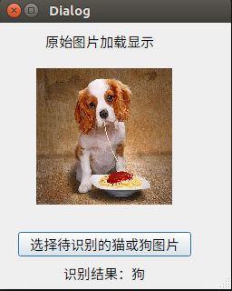
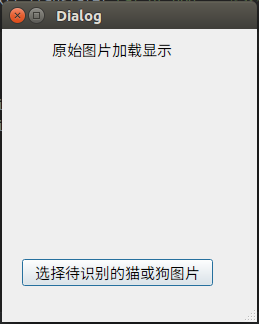
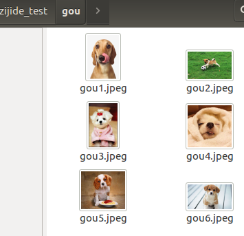
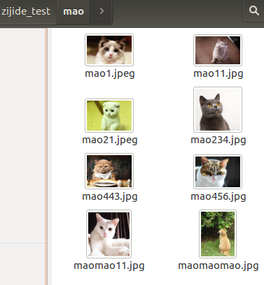
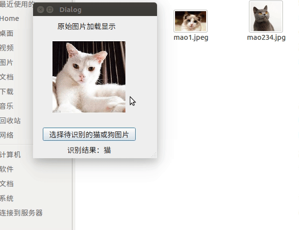

# 摘要

本节主要是学习keras的相关模型搭建，通过猫狗分类来进一步学习keras,通过对3.7的笔记中所保存的模型文件进行加载。

本次的模型加载学习，直接用了qt软件，将模型做成qt上位机，进行演示和使用。


<center>



</center>

### 使用模型

- 加载前一节保存的模型参数文件
- 创建Qt交互界面
- 加载图片
- 图片识别


- [x] Edit By Porter, 积水成渊,蛟龙生焉。

<!-- more -->

## 一、QT演示界面的实现

演示界面qt布局简单代码如下：

文件命名为：Ui_dog_cat_class.py

文件内代码如下：

```python
# -*- coding: utf-8 -*-

# Form implementation generated from reading ui file '/home/porter/文档/github workspace/MyKaggle/project/cat and dog classiy/dog_cat_class.ui'
#
# Created by: PyQt5 UI code generator 5.13.0
#
# WARNING! All changes made in this file will be lost!


from PyQt5 import QtCore, QtGui, QtWidgets


class Ui_cat_or_dog(object):
    def setupUi(self, cat_or_dog):
        cat_or_dog.setObjectName("cat_or_dog")
        cat_or_dog.resize(255, 293)
        cat_or_dog.setSizeGripEnabled(True)
        self.label_origin_image_dis = QtWidgets.QLabel(cat_or_dog)
        self.label_origin_image_dis.setGeometry(QtCore.QRect(40, 50, 150, 150))
        self.label_origin_image_dis.setAutoFillBackground(False)
        self.label_origin_image_dis.setText("")
        self.label_origin_image_dis.setObjectName("label_origin_image_dis")
        self.label_tips = QtWidgets.QLabel(cat_or_dog)
        self.label_tips.setGeometry(QtCore.QRect(50, 10, 141, 21))
        self.label_tips.setObjectName("label_tips")
        self.pushButton = QtWidgets.QPushButton(cat_or_dog)
        self.pushButton.setGeometry(QtCore.QRect(20, 230, 191, 27))
        self.pushButton.setObjectName("pushButton")
        self.label_result = QtWidgets.QLabel(cat_or_dog)
        self.label_result.setGeometry(QtCore.QRect(70, 260, 91, 31))
        self.label_result.setText("")
        self.label_result.setObjectName("label_result")

        self.retranslateUi(cat_or_dog)
        QtCore.QMetaObject.connectSlotsByName(cat_or_dog)

    def retranslateUi(self, cat_or_dog):
        _translate = QtCore.QCoreApplication.translate
        cat_or_dog.setWindowTitle(_translate("cat_or_dog", "Dialog"))
        self.label_tips.setText(_translate("cat_or_dog", "原始图片加载显示"))
        self.pushButton.setText(_translate("cat_or_dog", "选择待识别的猫或狗图片"))


if __name__ == "__main__":
    import sys
    app = QtWidgets.QApplication(sys.argv)
    cat_or_dog = QtWidgets.QDialog()
    ui = Ui_cat_or_dog()
    ui.setupUi(cat_or_dog)
    cat_or_dog.show()
    sys.exit(app.exec_())

```

运行的界面如下图：



## 二、模型加载和功能实现

### 2.1 下面是加载模型和加载图片进行猫狗分类识别的代码


```python
# -*- coding: utf-8 -*-

"""
Module implementing cat_or_dog.
"""

from PyQt5.QtCore import pyqtSlot
from PyQt5.QtWidgets import QDialog, QFileDialog
from PyQt5 import QtCore, QtGui, QtWidgets

from Ui_dog_cat_class import Ui_cat_or_dog

import os
from keras.models import load_model
import numpy as np
import cv2


class cat_or_dog(QDialog, Ui_cat_or_dog):
    """
    Class documentation goes here.
    """
    def __init__(self, parent=None):
        """
        Constructor
        
        @param parent reference to the parent widget
        @type QWidget
        """
        super(cat_or_dog, self).__init__(parent)
        self.setupUi(self)
        self.image_resize_target = 150


    def process_image(self, img):
        min_side = self.image_resize_target
        size = img.shape
        h, w = size[0], size[1]
        # 长边缩放为min_side
        scale = max(w, h) / float(min_side)
        new_w, new_h = int(w / scale), int(h / scale)
        resize_img = cv2.resize(img, (new_w, new_h))
        # 填充至min_side * min_side
        if new_w % 2 != 0 and new_h % 2 == 0:
            top, bottom, left, right = (min_side - new_h) / 2, (min_side - new_h) / 2, (min_side - new_w) / 2 + 1, (
                        min_side - new_w) / 2
        elif new_h % 2 != 0 and new_w % 2 == 0:
            top, bottom, left, right = (min_side - new_h) / 2 + 1, (min_side - new_h) / 2, (min_side - new_w) / 2, (
                        min_side - new_w) / 2
        elif new_h % 2 == 0 and new_w % 2 == 0:
            top, bottom, left, right = (min_side - new_h) / 2, (min_side - new_h) / 2, (min_side - new_w) / 2, (
                        min_side - new_w) / 2
        else:
            top, bottom, left, right = (min_side - new_h) / 2 + 1, (min_side - new_h) / 2, (min_side - new_w) / 2 + 1, (
                        min_side - new_w) / 2
        pad_img = cv2.copyMakeBorder(resize_img, int(top), int(bottom), int(left), int(right), cv2.BORDER_CONSTANT,
                                     value=[0, 0, 0])  # 从图像边界向上,下,左,右扩的像素数目

        return pad_img

    @pyqtSlot()
    def on_pushButton_clicked(self):

        self.label_result.setText("识别结果： ")
        model = load_model("cats_and_dogs_small_1.h5")
        images_1, filetype = QFileDialog.getOpenFileName(self, "选取文件", "./",
                                                         "Image Files(*.jpg *.png *.jpeg *.ico)")  # 设置文件扩展名过滤,注意用双分号间隔
        pixmap = QtGui.QPixmap(images_1)
        self.label_origin_image_dis.setPixmap(pixmap.scaled(150,150))

        input = cv2.imread(images_1)
        input = self.process_image(input)
        input = cv2.cvtColor(input, cv2.COLOR_BGR2RGB)
        pre_x = np.expand_dims(input, axis=0)
        pre_y = model.predict(pre_x)
        print(pre_y)
        print("预测结果输出：")
        if pre_y[0] > 0.5:
            print("识别结果：狗狗")
            self.label_result.setText("识别结果：狗狗")
        else:
            print("识别结果：猫猫")
            self.label_result.setText("识别结果：猫猫")

if __name__ == "__main__":
    import sys
    app = QtWidgets.QApplication(sys.argv)
    ui = cat_or_dog()
    icon = QtGui.QIcon()
    icon.addPixmap(QtGui.QPixmap("ico.png"), QtGui.QIcon.Normal, QtGui.QIcon.Off)
    ui.setWindowIcon(icon)
    ui.show()
    sys.exit(app.exec_())

```

执行的界面效果和上面的ui布局效果没有差别，只是这个代码是主函数代码，我们做识别猫狗的主函数。

### 2.2 代码效果演示如下

我这直接从百度上下载的几张狗狗的图片，如下





演示如下：



### 2.3 对主函数部分代码进行简单的说明

由于我们的模型输入的数据是150*150像素的彩色照片，所以我们对用户随意输入的图片需要先经过尺寸比例缩放，所以process_image这个函数是用来做输入图像预处理的代码。

```python
def process_image(self, img):
    ....
    ....
    ....
```