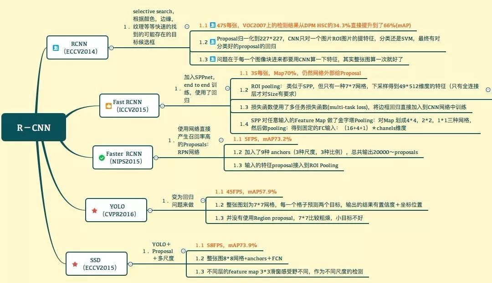

# 摘要

# 摘要

> 目标检测算法是计算机视觉三大基础任务之一，其包括目标定位和目标分类两部分。

<!-- more -->

参考

- https://arxiv.org/abs/1506.02640

- https://arxiv.org/pdf/1612.08242.pdf

- https://pjreddie.com/media/files/papers/YOLOv3.pdf

- https://pjreddie.com/darknet/yolo/

- https://github.com/BobLiu20/YOLOv3_PyTorch

- https://www.jianshu.com/p/d535a3825905
