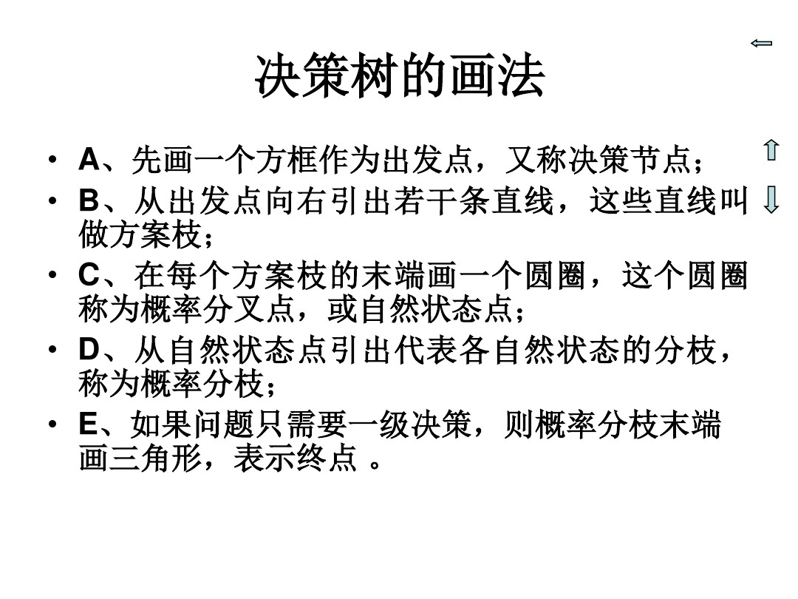

# 摘要

决策树是在已知各种情况发生的概率的基础上，通过决策树来求取净现值的期望值大于或等于零的概率，从而评价项目风险，判断其可能性的决策分析方法，是直观的运用概率分析的一种图解方法。由于决策树画成的图像就像一棵树的树干，故称决策树。在机器学习中决策树是一种预测模型，他表示对象属性和对象之间的一种映射关系。决策树是一种判断其可行性的决策分析的方法，也是一种能够直观运用概率分析的一种图解法。

- [x] Edit By Porter, 积水成渊,蛟龙生焉。 

<!-- more -->

决策树是一种树形结构，其中每个内部节点表示一个属性上的测试，每个分支代表一个测试输出，每个叶节点代表一种类别。

分类树（决策树）是一种十分常用的分类方法。他是一种监管学习，所谓监管学习就是给定一堆样本，每个样本都有一组属性和一个类别，这些类别是事先确定的，那么通过学习得到一个分类器，这个分类器能够对新出现的对象给出正确的分类。这样的机器学习就被称之为监督学习。

参考自百度百科：[决策树](https://baike.baidu.com/item/%E5%86%B3%E7%AD%96%E6%A0%91/10377049)

# 一、组成

决策树是一种树形的结构图，在计算机预测模型中，其中每个内部节点代表一个属性上的测试，每个分支代表一个测试输出（可能的属性值），每个叶节点代表一种类别。他由分支来对该类型的对象依靠属性进行分类。当不能在进行分割或一个单独的类可以被应用于某一分支时，递归过程就完成了。

# 二、 决策树的作用

* 尽可能最大化地规避项目风险。
* 能够直观地通过图示的方式传达信息背后的价值。
* 显示出项目所有可供选择的行动方案，行动方案之间的关系，行动方案的后果以及发生的概率，甚至是每种方案的损益期望值。

具体的决策树绘制方法与很多，下面给一个国内的强大绘图软件：[亿方图软件绘制决策树的方法](http://www.edrawsoft.cn/draw-decision-tree/)。
# 三、实例理解

还是纯粹的理论有点不好理解，接下来进行实例，来进一步了解决策树算法。

第一个例子是[引用百科的](https://baike.baidu.com/item/%E5%86%B3%E7%AD%96%E6%A0%91/10377049)。

## 3.1 案例一

为了适应市场的需要，某地准备扩大电视机生产。市场预测表明：产品销路好的概率为0.7；销路差的概率为0.3。

[ ] 备选方案有三个：第一个方案是建设大工厂，需要投资600万元，可使用10年；如销路好，每年可赢利200万元；如销路不好，每年会亏损40万元。

[ ] 第二个方案是建设小工厂，需投资280万元；如销路好，每年可赢利80万元；如销路不好，每年也会赢利60万元。

[ ] 第三个方案也是先建设小工厂，但是如销路好，3年后扩建，扩建需投资400万元，可使用7年，扩建后每年会赢利190万元。

**根据如上绘制决策树**如下图所示：

各点期望：

点②：0.7×200×10+0.3×（-40）×10-600（投资）=680（万元）

点⑤：1.0×190×7-400=930（万元）

点⑥：1.0×80×7=560（万元）

比较决策点4的情况可以看到，由于点⑤（930万元）与点⑥（560万元）相比，点⑤的期望利润值较大，因此应采用扩建的方案，而舍弃不扩建的方案。把点⑤的930万元移到点4来，可计算出点③的期望利润值。

点③：0.7×80×3+0.7×930+0.3×60×（3+7）-280 = 719（万元）

> 最后比较决策点1的情况。由于点③（719万元）与点②（680万元）相比，点③的期望利润值较大，因此取点③而舍点②。这样，相比之下，建设大工厂的方案不是最优方案，合理的策略应采用前3年建小工厂，如销路好，后7年进行扩建的方案。

## 3.2 实例学习2

假设有一项工程，施工管理人员需要决定下月是否开工。如果开工后天气好，则可为国家创收4万元，若开工后天气坏，将给国家造成损失1万元，不开工则损失1000元。根据过去的统计资料，下月天气好的概率是0.3,天气坏的概率是0.7。请做出决策。现采用决策树方法进行决策。

解：

* 第一步：将题意表格化

|自然状态|概率|行动方案| 行动方案| 
|:---:|:---:|:---:|:---:|
|   |   |开工|不开工|
|天气好|0.3|40000|-1000|
|天气坏|0.7|-10000|-1000|

* 第二步：画决策树形，根据第一步所列的表格，在绘制决策树，如下图：

* 第三步：计算期望值

一般按反向的时间程序逐步计算，将各方案的几种可能结果的数值和它们各自的概率相乘，并汇总所得之和，其和就是该方案的期望值。

* 第四步：确定决策方案

在比较方案考虑的是收益值时，则取最大期望值；若考虑的是损失时，则取最小期望值。
根据计算出的期望值分析，本题采取开工方案较好。 

[更多的可以参考这个PPT](./Attachment/决策树的画法A.ppt)