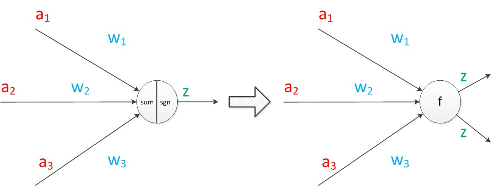
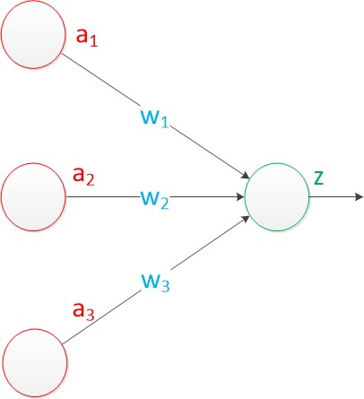
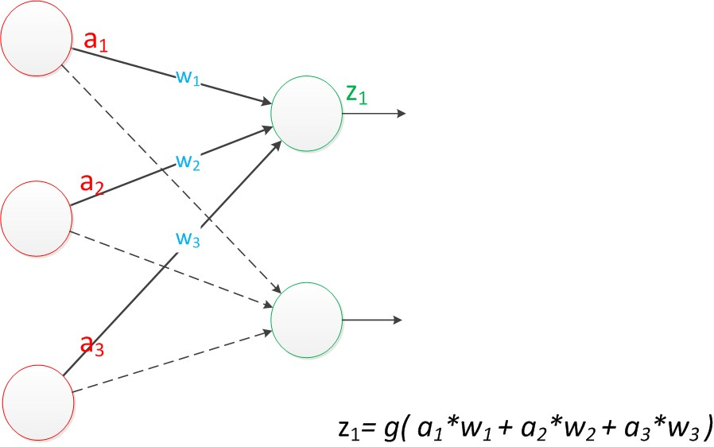
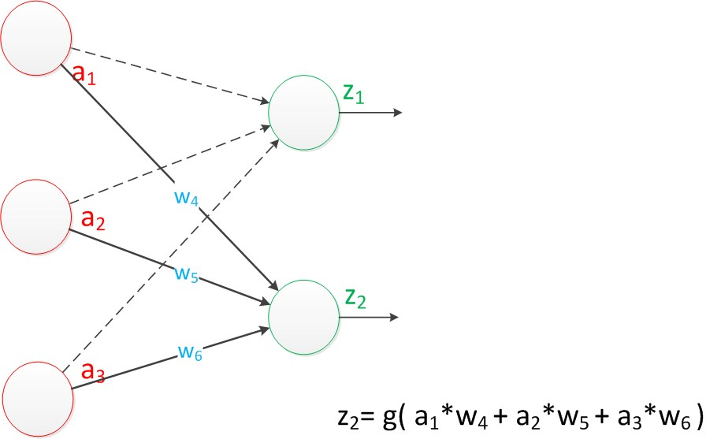
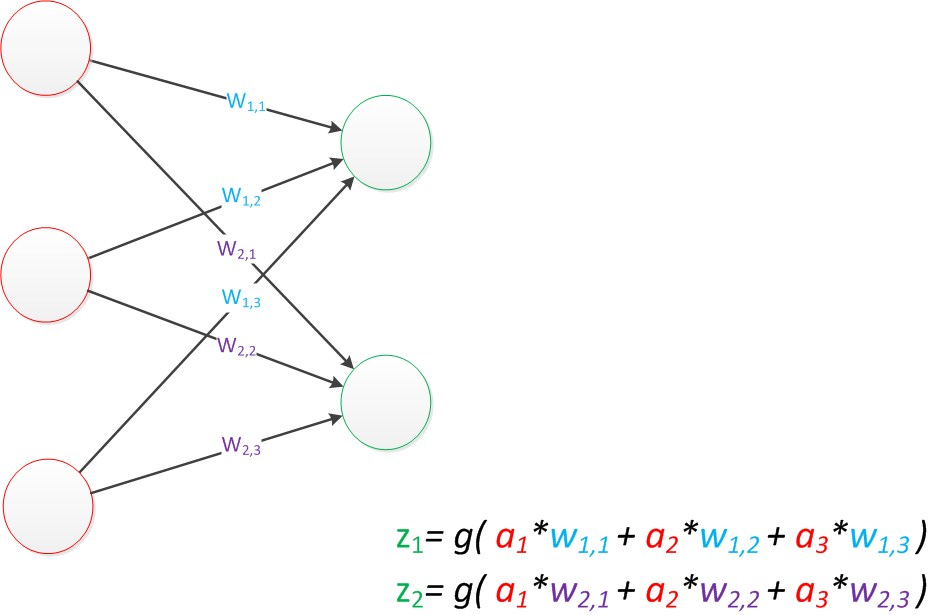
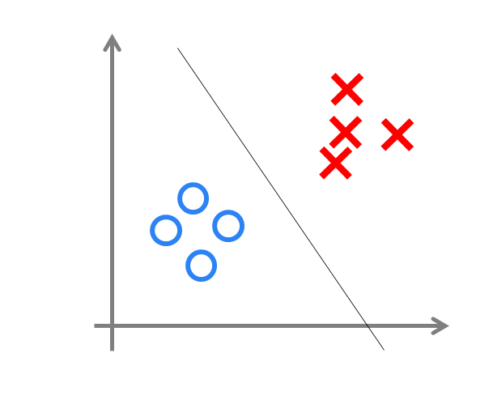

# 摘要

本文主要记录神经网络相关的基础知识

- [x] Edit By Porter, 积水成渊,蛟龙生焉。

<!-- more -->

# 一、神经网络

神经网络是一种模拟人脑的神经网络以期能够实现类人工智能的机器学习技术。

对于神经元的研究由来已久，1904年生物学家就已经知晓了神经元的组成结构。

　　一个神经元通常具有多个树突，主要用来接受传入信息；而轴突只有一条，轴突尾端有许多轴突末梢可以给其他多个神经元传递信息。轴突末梢跟其他神经元的树突产生连接，从而传递信号。这个连接的位置在生物学上叫做“突触”。

## 1.1 神经元

### 1.1.1 让我们来看一个经典的神经网络。

这是一个包含三个层次的神经网络。

红色的是输入层，绿色的是输出层，紫色的是中间层（也叫隐藏层）。

输入层有3个输入单元，隐藏层有4个单元，输出层有2个单元。

后文中，我们统一使用这种颜色来表达神经网络的结构。

### 1.1.2 在开始介绍前，有一些知识可以先记在心里

- 设计一个神经网络时，输入层与输出层的节点数往往是固定的，中间层则可以自由指定；

- 神经网络结构图中的拓扑与箭头代表着预测过程时数据的流向，跟训练时的数据流有一定的区别；

- 结构图里的关键不是圆圈（代表“神经元”），而是连接线（代表“神经元”之间的连接）。每个连接线对应一个不同的权重（其值称为权值），这是需要训练得到的。

### 1.1.3 神经元结构

神经元模型是一个包含输入，输出与计算功能的模型。输入可以类比为神经元的树突，而输出可以类比为神经元的轴突，计算则可以类比为细胞核。

下图是一个典型的神经元模型：包含有3个输入，1个输出，以及2个计算功能。注意中间的箭头线。这些线称为“连接”。每个上有一个“权值”。

连接是神经元中最重要的东西。每一个连接上都有一个权重。

一个神经网络的训练算法就是让权重的值调整到最佳，以使得整个网络的预测效果最好。

我们使用a来表示输入，用w来表示权值。一个表示连接的有向箭头可以这样理解：在初端，传递的信号大小仍然是a，端中间有加权参数w，经过这个加权后的信号会变成a*w，因此在连接的末端，信号的大小就变成了a*w。

在其他绘图模型里，有向箭头可能表示的是值的不变传递。而在神经元模型里，每个有向箭头表示的是值的加权传递。

如果我们将神经元图中的所有变量用符号表示，并且写出输出的计算公式的话，就是下图。

可见z是在输入和权值的线性加权和叠加了一个函数g的值。<strong>在MP模型里，函数g是sgn函数，也就是取符号函数。这个函数当输入大于0时，输出1，否则输出0。</strong>

下面对神经元模型的图进行一些扩展。首先将sum函数与sgn函数合并到一个圆圈里，代表神经元的内部计算。其次，把输入a与输出z写到连接线的左上方，便于后面画复杂的网络。最后说明，一个神经元可以引出多个代表输出的有向箭头，但值都是一样的。

　　神经元可以看作一个计算与存储单元。计算是神经元对其的输入进行计算功能。存储是神经元会暂存计算结果，并传递到下一层。

当我们用“神经元”组成网络以后，描述网络中的某个“神经元”时，我们更多地会用“单元”（unit）来指代。同时由于神经网络的表现形式是一个有向图，有时也会用“节点”（node）来表达同样的意思。 

### 1.1.4 神经元模型的使用可以这样理解

　　我们有一个数据，称之为样本。样本有四个属性，其中三个属性已知，一个属性未知。我们需要做的就是通过三个已知属性预测未知属性。

　　具体办法就是使用神经元的公式进行计算。三个已知属性的值是a1，a2，a3，未知属性的值是z。z可以通过公式计算出来。

　　这里，已知的属性称之为特征，未知的属性称之为目标。假设特征与目标之间确实是线性关系，并且我们已经得到表示这个关系的权值w1，w2，w3。那么，我们就可以通过神经元模型预测新样本的目标。

## 1.2 单层神经网络（感知器）

1958年，计算科学家Rosenblatt提出了由两层神经元组成的神经网络。他给它起了一个名字--“感知器”（Perceptron）

感知器是当时首个可以学习的人工神经网络。

### 1.2.1 感知器模型结构

在原来MP模型的“输入”位置添加神经元节点，标志其为“输入单元”。其余不变，于是我们就有了下图：从本图开始，我们将权值w1, w2, w3写到“连接线”的中间。

　　在“感知器”中，有两个层次。分别是输入层和输出层。输入层里的“输入单元”只负责传输数据，不做计算。输出层里的“输出单元”则需要对前面一层的输入进行计算。

我们把需要计算的层次称之为“计算层”，并把拥有一个计算层的网络称之为“单层神经网络”。有一些文献会按照网络拥有的层数来命名，例如把“感知器”称为两层神经网络。但在本文里，我们根据计算层的数量来命名。

假如我们要预测的目标不再是一个值，而是一个向量，例如[2,3]。那么可以在输出层再增加一个“输出单元”。

可以看到，z1的计算跟原先的z并没有区别。

我们已知一个神经元的输出可以向多个神经元传递，因此z2的计算公式如下图。

可以看到，z2的计算中除了三个新的权值：w4，w5，w6以外，其他与z1是一样的。整个网络的输出如下图。

目前的表达公式有一点不让人满意的就是：w4，w5，w6是后来加的，很难表现出跟原先的w1，w2，w3的关系。

　　因此我们改用二维的下标，用wx,y来表达一个权值。下标中的x代表后一层神经元的序号，而y代表前一层神经元的序号（序号的顺序从上到下）。

　　例如，w1,2代表后一层的第1个神经元与前一层的第2个神经元的连接的权值（这种标记方式参照了Andrew Ng的课件）。根据以上方法标记，我们有了下图。

如果我们仔细看输出的计算公式，会发现这两个公式就是线性代数方程组。因此可以用矩阵乘法来表达这两个公式。

　　例如，输入的变量是[a1，a2，a3]T（代表由a1，a2，a3组成的列向量），用向量a来表示。方程的左边是[z1，z2]T，用向量z来表示。

　　系数则是矩阵W（2行3列的矩阵，排列形式与公式中的一样）。

　　于是，输出公式可以改写成：

$$g(W * a) = z;$$

这个公式就是神经网络中从前一层计算后一层的矩阵运算。

### 1.2.2 效果

与神经元模型不同，感知器中的权值是通过训练得到的。因此，根据以前的知识我们知道，感知器类似一个逻辑回归模型，可以做线性分类任务。

我们可以用决策分界来形象的表达分类的效果。决策分界就是在二维的数据平面中划出一条直线，当数据的维度是3维的时候，就是划出一个平面，当数据的维度是n维时，就是划出一个n-1维的超平面。

下图显示了在二维平面中划出决策分界的效果，也就是感知器的分类效果。

> 感知器只能做简单的线性分类任务。

## 1.3 两层神经网络（多层感知器）

Minsky说过单层神经网络无法解决异或问题。但是当增加一个计算层以后，两层神经网络不仅可以解决异或问题，而且具有非常好的非线性分类效果。不过两层神经网络的计算是一个问题，没有一个较好的解法。

1986年，Rumelhar和Hinton等人提出了反向传播（Backpropagation，BP）算法，解决了两层神经网络所需要的复杂计算量问题，从而带动了业界使用两层神经网络研究的热潮。目前，大量的教授神经网络的教材，都是重点介绍两层（带一个隐藏层）神经网络的内容。 

　　这时候的Hinton还很年轻，30年以后，正是他重新定义了神经网络，带来了神经网络复苏的又一春。

### 1.3.1 两层神经网络的结构（多层感知器）

Minsky说过单层神经网络无法解决异或问题。但是当增加一个计算层以后，两层神经网络不仅可以解决异或问题，而且具有非常好的非线性分类效果。不过两层神经网络的计算是一个问题，没有一个较好的解法。

两层神经网络除了包含一个输入层，一个输出层以外，还增加了一个中间层。此时，中间层和输出层都是计算层。我们扩展上节的单层神经网络，在右边新加一个层次（只含有一个节点）。

现在，我们的权值矩阵增加到了两个，我们用上标来区分不同层次之间的变量。

例如$$a_{x} ^{(y)}$$代表第y层的第x个节点。$$z_{1},z_{2}$$变成了$$a_{1} ^{(2)} , a_{2} ^{(2)}$$。下图给出了$$a_{1} ^{(2)} , a_{2} ^{(2)}$$的计算公式。

https://www.cnblogs.com/subconscious/p/5058741.html