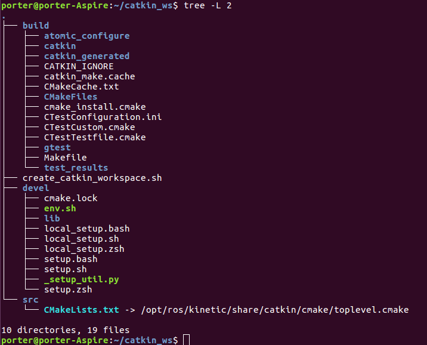

# 摘要


- [x] Edit By Porter, 积水成渊,蛟龙生焉。

<!-- more -->

## 一、基础

**基本概念:**

- 功能包（Pakage）：
>> 功能包是ROS中组织软件的主要形式，其作用相当于一个C++工程，在该工程中我们可以编写代码并编译、执行等操作。一个功能过呢包一般包括程序文件、编译描述文件、配置文件等。

- 功能包集(Stack): 
>> 功能包集是实现某种功能的多个功能包的集合，他可以提供更高级的功能。

- 节点(Node)：
>> 节点实际上是一个可执行文件，它位于功能包中，是实现功能的最小单位。程序文件（例如cpp和.py文件等）只有转换成可执行文件，才可以在ros中运行，一个功能包中可以有多个节点。

- 主题(Topic)和服务(Service)：

>> 单个节点能实现简单的功能，而多个节点联合起来就可以实现复杂的功能。这涉及节点之间的通信，其通信服务包括主题和服务两种。主题单向通信，服务是双向通信。

- 消息(Msg)：
>>  消息指节点之间的通信的内容，每一个消息都有一个固定的数据结构，它支持标准的原始数据类型，包括整形，浮点型，字符串，布尔型等。


### 1.1 创建工作空间

```bash
#!/bin/bash
#Program: Porter.Pan
#history: 10/06-2019
#discrible: ROS 创建基础功能包

# 创建一个工作空间
cd ~ && mkdir -p catkin_ws/src
cd ~/catkin_ws/src && catkin_init_workspace

cd ~/catkin_ws && catkin_make

# 更新环境变量
source devel/setup.bash

# 打印当前环境
echo $ROS_PACKAGE_PATH

# cp ~/create_catkin_workspace.sh ~/catkin_ws/

```



### 1.2 创建功能包


