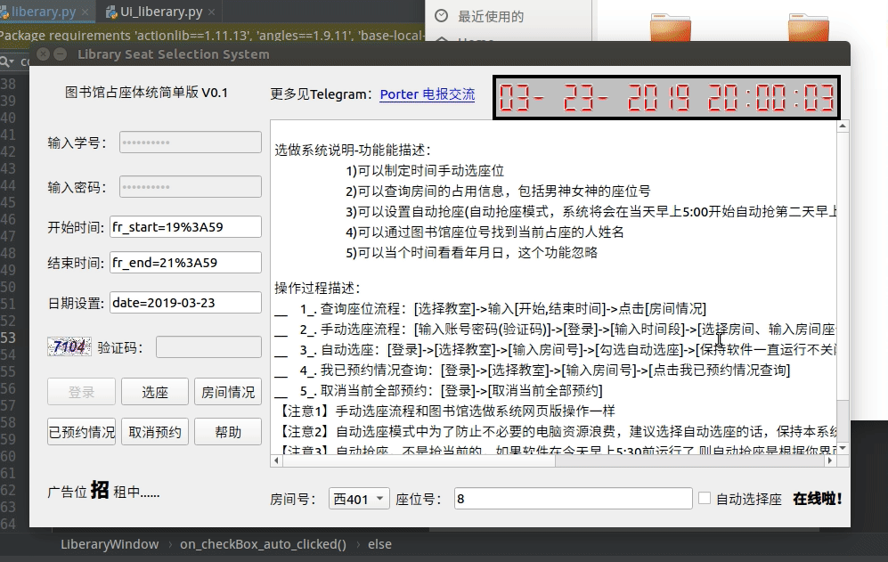

# ptqt_Library_select_seat

<!-- TOC -->

- [ptqt_Library_select_seat](#ptqt_library_select_seat)
- [使用说明](#使用说明)
    - [房间情况查询操作帮助说明](#房间情况查询操作帮助说明)
        - [查询功能描述](#查询功能描述)
        - [查询-软件操作步骤](#查询-软件操作步骤)
        - [注意](#注意)
    - [选座操作帮助说明](#选座操作帮助说明)
        - [手动选座功能描述](#手动选座功能描述)
        - [选座-软件操作步骤](#选座-软件操作步骤)
        - [注意](#注意-1)
    - [自动选座操作帮助说明](#自动选座操作帮助说明)
        - [自动选座功能描述](#自动选座功能描述)
        - [自动选座-软件操作步骤](#自动选座-软件操作步骤)
        - [注意](#注意-2)
    - [关于软件打包成exe方案](#关于软件打包成exe方案)
        - [安装pyinstaller](#安装pyinstaller)
        - [打包成exe文件](#打包成exe文件)

<!-- /TOC -->

帮网友做的图书馆抢座和查学生信息的GUI操作界面


# 使用说明

> 注意自动抢座模式，电脑不能掉网哦，程序内部已经添加了学校网络账号自动登录功能，但是用的作者个人账号，所以为了不影响作者上网，除了调试阶段的程序，其他发布的程序，自动链接网络的功能都是注释掉的，望海涵，如果后期有需要，笔者可以在软件界面加个输入上网账号的输入口，实现用用户自己的上网号自动上网。

## 房间情况查询操作帮助说明

### 查询功能描述

- 可以查询当前选择的房间号和当前填写的时间段的座位被占用情况
- 可以查询当前座位的同学姓名

### 查询-软件操作步骤

- 1. 输入 【开始时间】-【结束时间】-【日期设置】
- 2. 选择 【房间号】
- 3. 填写 【座位号】
- 4. 点击 【房间查询】按键

通过以上4步骤，即可返回你要查询年月日下的对应时间段房间预约情况。

### 注意

- 输入格式严格按照运行软件的实例格式输入，具体怎么输入，可咨询作者，但是非作者本人分享，你是找不到作者的，如果命令输入错误，拼写问题，会有相应提示错误原因。如果字符格式错误，软件将会气死的。为啥不人性化直接输入时间数值，原因很简单，害怕软件传播，影响其他爱学习的孩子，建议1楼的都不要抢啊，人家考研的辛苦的。

> 如果输入信息出错将会有相应错误信息提示，按照错误信息操作即可解决


## 选座操作帮助说明

### 手动选座功能描述

- 可以选择当前选择的房间号和当前填写的时间段的座位，对对应房间号中的某座位进行预约
- 支持当天的位置预约和未来24小时的位置进行预约
- 更多功能自行探索

### 选座-软件操作步骤

- 1. 输入 【输入学号】-【输入密码】-【验证码】
- 2. 点击 【登录】按键
- 3. 【开始时间】-【结束时间】-【日期设置】
- 4. 选择 【房间号】
- 5. 填写 【座位号】
- 6. 然后点击【选座】

通过以上6步骤，即可成功预约在你指定的时间断中，你选择的房间号下对应的座位号，即成功按照你的需要预约成功。

### 注意

- 输入格式严格按照运行软件的实例格式输入，具体怎么输入，可咨询作者，但是非作者本人分享，你是找不到作者的，如果命令输入错误，拼写问题，会有相应提示错误原因。如果字符格式错误，软件将会气死的。为啥不人性化直接输入时间数值，原因很简单，害怕软件传播，影响其他爱学习的孩子，建议1楼的都不要抢啊，人家考研的辛苦的。

> 如果输入信息出错将会有相应错误信息提示，按照错误信息操作即可解决，成功预约会返回成功的相应信息。如“您已成功预约”等字样


## 自动选座操作帮助说明

### 自动选座功能描述

- 可以在当天上午5:30时刻自动对明天8：30-22:00时间段的，当前选定的房间号和座位号进行座位的抢占
- 注意勾选自动抢座后，程序会到每天的上午5:30时刻进行自动预约24小时后的位置（相对今天，明天的位置）

### 自动选座-软件操作步骤

- 1. 输入 【输入学号】-【输入密码】-【验证码】
- 2. 点击 【登录】按键
- 3. 选择 【房间号】
- 4. 填写 【座位号】
- 5. 然后勾选右下角的【自动选座】

通过以上5步骤，软件讲处于自动选座模式，此时需要保持软件处于运行状态，软件将会在每天的5:30开始抢座。

抢座的时间段固定为当天后一天（今天5:30开抢明天8:30-22:00）的座位。

抢占的座位和房间号可以在5:30前的任何时间填写好，（今天5:30开抢，一般昨天晚上睡觉前，在选择房间号和座位号后就点击自动选位开抢了）然后不要玩了勾选自动选择座位。

### 注意

- 输入格式严格按照运行软件的实例格式输入，具体怎么输入，可咨询作者，但是非作者本人分享，你是找不到作者的，如果命令输入错误，拼写问题，会有相应提示错误原因。如果字符格式错误，软件将会气死的。为啥不人性化直接输入时间数值，原因很简单，害怕软件传播，影响其他爱学习的孩子，建议1楼的都不要抢啊，人家考研的辛苦的。

> 如果输入信息出错将会有相应错误信息提示，按照错误信息操作即可解决，成功预约会返回成功的相应信息。如“您已成功预约”等字样




## 关于软件打包成exe方案

### 安装pyinstaller

- www.pyinstaller.org
- 安装指令

```python
pip install pyinstaller 
```

### 打包成exe文件

```python
-F, –onefile 打包成一个exe文件。

-D, –onedir 创建一个目录，包含exe文件，但会依赖很多文件（默认选项）。

-c, –console, –nowindowed 使用控制台，无界面(默认)

-w, –windowed, –noconsole 使用窗口，无控制台

更详细的使用方法可以参考下载包里的doc目录下的Manual.html文件。
```

- 生成的exe文件相对较小，而且可以不用安装运行环境

```python
pyinstaller -w -F 
```

这条指令后会生成一个exe，并且占用空间小，占内存和你代码写的有关系，一般占用内存也不大

