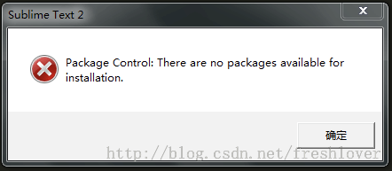
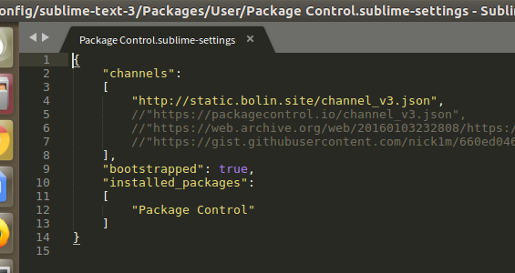

# 摘要

## Package Control 包控制安装

最简单的安装方法是通过 Sublime Text 控制台。控制台可以通过 ctrl +` 快捷方式 或 View > Show Console 菜单来开启/关闭。 打开后，将适用于你 Sublime Text 版本的 Python 代码粘贴到控制台中。

/Sublime Text 3 包控制安装代码/

```Python
import urllib.request,os,hashlib; 
h = 'df21e130d211cfc94d9b0905775a7c0f' + '1e3d39e33b79698005270310898eea76'; 
pf = 'Package Control.sublime-package'; ipp = sublime.installed_packages_path(); 
urllib.request.install_opener( urllib.request.build_opener( urllib.request.ProxyHandler()) ); 
by = urllib.request.urlopen( 'http://packagecontrol.io/' + pf.replace(' ', '%20')).read();
dh = hashlib.sha256(by).hexdigest(); 
print('Error validating download (got %s instead of %s), please try manual install' % (dh, h)) 
if dh != h 
else 
open(os.path.join( ipp, pf), 'wb' ).write(by)
```

- [x] Edit By Porter, 积水成渊,蛟龙生焉。

<!-- more -->


通过Package Control 包控制安装插件
Package Control（包控制）是安装下面列出的所有插件和主题的最佳方式。继续，在包控制中安装插件。通过 Package Control（包控制）安装插件和主题很简单：

使用方法：进入命令面板（ctrl + shift+ p），然后键入 install。
然后键入 remove 删除。

- Emmet

Emmet绝对的节省时间。您可以轻松快速地编写HTML。

- BracketHighlighter

##  该插件提供行数列高亮的各种配对的语法符号。

（愚人码头注：就是将配对的括号等显示在行数列上

- Colorpicker

##  使用一个取色器改变颜色

使用方法: ctrl + shift + c

- DocBlockr

> 一个真正简单的方式来轻松地创建许多语言包括JavaScript，PHP和CoffeeScript的文档块。只要在函数的上面输入/**，按Tab就可以了。DocBlockr会观察函数需要的变量名和类型，并创建文档块。

- SidebarEnhancements

##  扩展文件树右键功能

- CSSComb

##  用来给CSS属性进行排序的格式化

注：因为Csscomb的快捷键是shift+ctrl+c，可能与其他快捷键冲突
你可以去Preferences-->插件设置-->CssComb-->key-Bindings-Defallut设置

- ColorHighlighter

>  它可以展示你所选择的颜色代码（像“#FFFFFF”, “rgb(255,255,255)”, “white”）的真正颜色。同时它还包含一个颜色选择器让你可以方便地更改颜色。

##  使用：快捷键Windows: ctrl+shift+w

- Trailing spaces

##  功能：检测并一键去除代码中多余的空格

使用：安装插件并重启，即可自动提示多余空格。一键删除多余空格：CTRL+SHITF+T（需配置）
快捷键配置：在Preferences / Key Bindings – User加上代码（数组内）{ "keys": ["ctrl+shift+t"], "command": "delete_trailing_spaces" },

- auto-save

##  功能：自动保存文件

使用：默认是不会自动保存，按快捷键Ctrl+Shift+S开启。
快捷键配置方法：首选项-快捷键设置，在数组内添加{ "keys": ["ctrl+shift+s"], "command": "auto_save" },如需自动启用，首选项-插件-auto-save## settings-usre粘帖一下配置
{
"auto_save_on_modified": true,
"auto_save_delay_in_seconds": 10,
"auto_save_all_files": true,
"auto_save_current_file": "",
"auto_save_backup": false,
"auto_save_backup_suffix": "autosave"
}

- view in browser

##  功能：通过默认浏览器打开文件

使用：快捷键配置方法：首选项-快捷键设置，在数组内添加快捷键：{ "keys": ["f12"], "command": "open_in_browser" },

- autoprefixer

##  功能：CSS添加私有前缀

简介：CSS还未标准化，所以要给各大浏览器一个前缀以解决兼容问题
使用：快捷键配置方法：首选项-快捷键设置，在数组内添加{ "keys": ["ctrl+shift+enter"], "command": "autoprefixer" },
快捷键：ctrl+shift+enter

- CSS Extended Completions

##  功能：关联CSS文件

智能提示css文件中的类名，非常好用

- JavaScript Completions

##  功能：支持javascript原生语法提示

- jQuery

##  功能：jQ函数提示

简介：快捷输入jQ函数，是偷懒的好方法

- AutoFileName

##  功能：快捷输入文件名

简介：自动完成文件名的输入，如图片选取
使用：输入”/”即可看到相对于本项目文件夹的其他文件

- HTML-CSS-JS Prettify

##  功能：快捷输入文件名

简介: 编辑HTML, CSS, JS时，经常会出现缩进不对，代码行不对其的情况。装了这个插件之后，只要按下 Ctrl+Shift+h (Windows), Command+Shift+h (Mac), 你的文档就会被整理干净。

注: 需要配置node文件路径 HTML-CSS-JS Prettify > plugin Options

##  问题：Ubuntu中Ctrl+Shift+P. 输入ip,提示

Package Control: There are no packages available for installation.



```bash
Package Control: Error downloading channel. URL error [Errno 65] 
No route to host downloading https://packagecontrol.io/channel_v3.json.
```

解决方法一：[官方解决办法](https://packagecontrol.io/docs/troubleshooting#There_are_no_packages_available_for_installation)

解决办法二：

解决方法：
Package Control.sublime-settings]修改方法：
Preferences > Package Settings > Package Control > Settings - User
添加
```bash
    "channels":
    [
        "http://static.bolin.site/channel_v3.json",
        //"https://packagecontrol.io/channel_v3.json",
        //"https://web.archive.org/web/20160103232808/https://packagecontrol.io/channel_v3.json",
        //"https://gist.githubusercontent.com/nick1m/660ed046a096dae0b0ab/raw/e6e9e23a0bb48b44537f61025fbc359f8d586eb4/channel_v3.json"
    ],
```

