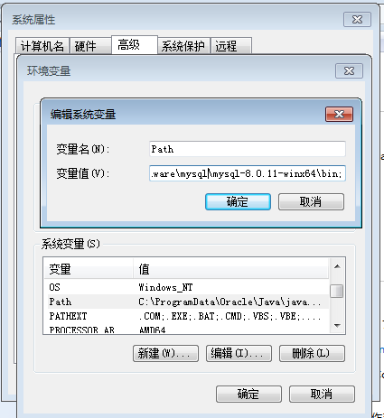
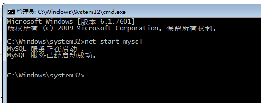
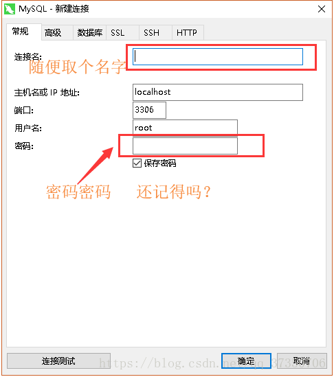
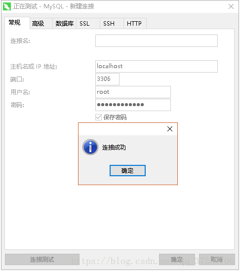
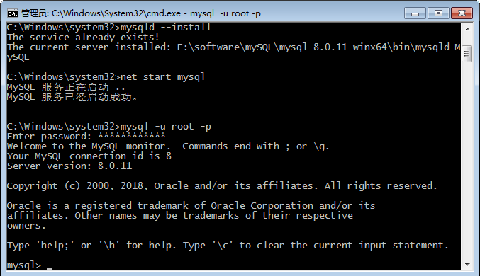
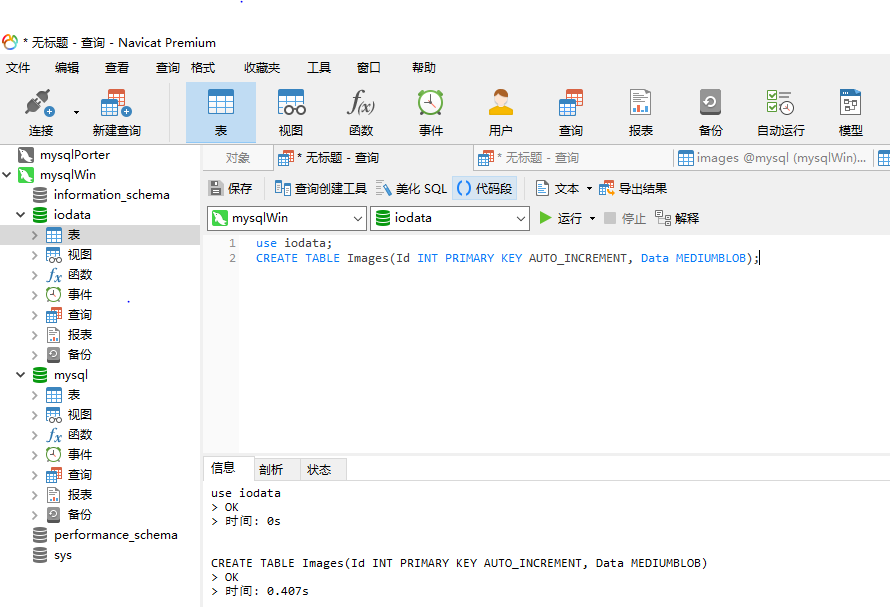
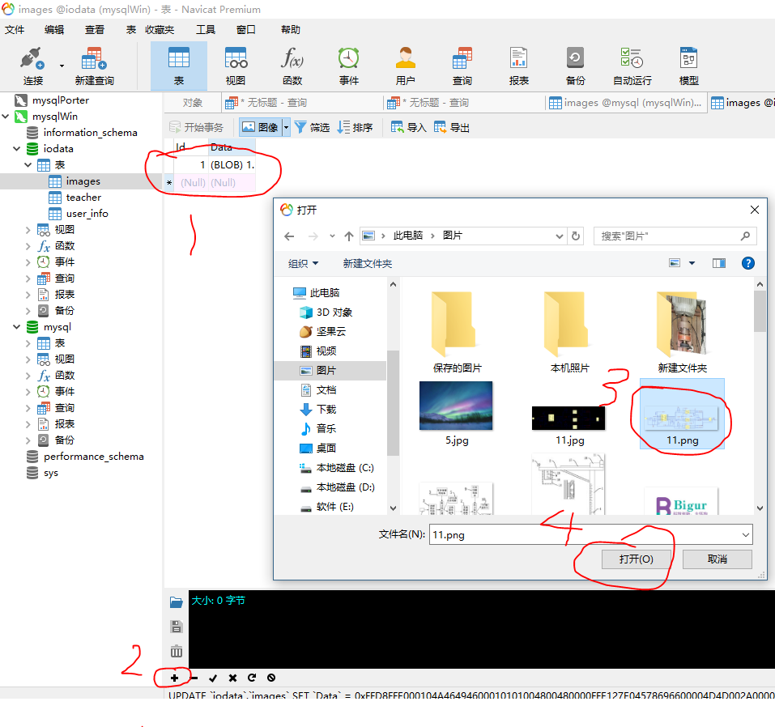

# 摘要

本文主要记录mysql的相关文档，包括安装，配置和数据库访问相关代码

- [x] Edit By Porter, 积水成渊,蛟龙生焉。

<!-- more -->

# 一、下载安装mysql

## 1.1 准备工作

- MySQL8.0 For Windows zip包 -> : [下载地址](https://dev.mysql.com/downloads/file/?id=476233)

- [1] 解压

我的解压在了D:\program\mysql\mysql-8.0.11-winx64


- [2] 配置环境变量



- [3] 配置初始化的my.ini文件

> 我们发现解压后的目录并没有my.ini文件，没关系可以自行创建。在安装根目录下添加 my.ini（新建文本文件，将文件类型改为.ini），写入基本配置：

```ini
[mysqld]
# 设置3306端口
port=3306
# 设置mysql的安装目录
basedir=D:\Program Files\MySQL
# 设置mysql数据库的数据的存放目录
datadir=D:\Program Files\MySQL\Data
# 允许最大连接数
max_connections=200
# 允许连接失败的次数。
max_connect_errors=10
# 服务端使用的字符集默认为UTF8
character-set-server=utf8
# 创建新表时将使用的默认存储引擎
default-storage-engine=INNODB
# 默认使用“mysql_native_password”插件认证
#mysql_native_password
default_authentication_plugin=mysql_native_password
[mysql]
# 设置mysql客户端默认字符集
default-character-set=utf8
[client]
# 设置mysql客户端连接服务端时默认使用的端口
port=3306
default-character-set=utf8
```


> 注意：其中的data目录不需要创建，下一步初始化工作中会自动创建

## 1.2 安装工作

在安装时，必须以管理员身份运行cmd，否则在安装时会报错，会导致安装失败的情况


### 1.2.1 初始化数据库

```cmd
CD \d D:/
```
在MySQL安装目录的 bin 目录下执行命令：

```cmd
mysqld --initialize --console
```

执行完成后，会打印 root 用户的初始默认密码，比如：

```c
D:\Program Files\mysql\bin>mysqld --initialize --console
2019-02-14T11:47:59.282979Z 0 [System] [MY-013169] [Server] D:\Program Files\mysql\bin\mysqld.exe (mysqld 8.0.15) initializing of server in progress as process 13752
2019-02-14T11:47:59.284705Z 0 [Warning] [MY-013242] [Server] --character-set-server: 'utf8' is currently an alias for the character set UTF8MB3, but will be an alias for UTF8MB4 in a future release. Please consider using UTF8MB4 in order to be unambiguous.
2019-02-14T11:48:40.707445Z 5 [Note] [MY-010454] [Server] A temporary password is generated for root@localhost: 7CwffH5<(lem
2019-02-14T11:49:02.894787Z 0 [System] [MY-013170] [Server] D:\Program Files\mysql\bin\mysqld.exe (mysqld 8.0.15) initializing of server has completed
```

注意！执行输出结果里面有一段： [Note] [MY-010454] [Server] A temporary password is generated for root@localhost: 7CwffH5<(lem,D 其中root@localhost:后面的“7CwffH5<(lem,D”就是初始密码（不含首位空格）。在没有更改密码前，需要记住这个密码，后续登录需要用到。
要是你手贱，关快了，或者没记住，那也没事，删掉初始化的 datadir 目录，再执行一遍初始化命令，又会重新生成的。当然，也可以使用安全工具，强制改密码，用什么方法，自己随意。

## 1.3 安装服务

在MySQL安装目录的 bin 目录下执行命令：

```c
mysqld --install [服务名]
```

后面的服务名可以不写，默认的名字为 mysql。当然，如果你的电脑上需要安装多个MySQL服务，就可以用不同的名字区分了，比如 mysql5 和 mysql8。
安装完成之后，就可以通过命令net start mysql启动MySQL的服务了。通过命令net stop mysql停止服务。通过命令sc delete MySQL/mysqld -remove卸载 MySQL 服务



## 1.4 更改密码

下面提供两种方法修改密码，一种是GUI界面的一种是终端操作

### 1.4.1 GUI界面修改密码（推荐）


这里附上[软件下载地址](https://pan.baidu.com/s/19mjZmCgZYaXRezxdukuG0w):

链接: https://pan.baidu.com/s/19mjZmCgZYaXRezxdukuG0w 提取码: m7de 复制这段内容后打开百度网盘手机App，操作更方便哦

新建的MySQL的连接



还记得刚刚让你复制的root @ localhost：后面的初始密码了吗？现在要用到它了复制粘贴上去！
测试一下！



MySQL的是成功安装了也可以登录  
现在就是改密码的时候了
写SQL改密码吗？
太麻烦了太低
来我有个简单的方法
用Navicat的点击刚刚的连接  
就会提示我们输入新密码


### 1.4.2 终端方式修改密码

终端里管理员身份运行cmd,并CD 到在MySQL安装目录的 bin 目录下执行命令：

```bash
mysql -u root -p
```
这时候会提示输入密码，记住了上面第3.1步安装时的密码，填入即可登录成功，进入MySQL命令模式。



在MySQL中执行命令：

```mysql
ALTER USER 'root'@'localhost' IDENTIFIED WITH mysql_native_password BY '新密码'; 
```

修改密码，注意命令尾的；一定要有，这是mysql的语法

# 二、账号配置与使用测试

## 2.1 数据库的创建、表单和字段配置

* 创建数据库：iodata
* 创建数据库表单：teacher ，user_info
* 创建数据库表单中的字段：user_id，user_pass，user_modified 等等
* 设置数据库表单中的主键。

```mysql
CREATE DATABASE iodata;
use iodata;
/*show tables;
create table teacher 
(
    code varchar(20) primary key,
    name varchar(20)
);*/
CREATE TABLE user_info
(
		ID int NOT NULL AUTO_INCREMENT,/* 设置自动加的用户ID*/
		user_id VARCHAR(200) NOT NULL,/*支持中英文200个字符的用户字符串*/
		user_pass VARCHAR(200) NOT NULL,
		user_create datetime(3) NULL DEFAULT CURRENT_TIMESTAMP(3),
		user_modified datetime(3) NULL DEFAULT CURRENT_TIMESTAMP(3) ON UPDATE CURRENT_TIMESTAMP(3),
		PRIMARY KEY (ID)/* 设置主键*/
);
```

## 2.2 配置数据库的用户访问账号密码，权限

```mysql
use iodata;
CREATE USER 'porter'@'localhost' IDENTIFIED BY 'shuruniziji_mima';/* 创建用户 */
INSERT INTO iodata.user_info ( user_id, user_pass)
                       VALUES
                       ( 'porter', '123');  
grant all privileges on *.* to 'porter'@'%'; /* 放行用户的所有权限并允许远程网络连接 */
```

Python 代码来链接数据库

如下代码功能是链接数据库并从数据库中读取数据并打印出来

```Python
# -*- coding:utf-8 -*-
import pymysql
import sys

def get_db_data():
    connect = pymysql.Connect(
        host="210.28.33.2",
        port=3306,
        user="porter",
        passwd="smrit",
        db="iodata",
        charset='utf8'
    )
    print("写入中，请等待……")
    cursor = connect.cursor()
    sql = "select * from user_info"
    cursor.execute(sql)
    number = cursor.fetchall()
    print(number)
    cursor.close()
    connect.close()

if __name__ == "__main__":
    get_db_data()
```

# 三、简单的操作例程

## 3.1 存储图片的数据库读写操作

使用上面推荐的GUI数据库操作工具：Navicat Premium, 软件，在软件中执行



```mysql
use iodata;
CREATE TABLE Images(Id INT PRIMARY KEY AUTO_INCREMENT, Data MEDIUMBLOB);
```



读取数据库中图片的Python 代码

```Python
# -*- coding:utf-8 -*-
import pymysql
import matplotlib.pyplot as plt
import matplotlib.image as mpimg # mpimg 用于读取图片
import sys

def get_loan_number(file):
    connect = pymysql.Connect(
        host="210.28.33.2",
        port=3306,
        user="porter",
        passwd="smriti",
        db="iodata",
        charset='utf8'
    )
    print("写入中，请等待……")
    cursor = connect.cursor()
    sql = "select Data from images LIMIT 1"
    cursor.execute(sql)
    fout = open('2.jpg','wb')
    image_file = cursor.fetchone()[0]
    fout.write(image_file)
    fout.close()
    cursor.close()
    connect.close()
    print("写入完成,共写入%d条数据……" % 1)


if __name__ == "__main__":
    # file = r"C:\Users\test\Desktop\loanNUmber.txt"
    file = "task1.txt"
    get_loan_number(file)
```
## 3.2 读取数据数据并保存在txt文件中

```Python
# -*- coding:utf-8 -*-
import pymysql
def get_loan_number(file):
    connect = pymysql.Connect(
        host="106.14.221.55",
        port=3306,
        user="nadersidc",
        passwd="366583",
        db="defect_detecting",
        charset='utf8'
    )
    print("写入中，请等待……")
    cursor = connect.cursor()
    # sql = "select id  from application where status='SUBMITTING' and contract like 'Performance-%'  and " \
    #       "loan_org_party='166490194444444444'"

    # sql = "select Element.Id,Element.FileName,DefectPosition.TopX,DefectPosition.TopY,\
    # DefectPosition.Width,DefectPosition.Height from Element,DefectPosition where Element.DefectId=6 \
    # and Element.ImageTypeId=2 and DefectPosition.ElementId=Element.Id"

    # sql = "select * from Element LIMIT 1,5"
    # sql = "select * from * LIMIT 1,5"
    # 查询数据库表中所有的表名字
    # sql = "select table_name from information_schema.tables where table_schema='defect_detecting'"
    sql = "select * from TrainProject LIMIT 1,5"
    cursor.execute(sql)
    number = cursor.fetchall()
    fp = open(file, "w")
    loan_count = 0
    for loanNumber in number:
        loan_count += 1
        fp.write(str(loanNumber)+'\n')
    fp.close()
    cursor.close()
    connect.close()
    print("写入完成,共写入%d条数据……" % loan_count)


if __name__ == "__main__":
    # file = r"C:\Users\test\Desktop\loanNUmber.txt"
    file = "task2.txt"
    get_loan_number(file)
```

## 3.2 读取数据数据并直接显示

* 涉及一个问题，就是数据库中的图片是二进制流的，如何直接从数据库中获取数据并显示


