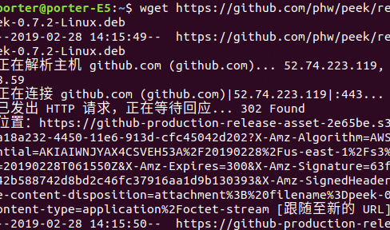

# 摘要

在写一些博客文章中，一般的png，jpg格式的图片往往满足不了复杂的演示过程，这时peek软件就能很好的帮助我们完成gif文件的制作，并且peek还是一个轻量级的gif制作软件，值得推荐，但是我根据官方的ubuntu安装步骤，发现确实能够安装，但是容易出问题，这里我把我的安装方法写出来，供安装后录制保存就死机的朋友参考。

- [x] Edit By Porter, 积水成渊,蛟龙生焉。

<!-- more -->

# 一、安装

- 获取deb包：
```bash
wget https://github.com/phw/peek/releases/download/v0.7.2/peek-0.7.2-Linux.deb
```

- 安装依赖：

```bash
sudo apt install libsdl1.2debian ffmpeg libavdevice-ffmpeg56
```

- 安装peek：

```bash
sudo dpkg -i peek-0.7.2-Linux.deb
```
# 二、使用演示




| 已启用|类型 |名称 | 命令行| 图标|
|---|---|---|---|---|
| [v]|html|词典名称随意填|/词典路径/wordtag.py %GDWORD%|/图标路径/png.png|