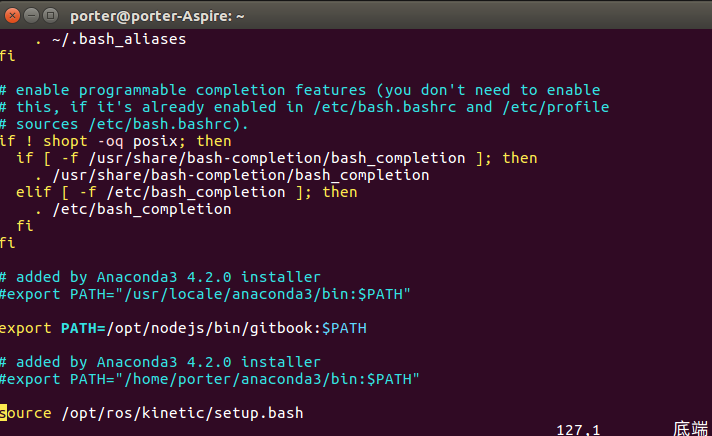
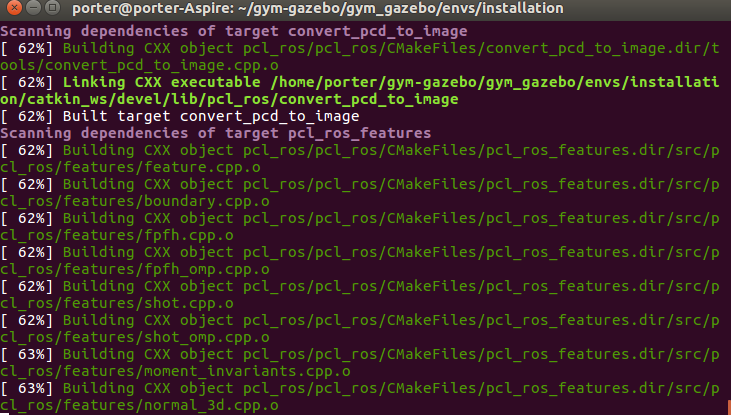

# 摘要

本文主要记录gym_gazebo安装的过程，想想每次安装都要一堆的百度，过程很痛苦，所以直接记录下我成功安装的过程，方便后面安装的参考。

具体内容如下：
<!-- TOC -->

- [摘要](#摘要)
    - [解决ubuntu 中安装 gym_gazabe 遇到的各种水土不服](#解决ubuntu-中安装-gym_gazabe-遇到的各种水土不服)
        - [Basic requirements:](#basic-requirements)
        - [ROS Kinetic dependencies](#ros-kinetic-dependencies)
        - [Install Sophus](#install-sophus)
        - [Gazebo gym](#gazebo-gym)
        - [Dependencies and libraries](#dependencies-and-libraries)
        - [<font color = 'red'>Agent dependencies </font>](#font-color--redagent-dependencies-font)
        - [Run the environment with a sample agent](#run-the-environment-with-a-sample-agent)

<!-- /TOC -->

<!-- more -->

## 解决ubuntu 中安装 gym_gazabe 遇到的各种水土不服

### Basic requirements:

- ROS Kinetic (/rosversion: 1.12.7)
- <font color = 'red'>Gazebo 8.1.1 </font>
- Python 3.5.2
- OpenCV3, installed from sources for Python 3 (git clone https://github.com/Itseez/opencv.git)
- OpenAI gym

> 这部分的安装请自行百度, 但是这部分的内容也要安装上，不然安装gym_gazebo会出错的。


### ROS Kinetic dependencies

```bash
sudo pip3 install rospkg catkin_pkg

sudo apt-get install python3-pyqt4

sudo apt-get install \
cmake gcc g++ qt4-qmake libqt4-dev \
libusb-dev libftdi-dev \
python3-defusedxml python3-vcstool \
libbluetooth-dev libspnav-dev \
pyqt4-dev-tools libcwiid-dev \
ros-kinetic-octomap-msgs        \
ros-kinetic-joy                 \
ros-kinetic-geodesy             \
ros-kinetic-octomap-ros         \
ros-kinetic-control-toolbox     \
ros-kinetic-pluginlib	       \
ros-kinetic-trajectory-msgs     \
ros-kinetic-control-msgs	       \
ros-kinetic-std-srvs 	       \
ros-kinetic-nodelet	       \
ros-kinetic-urdf		       \
ros-kinetic-rviz		       \
ros-kinetic-kdl-conversions     \
ros-kinetic-eigen-conversions   \
ros-kinetic-tf2-sensor-msgs     \
ros-kinetic-pcl-ros \
ros-kinetic-navigation \
ros-kinetic-ar-track-alvar-msgs
```

### Install Sophus
```shell
cd
git clone https://github.com/stonier/sophus -b release/0.9.1-kinetic
cd sophus
mkdir build
cd build
cmake ..
make
sudo make install
echo "## Sophus installed ##\n"
```

### Gazebo gym
```bash
cd 
git clone https://github.com/erlerobot/gym-gazebo
cd gym-gazebo
sudo pip3 install -e .
```

### Dependencies and libraries

```bash
sudo pip3 install h5py
sudo apt-get install python3-skimage

# install Theano
cd ~/
git clone git://github.com/Theano/Theano.git
cd Theano/
sudo python3 setup.py develop

#install Keras
sudo pip3 install keras
```

### <font color = 'red'>Agent dependencies </font>

这部分的安装可以参考我的github 仓库(gazebo.repos 已经修改过,并且在ubuntu16上正确编译安装通过，可以直接clone下来安装,我只修改了gazebo.repos,设置/usr/local/python3.5环境):[]()

<font color = 'blue'> 这部分的安装需要注意请尽量用"/usr/local/bin/python3.5"如果用anaconda的python环境下安装，会出现Cmake 报错,如果你有解决的办法可以忽略提示</font>

> 切换python 环境，只需要执行如下命令：

```bash
vim ~/.bashrc
# 修改弹出的文本，将export anaconda这行注释掉，如下所示
# added by Anaconda3 4.2.0 installer
#export PATH="/home/porter/anaconda3/bin:$PATH"
```

效果如下：



> 安装前需要配置下Agent 的gazebo.repos
```bash
cd ~/gym-gazebo/gym_gazebo/envs/installation/
cp ./gazebo.repos ./gazebo.repos.bak
gedit ~/gym-gazebo/gym_gazebo/envs/installation/gazebo.repos
```
- gazebo.repos 内容如下
> 主要修改一些github 仓库对应版本release的分支问题, 解决安装时的错误， 修改后的内容如下：

```bash 
repositories:
#  ardupilot_sitl_gazebo_plugin:
#    type: git
#    url: https://github.com/erlerobot/ardupilot_sitl_gazebo_plugin
#
#    version: master

  ar_track_alvar:
    type: git
    url: https://github.com/ros-perception/ar_track_alvar.git
    version: kinetic-devel

  mav_comm:
    type: git
    url: https://github.com/ethz-asl/mav_comm.git
    version: master
#  ar_track_alvar:
#    type: git
#    url: https://github.com/sniekum/ar_track_alvar
#    version: indigo-devel
#  ar_track_alvar_msgs:
#    type: git
#    url: https://github.com/sniekum/ar_track_alvar_msgs
#    version: indigo-devel
  catkin_simple:
    type: git
    url: https://github.com/catkin/catkin_simple.git
    version: master
  control_toolbox:
    type: git
    url: https://github.com/ros-controls/control_toolbox.git
    version: indigo-devel
#  drcsim:
#    type: hg
#    url: https://bitbucket.org/osrf/drcsim
#    version: default
  ecl_core:
    type: git
    url: https://github.com/stonier/ecl_core
    version: release/0.61-indigo-kinetic
  ecl_lite:
    type: git
    url: https://github.com/stonier/ecl_lite
    version: release/0.61-indigo-kinetic
  ecl_navigation:
    type: git
    url: https://github.com/stonier/ecl_navigation
    version: devel
  ecl_tools:
    type: git
    url: https://github.com/stonier/ecl_tools
    version: release/0.61-indigo-kinetic
  driver_base:
    type: git
    url: https://github.com/ros-drivers/driver_common.git
    version: indigo-devel
  gazebo_ros_pkgs:
    type: git
    url: https://github.com/ros-simulation/gazebo_ros_pkgs
    version: indigo-devel
#  glog_catkin:
#    type: git
#    url: https://github.com/ethz-asl/glog_catkin.git
#    version: master
  hector_gazebo:
    type: git
    url: https://github.com/tu-darmstadt-ros-pkg/hector_gazebo/
    version: indigo-devel
  image_common:
    type: git
    url: https://github.com/ros-perception/image_common.git
    version: hydro-devel
  joystick_drivers:
    type: git
    url: https://github.com/ros-drivers/joystick_drivers.git
    version: master
  kobuki:
    type: git
    url: https://github.com/yujinrobot/kobuki
    version: indigo
  kobuki_core:
    type: git
    url: https://github.com/yujinrobot/kobuki_core
    version: indigo
  kobuki_desktop:
    type: git
    url: https://github.com/erlerobot/kobuki_desktop
    version: indigo
  kobuki_msgs:
    type: git
    url: https://github.com/yujinrobot/kobuki_msgs
    version: indigo
#  mavros:
#    type: git
#    url: https://github.com/erlerobot/mavros.git
#    version: gazebo_udp
#  mav_comm:
#    type: git
#    url: https://github.com/PX4/mav_comm.git
#    version: master
  navigation:
    type: git
    url: https://github.com/ros-planning/navigation
    version: indigo-devel
#  osrf-common:
#    type: hg
#    url: https://bitbucket.org/osrf/osrf-common
#    version: default
  pcl_ros:
    type: git
    url: https://github.com/ros-perception/perception_pcl.git
    version: indigo-devel
#  python_qt_binding:
#    type: git
#    url: https://github.com/ros-visualization/python_qt_binding
#    version: kinetic-devel
#  qt_gui_core:
#    type: git
#    url: https://github.com/ros-visualization/qt_gui_core
#    version: groovy-devel
  realtime_tools:
    type: git
    url: https://github.com/ros-controls/realtime_tools
    version: indigo-devel
  ros_control:
    type: git
    url: https://github.com/ros-controls/ros_control
    version: indigo-devel
  roslint:
    type: git
    url: https://github.com/ros/roslint
    version: master
#  rqt:
#    type: git
#    url: https://github.com/ros-visualization/rqt
#    version: groovy-devel
#  rqt_common_plugins:
#    type: git
#    url: https://github.com/ros-visualization/rqt_common_plugins
#    version: master
#  rqt_robot_plugins:
#    type: git
#    url: https://github.com/ros-visualization/rqt_robot_plugins
#    version: master
  turtlebot:
    type: git
    url: https://github.com/turtlebot/turtlebot
    version: indigo
  turtlebot_create:
    type: git
    url: https://github.com/turtlebot/turtlebot_create
    version: indigo
  turtlebot_simulator:
    type: git
    url: https://github.com/turtlebot/turtlebot_simulator
    version: indigo
  xacro:
    type: git
    url: https://github.com/ros/xacro
    version: indigo-devel
  yocs_msgs:
    type: git
    url: https://github.com/yujinrobot/yocs_msgs
    version: release/0.6-kinetic
  yujin_ocs:
    type: git
    url: https://github.com/yujinrobot/yujin_ocs
    version: kinetic
```

> 具体的修改地方建议，通过code compare 工具查看，这里推荐一个好用而代码比较工具：Meld Diff 比较好用。

- 接下来执行如下Agent dependences

```bash 
cd gym_gazebo/envs/installation
bash setup_kinetic.bash		
```


### Run the environment with a sample agent
```bash
cd gym_gazebo/examples/scripts_turtlebot
python circuit2_turtlebot_lidar_qlearn.py
```
