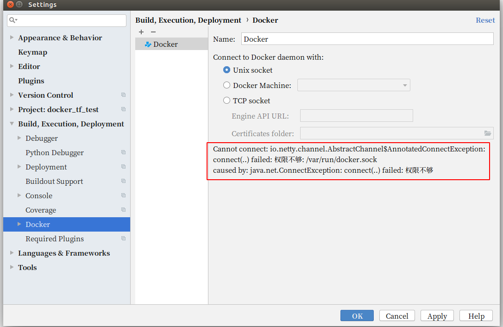
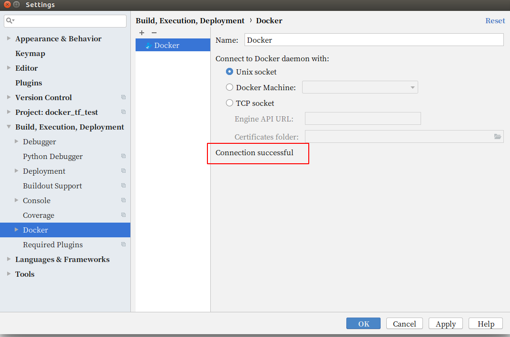

# 摘要

<div align=center> 


</div>

本文主要介绍Docker 安装结束后的全权限配置问题

- 一、解决终端运行每次需要运行root权限问题

```python
porter@porter-Aspire:~$ docker images 
Got permission denied while trying to connect to the Docker daemon socket at unix:///var/run/docker.sock: Get http://%2Fvar%2Frun%2Fdocker.sock/v1.39/images/json: dial unix /var/run/docker.sock: connect: permission denied
```

- 二、解决Pycharm中导入docker时提示权限问题




<!-- more -->

## 一、问题分析

以上两种问题的出现，都是因为没把当前的用户组加到 /var/run/docker.sock 执行组中去

## 解决办法

### 步骤一、检查docker.sock  的用户权限情况

```bash
 ls -l /var/run/docker.sock
 srw-rw---- 1 root docker 0 Aug 23 09:40 /var/run/docker.sock
```
### 步骤二、将当前用户组添加到docker的组中

```bash
sudo gpasswd -a ${USER} docker
cat /etc/group | grep ^docker
```
### 步骤三、重启docker

```bash
sudo service docker restart
```

### 步骤四、更新docker的用户和组

```bash
newgrp docker     #更新用户组
```

### 步骤五、终端测试

可以发现可以不用root权限就可以操作docker相关的命令了

```bash
docker ps    #测试docker命令是否可以使用sudo正常使用
```

## 二、 问题分析

导致问题二中的pycharm出问题的原因是因为file的读写权限的问题，我们只需要改下，出问题的文件的读写权限就可以了

问题的现象如下图


问题的解决方法如下

```bash
sudo chmod a+rw /var/run/docker.sock
```

然后再重新+一个Docker 看下效果如下


