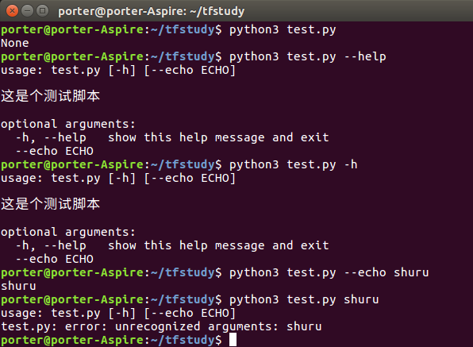

# 摘要

argparse是一个命令行参数解析模块，本文主要介绍python的终端交互模块argparse模块的一些简单而常用的使用方法。

<!-- more -->

首先导入一个简单的例子

```python
import argparse
parser = argparse.ArgumentParser()
parser.parse_args()
```

以上的简单例子，就构成了，一个简单的命令行参数解析的例子。通过执行

```bash
python test.py --help
```

将会有了参数用法的提示说明输出。

下面开始正式的介绍这个模块的用法

## 为你的程序添加描述

```python
import argparse
parser = argparse.ArgumentParser()
parser.add_argument('--echo')
parser.description = '这是个测试脚本'
args = parser.parse_args()
```

**parser.description** 是一个程序的描述性语句。

最终终端输入

```bash
python test.py --help 
```

执行该语句就会有相应的脚本描述被打印出来

## 必选参数和选择性填入的参数语法

```python
import argparse
parser = argparse.ArgumentParser()
#该参数是必须在终端有输入
parser.add_argument("ParA", help="我是A",type=int) 
#该参数是在终端可以有选择性输入的参数
parser.add_argument("--ParB", help="我是A",type=int) 
args = parser.parse_args()
print(args.ParA)
print(args.ParB)
```
在参数的定义前面,未加双横线，表示终端中必须要有的一个参数；加了双横线表示，终端输入中可以不适用该参数。

## 提取命令行中输入参数的类型

```python 
import argparse
parser = argparse.ArgumentParser()
parser.add_argument("ParA", help="我是A",type=int)
parser.add_argument("ParB", help="我是B",type=int)
args = parser.parse_args()
if args.ParA == 1:
    print('您的ParA参数输入正确，确实是1')
else
    print('请输入正确的参数，参数的输入不应该是{}'%)
```

对于需要输入int类型的参数，只需要写入**type=int**.

## 下面使用一个完整的例子

```python
import argparse
parser = argparse.ArgumentParser()
parser.add_argument('--echo')
parser.description = '这是个测试脚本'
args = parser.parse_args()
print(args.echo)
```

我们针对这个例子，在终端中输入如下命令，将会有相应的效果。



