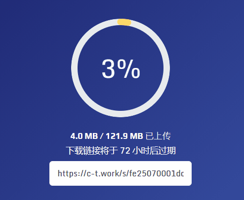
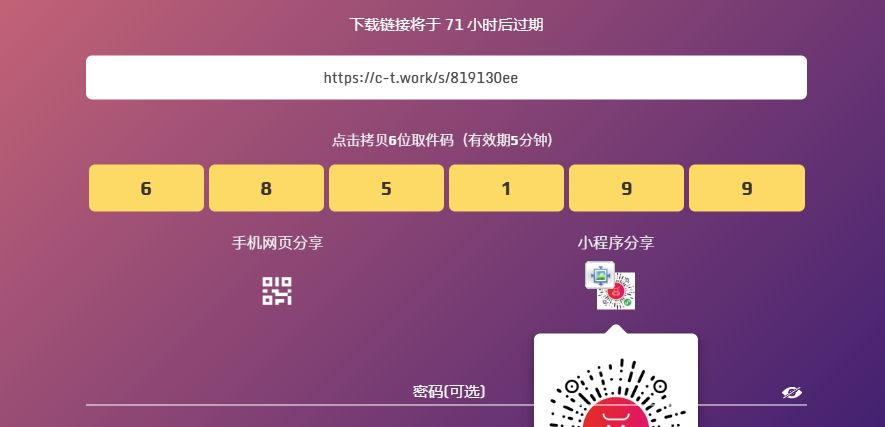
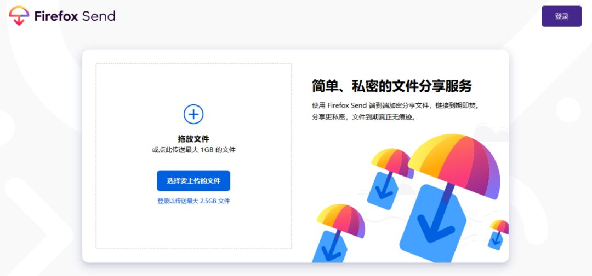
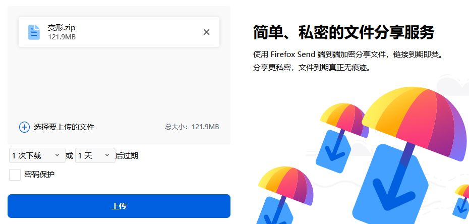
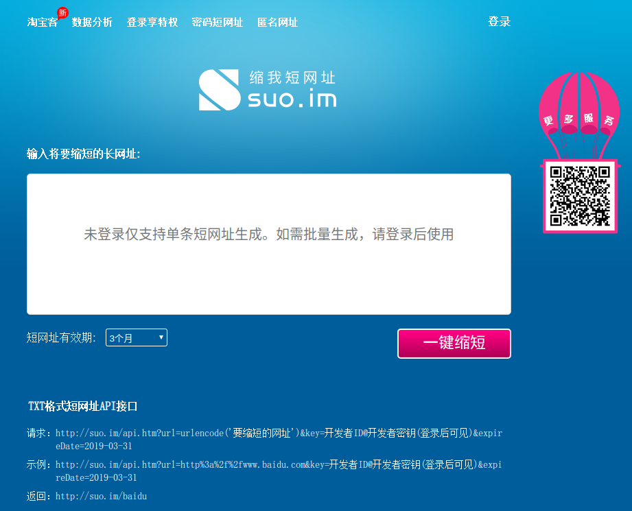
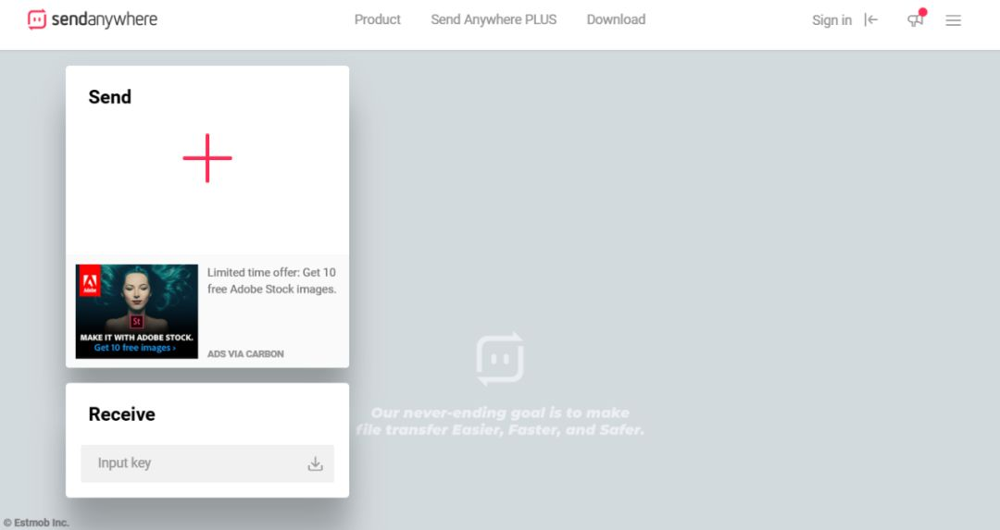

# 摘要

[v] 百度网盘，上传下载都要客户端很不方便；

[v] 打印店还要带u盘？病毒太多，u盘携带易丢

[v] 下载速度太慢，上传速度也太慢

[v] 分享个文件超过多大后还要登录账号或者依靠客户端才能下载

- 烦恼如此之多，如何解决

生活中你是否遇到过这么多的不如意，下面介绍几个免费，免注册，免VIP高速在线上传下载的文件分享神奇。

推荐使用场所： 打印店打印资料，电脑分享文档，音乐，视频；淘宝资料发货(可设置过期时间和过期的下载次数)；危险亚健康的数据(加密性好，无记录账号等个人信息，谁知道是谁传的，就是安全)；传你所不敢传，分享你所不敢分享；方便才是王道。

-----
以上都是废话，下面才是干获，如何使用，客官还请见下文

<!-- more -->

## 第一个、超高颜值的---牛奶快传

[牛奶快传](https://c-t.work),是我很喜欢的一个文件分享网站，特点如下：

- 安全、可加密等特点就不说了
- 免注册即可高速上传和下载文档
- 支持批量上传
- 共享可以是链接和取件码
- 取件码形式下载文件(我最喜欢的，省去了短连接转换)
- 提供免费的5G私人网盘(仅需邮箱就可以注册拥有)

### 我们感受下上下传的速度吧

### 取件码形式下载文件

共享还可以直接登录这个短的官网首页，输入你共享文件生成的共享取件码**即可**下载文件,这是我认为最方便的一点，很喜欢

### 支持批量上传

不仅上传飞快，还支持文件的批量上传。下载文件时也几乎是满速状态，完全不会出现像某盘那样的限速问题。

### 提供免费的5G私人网盘

如果你想要私人网盘空间，你可以随便搞个邮箱就注册拥有私人空间了

## 第二个、Firefox Send

[send.firefox.com](https://send.firefox.com/),也是一个很不错的文件分享网站，特点如下：

- 安全、可加密等特点就不说了
- 免注册即可高速上传和下载文档
- 共享可以是链接

非注册用户可上传最大 1G 的文件，注册后可上传 2.5G 的文件，文件均保留 24 小时。

但这款工具的最大特点，是安全性强。可选择文件有效的时间、天数、下载次数。

但是呢，这个不能取件码式下载文件,但是也有很方便的解决办法哦

不错就是短连接配合使用。

----

推荐使用短连接[suo.im](http://suo.im/),可以设置短连接的失效时间，比较不错的。

### 短连接使用步骤：

用Firefox Send 生成共享文件链接，然后打开[suo.im短连接网](http://suo.im/),然后执行生成短连接即可。

## 第三个、Sendanywhere（这个需要翻墙）

[Sendanywhere](https://send-anywhere.com/),这个是我曾经使用的，加密性很好，给朋友共享病毒发毒瘤啥的，很方便呀，大文件也可以，由于这款软件不具备国内小朋友们玩，能出去的就自己探索下吧，功能不小，很方便呀。

