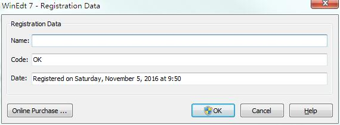
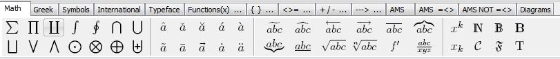
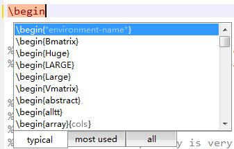
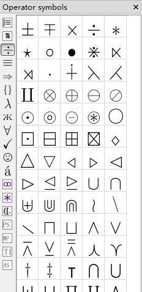
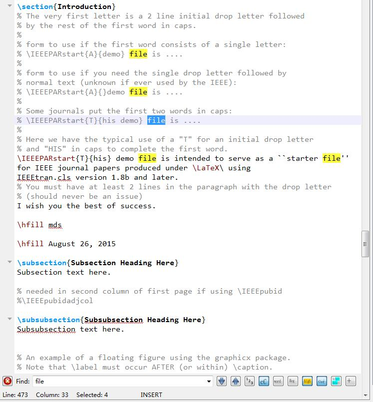

 Editor: Porter Pan 

# 摘要

本文记录了Latex排版相关的语法句法使用，是对latex学习中的一种总结，笔记，具体笔记见文中内容所描述。

<!-- more -->

# Latex 排版使用笔记

## 一、 简单的介绍

> LaTeX（LATEX，音译“拉泰赫”）是一种基于ΤΕΧ的排版系统，由美国计算机学家莱斯利·兰伯特（Leslie Lamport）在20世纪80年代初期开发，利用这种格式，即使使用者没有排版和程序设计的知识也可以充分发挥由TeX所提供的强大功能，能在几天，甚至几小时内生成很多具有书籍质量的印刷品。对于生成复杂表格和数学公式，这一点表现得尤为突出。因此它非常适用于生成高印刷质量的科技和数学类文档。这个系统同样适用于生成从简单的信件到完整书籍的所有其他种类的文档。

> LaTeX 是一款非常优秀的科技论文排版系统，除了编写学术论文、幻灯片、书籍、报告等之外，甚至可以画矢量图。尤其在学术界非常认可，各个主流的学术期刊都提供了相应的 latex 模板。与 word 排版不同，它不是一个所见即所得的编辑器，而是基于许多的规范的 TeX 语法。正是基于此，LaTeX 在使用时可以让作者花更少的时间在文章的格式排版上，而是更关注与内容的编辑。

### 1.1 TeXLive 

TeXLive 是一款经典的官方发布的 TeX 系统，特点是跨平台（Unix、Linux、Windows 操作系统均可）安装，不断有开发人员在维护和更新，解决BUG。缺点是软件仅仅是一个编译系统，与 CTeX 相比缺少了编译器和查看器，需要另外安装；

当然也可以不使用编辑软件，直接使用命令行（command line）或记事本编辑，再使用命令行的指令进行编译（latex、pdflatex、bibtex、dvi2ps 等），一般人当然接受不了（只有极少数程序员会这么做），开发也不方便。

### 1.2 CTeX

> CTeX 环境（适合中国人使用的 Chinese TeX 环境）中文套装是基于 Windows 下的 MiKTeX 系统，集成了编辑器 WinEdt 和 PostScript 处理软件 Ghostscript 和 GSview 等主要工具。 CTeX 中文套装在 MiKTeX 的基础上增加了对中文的完整支持。 

* WinEdt 一款 CTeX 自带的编辑软件，并不是免费的软件，需要（和谐）之后才好使用，否则会不断提示你进行 register。

* WinEdt 提供了许多按钮式的数学符号、运算、字母提示，不需要记忆很多命令； 

### 1.3 TexStudio [推荐]

TeXstudio 是一款非常精良的 LaTeX 免费开发软件（不包括 TeX 编译环境，需要另外安装 CTeX 或 TeXLive），有着许多实用、便捷的功能：

* 配置非常简单，基本使用默认的配置即可，个人喜欢修改字体为 Consolas，编译方式 DVI->PS->PDF，编码 UTF-8（对中文兼容）、加入英语拼写检查（Spell Check，en_US）；

* 自带 PDF 查看器，即界面左边为编辑文档，右边显示编译生成的 PDF 文档，在 pdflatex 编译之后，支持对象反查（代码 –> PDF（右键 Go to PDF）、PDF–> 代码（右键 Go to Source））；

* 代码自动提示，可以自动补全，菜单里含有丰富的命令； 

## 二、Latex基本语法

## 三、Latex 在线参考资料

