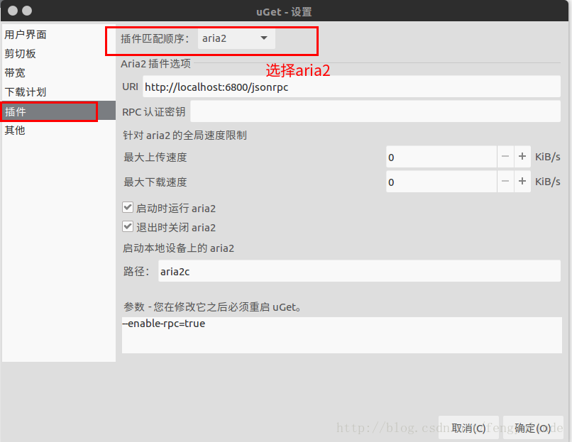

# 摘要

本文记录了Ubuntu下常用工具软件配置、安装，包括高速下载的工具安装使用，具体安装和介绍见文章内容所述。

- [x] Edit By Porter, 积水成渊,蛟龙生焉。

<!-- more -->

文章同步于: [我的gitbook](https://porter.gitbook.io/)

# Ubuntu下常用工具软件配置安装

> 终端打开软件，不占用终端的方法是在命令后面加&

```bash
sudo matlab &
```

## 一、安装高速下载工具

uGet：是一款图形化界面软件， 支持队列下载和恢复下载的功能。uGet官网 
aira2：是一个命令行下载工具，使用不方便，需要配合其他图形界面的下载软件使用。其下载原理类似于Windows上的迅雷，通过搜索资源、为己所用，而不是仅仅从原始地址这单一资源处下载。 
uGet采用aria2作为后端，安装aria2插件后可与其进行交互。支持的下载协议包括：HTTP，HTTPS，FTP，BitTorrent和Metalink。

--------------------- 

作者：Geroff 
来源：CSDN 
原文：https://blog.csdn.net/fengyulinde/article/details/78309314 
版权声明：本文为博主原创文章，转载请附上博文链接！

### 1.1 安装步骤

- 安装 uget aria2

```bash
sudo add-apt-repository ppa:plushuang-tw/uget-stable
sudo apt update
sudo apt install uget aria2
```

### 1.2卸载

- 1.如果要移除uGet和aria2，可执行如下命令

```bash
sudo apt-get remove --purge uget aria2
```

- 2.移除相应ppa，执行如下步骤 

先安装ppa-purge

```bash
sudo apt-get install ppa-purge 
```
接着删除相应ppa

```bash
sudo ppa-purge ppa:plushuang-tw/uget-stable
```

### 1.3 uGet设置

如图界面选择插件--> aria2即可，更多的帮助请在终端中输入，aria2c -h即可看到。




## 二、终端相关的配置

* 终端打开软件，但当软件打开后，不想让终端占用软件的方法

```bash
software &
```
即在软件的后面加上 & 符号

