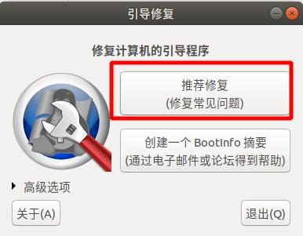
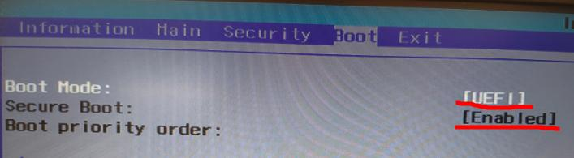
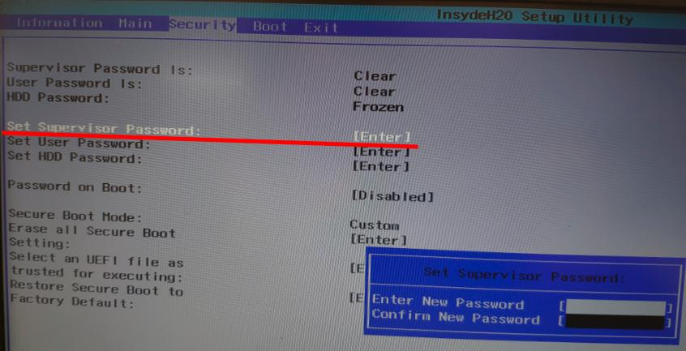
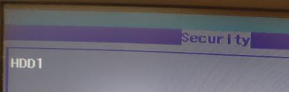
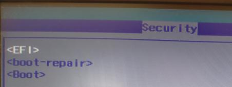
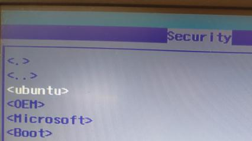
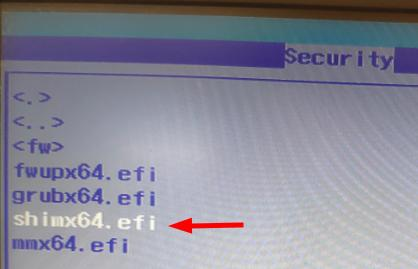
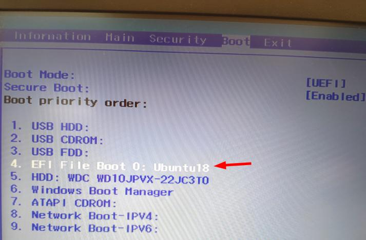

- [x] Edit By Porter, 聚水渊，聚少成多，涓涓长流。

# 摘要

本文记录了win10+ubuntu双系统修复ubuntu启动引导，解决最新版win10系统的UEFI快速启动带来的双系统安装启动问题（开机引导无法修复的解决方法）。

文章同步于: [我的gitbook](https://porter.gitbook.io/)

<!-- more -->

# win10+ubuntu双系统修复ubuntu启动引导

## 摘要


我的环境是：uefi启动模式下的win10 + ubutu18.04，其中win10 安装在 128G固态硬盘上，Ubuntu18.04LTS 安装在1T 机械硬盘上，由于我已安装好的ubuntu18 没有UEFI，但是ubuntu18确实是支持UEFI的，难道我必须要重新安装下ubuntu系统吗？（我ubuntu上好不容易安装好了好多软件，此时内心是崩溃的）

## 一、啥都不用改的解决办法（有点不推荐）

* 每次打开电脑后狂按F12按键，会进入Boot引导管理，然后选择你的Ubuntu系统进入即可打开ubuntu，如果你要打开window10 你可以按下开机电源后啥都不做就能进入，或者，也是狂按F12进入Boot管理界面，选择windows。

> 每次开机都得这么累，所以不推荐

## 二、先进入Ubuntu 然后执行如下命令（就是安装Ubuntu的引导修复工具软件）

```bash
$ sudo su
# sudo add-apt-repository ppa:yannubuntu/boot-repair
# apt-get update
# apt-get install boot-repair
1.在dash中搜索boot-repair
2.点recommand repair
  之后会自动执行
```



执行完以上步骤后会出现如下图所示的信息：


然后重启电脑，然后狂按F2,进入BOOT设置界面，设置UEFI 和 Enable。



接下来设置个Supervisor密码，注意后期退出并保存这个boot配置时，要重新设置这个密码，新密码直接全敲回车（这样代表不设置密码，面对你以后密码忘记了）如下图：



设置密码后，下面灰色的选项就可以用了。此时进入 **Select an UEFI file as trust executing** ,进入的界面如下图



||



||



||



接下来，回到Boot设置栏，讲EFI 的Ubuntu 重新排序，排到最高优先级，我这排到了我的windows启动选项的前面的，如果你了解你的windows启动标志，直接放到windows启动选项前也就可以的。



* 到此设置结束，但是不要忘了，把你之前的Security选项里的密码重新清楚掉哦，就是重新设置新密码，新密码内容设置为回车就好了，下次你要使用就会直接提示你输入新密码。

接下来F10保存并退出。然后启动你的电脑，会直接进入linux的引导界面，还包括了Windows的启动界面选项，这时你想进Ubuntu还是windows都是很好选择的。