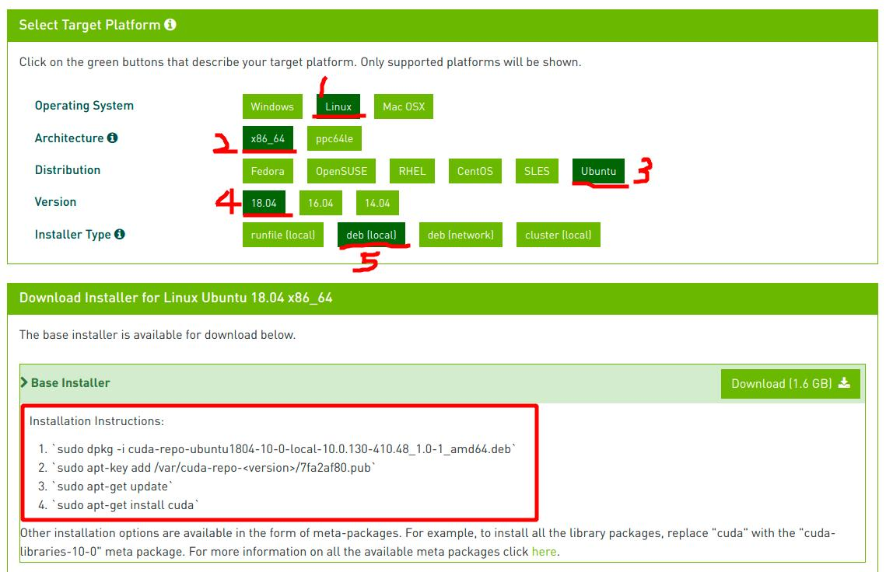
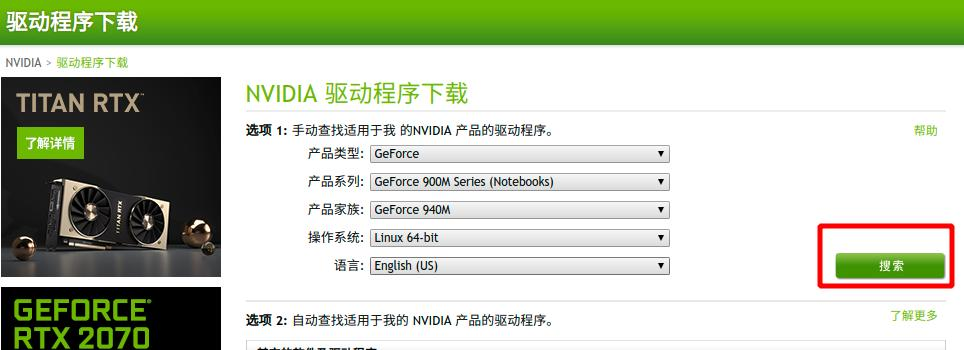

# 摘要

本文记录了1.8 深度学习环境搭建，安装CUDA，安装NVIDIA驱动，pytorch，caffe框架等等。

文章同步于: [我的gitbook](https://porter.gitbook.io/)

- [x] Edit By Porter, 积水成渊,蛟龙生焉。

<!-- more -->

# 深度学习环境搭建

## 一、安装CUDA运算平台+NVIDIA驱动

这些安装的方法很简单，官方网站有具体的安装过程，这里一步带过







### 1.1 软件简介


### 1.2 安装步骤


## 二、安装PyTorch

### 2.1 环境简介

CUDA（Compute Unified Device Architecture），是显卡厂商NVIDIA推出的运算平台。CUDA™是一种由NVIDIA推出的通用并行计算架构，该架构使GPU能够解决复杂的计算问题。 它包含了CUDA指令集架构（ISA）以及GPU内部的并行计算引擎。 开发人员现在可以使用C语言来为CUDA™架构编写程序，C语言是应用最广泛的一种高级编程语言。所编写出的程序可以在支持CUDA™的处理器上以超高性能运行。CUDA3.0已经开始支持C++和FORTRAN。

----来自百度百科

NVIDIA（纳斯达克股票代码：NVDA）是一家人工智能计算公司  。公司创立于 1993 年，总部位于美国加利福尼亚州圣克拉拉市。Jensen Huang (黄仁勋) 是创始人兼首席执行官。 

Ultra：Nvidia的旗舰级产品，为本系列中的最强者。

GTX：其性能介于GTS和Ultra之间。一般为Nvidia首发的高端产品。

GTS：始终为Nvidia第三强的产品(GeForce 2 GTS与GeForce 8800GTS均可展示出来)，性能处于GTX之下，与GT相比有些模糊。

GT：频率提升版本"GeForce Technology"的缩写，频率和管线都较LE GS SE XT有较大的提升

GS：相比GT，渲染管线或者显存位宽的缩减，频率一般在GT之下，并且由于规格限制，性能在GT之下。

LE:"Limit Edition"的缩写，表示限制版本，代表某一产系列中的入门级产品，主要是频率和规格均与标准版本相比有一定的下降。

SE：在Nvidia卡中不常出现，与LE相似。

XT:"Cost Down"表示降频率版本，将标准版的频率降低，部分产品削减了管线。

由于我在笔记本上安装的，是NVIDIA GeForce 系列，所以不介绍其他的了。

配有NVIDIA GeForce 系列GPU的台式电脑和笔记本电脑带给用户无法比拟的性能，明快的照片，高清晰的视频回放，和超真实效果的游戏。GeForce 系列的笔记本GPU还包括先进的耗电管理技术，这种技术可以在不过分耗费电池的前提下保证高性能。


### 2.2 安装方法

CUDA安装方法:linux中打开终端按照下面代码这个过程走完就好了
[CUDA 平台网站](https://developer.nvidia.com/cuda-zone)

```bash
Installation Instructions:
`sudo dpkg -i cuda-repo-ubuntu1804-10-0-local-10.0.130-410.48_1.0-1_amd64.deb`
`sudo apt-key add /var/cuda-repo-<version>/7fa2af80.pub`
`sudo apt-get update`
`sudo apt-get install cuda`
```

[NVIDIA驱动](https://www.nvidia.cn/Download/index.aspx?lang=cn)


### 2.3 使用说明


## 三、 caffe框架安装


