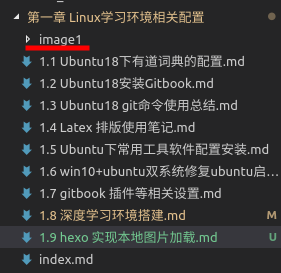
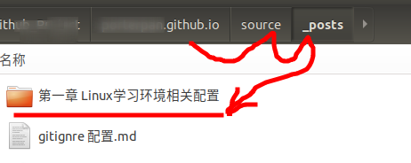
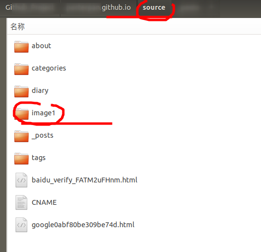

- [x] Edit By Porter, 聚水渊，聚少成多，涓涓长流。

# 摘要

本文记录了1.9 hexo 实现本地图片加载，要知道原作官方提供的hexo-asset-image，根本不能满足自己的需要，所以这里是基于原作的代码进行修改实现，原作并未其提供的代码做出解释说明，本文将对更改后能实现本地图片加载的代码进行解释，并有针对性的对后来遇到问题的，或者可以给你们提供二次修改说明的解释并提醒。

文章同步于: [我的gitbook](https://porter.gitbook.io/)

<!-- more -->

[hexo-asset-image](https://github.com/CodeFalling/hexo-asset-image),这是原作者提供的代码，有一个特别致命的问题，是每次hexo g,后，需要手动将图片一张张对应复制到public文件夹中对应你的博文对应生成的文件夹的路径下才可以实现，本地图片显示。那么问题来了，我如果写了很多博文，需要每次复制如此多的图片到不同博文对应生成的文件夹中去。太麻烦了

* 若，我是写的书的格式，分章分节，一章我有10几节，那一个文件一个文件复制太麻烦了。

# 一、要解决的问题

* 我们要解决既要加载本地图库在我们的站点显示
* 又不想一个博文一个博文区分开了分别拷贝对应图片到public文件夹中

> 假设：如果我们能够把每章节的很多文章的不同图片放到该章节的图库文件夹中，这样每章就一个图库文件，我们把图库（image1文件夹）直接复制到（source文件夹下），然后直接hexo clean && hexo g 就可以，这样不用手动添加文件到问文件夹中。

# 二、操作

## 2.1 下载原作者的文件，然后修改原文件代码

* 安装原作者的[hexo-asset-image](https://github.com/CodeFalling/hexo-asset-image)

```bash
npm install hexo-asset-image --save
```

## 2,2 原始作者的代码如下（还未经过博主修改前的代码）

```js
'use strict';
var cheerio = require('cheerio');

// http://stackoverflow.com/questions/14480345/how-to-get-the-nth-occurrence-in-a-string
function getPosition(str, m, i) {
  return str.split(m, i).join(m).length;
}

hexo.extend.filter.register('after_post_render', function(data){
  var config = hexo.config;
  if(config.post_asset_folder){
    var link = data.permalink;
	var beginPos = getPosition(link, '/', 3) + 1;
	// In hexo 3.1.1, the permalink of "about" page is like ".../about/index.html".
	var endPos = link.lastIndexOf('/') + 1;
    link = link.substring(beginPos, endPos);

    var toprocess = ['excerpt', 'more', 'content'];
    for(var i = 0; i < toprocess.length; i++){
      var key = toprocess[i];
 
      var $ = cheerio.load(data[key], {
        ignoreWhitespace: false,
        xmlMode: false,
        lowerCaseTags: false,
        decodeEntities: false
      });

      $('img').each(function(){
		if ($(this).attr('src')){
			// For windows style path, we replace '\' to '/'.
			var src = $(this).attr('src').replace('\\', '/');
			if(!/http[s]*.*|\/\/.*/.test(src) &&
			   !/^\s*\//.test(src)) {
			  // For "about" page, the first part of "src" can't be removed.
			  // In addition, to support multi-level local directory.
			  var linkArray = link.split('/').filter(function(elem){
				return elem != '';
			  });
			  var srcArray = src.split('/').filter(function(elem){
				return elem != '' && elem != '.';
			  });
			  if(srcArray.length > 1)
				srcArray.shift();
			  src = srcArray.join('/');
			  $(this).attr('src', config.root + link + src);
			  console.info&&console.info("update link as:-->"+config.root + link + src);
			}
		}else{
			console.info&&console.info("no src attr, skipped...");
			console.info&&console.info($(this));
		}
      });
      data[key] = $.html();
    }
  }
});
```

## 2.3 修改原作代码

```js
'use strict';
var cheerio = require('cheerio');

// http://stackoverflow.com/questions/14480345/how-to-get-the-nth-occurrence-in-a-string
//获取对应链接的'/'分开的某部分
function getPosition(str, m, i) {
  return str.split(m, i).join(m).length;
}

hexo.extend.filter.register('after_post_render', function(data){
  var config = hexo.config;
  if(config.post_asset_folder){
    var link = data.permalink;
    //调用上面的函数，取link链接的第三个'/'位置的数组下标值，做下面取链接的首地址区间。
	var beginPos = getPosition(link, '/', 3) + 1;
	// In hexo 3.1.1, the permalink of "about" page is like ".../about/index.html".
    //取link链接的最后一个'/'，做下面取链接的尾地址区间。
	var endPos = link.lastIndexOf('/') + 1;
    //取link连接中我们认为有用的地址部分。
    link = link.substring(beginPos, endPos);
	
    var toprocess = ['excerpt', 'more', 'content'];
    for(var i = 0; i < toprocess.length; i++){
      var key = toprocess[i];
 
      var $ = cheerio.load(data[key], {
        ignoreWhitespace: false,
        xmlMode: false,
        lowerCaseTags: false,
        decodeEntities: false
      });

      $('img').each(function(){
		if ($(this).attr('src')){
			// For windows style path, we replace '\' to '/'.
			var src = $(this).attr('src').replace('\\', '/');
			if(!/http[s]*.*|\/\/.*/.test(src) &&
			   !/^\s*\//.test(src)) {
			  // For "about" page, the first part of "src" can't be removed.
			  // In addition, to support multi-level local directory.
			  var linkArray = link.split('/').filter(function(elem){
				return elem != '';
			  });
              //取图片的名字，比如 x.png
			  var srcArray = src.split('/').filter(function(elem){
				return elem != '' && elem != '.';
			  });
			  if(srcArray.length > 1)
				srcArray.shift();
			  src = srcArray.join('/');
			  //$(this).attr('src', config.root + link + src);
			  //notes: src is image name,and config.root is localhost:port,the middle cahr string is my local image Repository
			  //这我们做判断，判断原始link链接的前3个字是不是“第一章”,如果是，我们将link地址写成'image1'，（image1是我们存放第一章所有图片的图库文件夹）
              if(link.substring(0,3)=="第一章"){
				//第一章的所有图片放到这个文件夹下
				link="image1/";	
				console.info&&console.info("judement the fist capture!");
				}
                //这我们做判断，判断原始link链接的前3个字是不是“第二章”,如果是，我们将link地址写成'image2'，（image2是我们存放第二章所有图片的图库文件夹）
			  else if(link.substring(0,3)=="第二章"){
				link="image2/";				
				console.info&&console.info("judement the second capture!");
				}
			else if(link.substring(0,3)=="第三章"){
				link="image3/";				
				console.info&&console.info("judement the third capture!");
				}
			else if(link.substring(0,3)=="第四章"){
				link="image4/";				
				console.info&&console.info("judement the fourth capture!");
				}
			else if(link.substring(0,3)=="第五章"){
				link="image5/";				
				console.info&&console.info("judement the fifth capture!");
				}
			else if(link.substring(0,3)=="第六章"){
				link="image6/";				
				console.info&&console.info("judement the sixth capture!");
				}
			else if(link.substring(0,3)=="第七章"){
				link="image7/";				
				console.info&&console.info("judement the seventh capture!");
				}

			  //$(this).attr('src', config.root + "image1/" + src);
              //这里我们做字符串的拼接，将最终输出的图片链接地址改为：config.root + link + src
              //其中config.root 是'/'表示根目录。link使我们的图库相对根目录的位置。src是图片的名字: x.png或其他格式图片
			  $(this).attr('src', config.root + link + src);
              //终端上打印调试信息，供自己调试，是否每个图片输出地址是正确的。
			  console.info&&console.info("update link as:-->"+config.root + "==" + link + "==" + src);
			}
		}else{
			console.info&&console.info("no src attr, skipped...");
			console.info&&console.info($(this));
		}
      });
      data[key] = $.html();
    }
  }
});
```
## 2.3 修改你站点文件根目录的_config.yml文件的配置信息

找到如下条，将默认的false改为true,注意_config.yml不是你的主题文件家中的文件

```
post_asset_folder: true # local image to url,revise true
```

## 2.4 我的博文目录格式如下图片所示：



## 2.5 将你的的博文直接放到你站点根目录下的：source->_post文件夹下，如下图



## 2.6 将你的所有章节的图库文件夹直接放到source文件夹中即可

如图：




