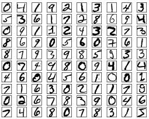
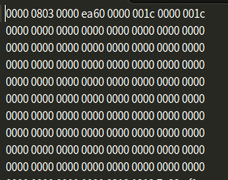

# 摘要

本文记录的是学习Pytorch 之MNIST手写字识别分类过程实现的笔记，包括MNIST分类实现的算法定义和代码实现。

- [x] Edit By Porter, 积水成渊,蛟龙生焉。

<!-- more -->

# 一、MNIST

MNIST数据集是一个关于手写的数字识别的数据集，详见[MNIST数据集官网](http://yann.lecun.com/exdb/mnist/)

## 1.1 数据集介绍

**数据集分为4个部分：**

- Training set images: [train-images-idx3-ubyte.gz](http://yann.lecun.com/exdb/mnist/train-images-idx3-ubyte.gz) (9.9 MB, 解压后 47 MB, 包含 60,000 个样本)
- Training set labels: [train-labels-idx1-ubyte.gz](http://yann.lecun.com/exdb/mnist/train-labels-idx1-ubyte.gz) (29 KB, 解压后 60 KB, 包含 60,000 个标签)
- Test set images: [t10k-images-idx3-ubyte.gz](http://yann.lecun.com/exdb/mnist/t10k-images-idx3-ubyte.gz) (1.6 MB, 解压后 7.8 MB, 包含 10,000 个样本)
- Test set labels: [t10k-labels-idx1-ubyte.gz](http://yann.lecun.com/exdb/mnist/t10k-labels-idx1-ubyte.gz) (5KB, 解压后 10 KB, 包含 10,000 个标签)

> MNIST 数据集来自美国国家标准与技术研究所, National Institute of Standards and Technology (NIST). 训练集 (training set) 由来自 250 个不同人手写的数字构成, 其中 50% 是高中学生, 50% 来自人口普查局 (the Census Bureau) 的工作人员. 测试集(test set) 也是同样比例的手写数字数据.

数据集并非-常规的文本文件或者图片文件，值得注意的是，我们下载解压后会发现文件是二进制的文件，如下图所示：

MNIST（Mixed National Institute of Standards and Technology database）是一个计算机视觉数据集，它包含70000张手写数字的灰度图片，其中每一张图片包含 28 X 28 个像素点。可以用一个数字数组来表示这张图片：

每一张图片都有对应的标签，也就是图片对应的数字，例如上面这张图片的标签就是 1

数据集被分成两部分：

60000 行的训练数据集（mnist.train）和10000行的测试数据集（mnist.test）。

> 其中：60000 行的训练集分拆为 55000 行的训练集和 5000 行的验证集。

60000行的训练数据集是一个形状为 [60000, 784] 的张量，第一个维度数字用来索引图片，第二个维度数字用来索引每张图片中的像素点。（28x28=784）在此张量里的每一个元素，都表示某张图片里的某个像素的强度值，值介于 0 和 1 之间。

## 1.2 

