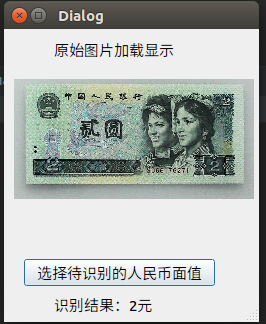
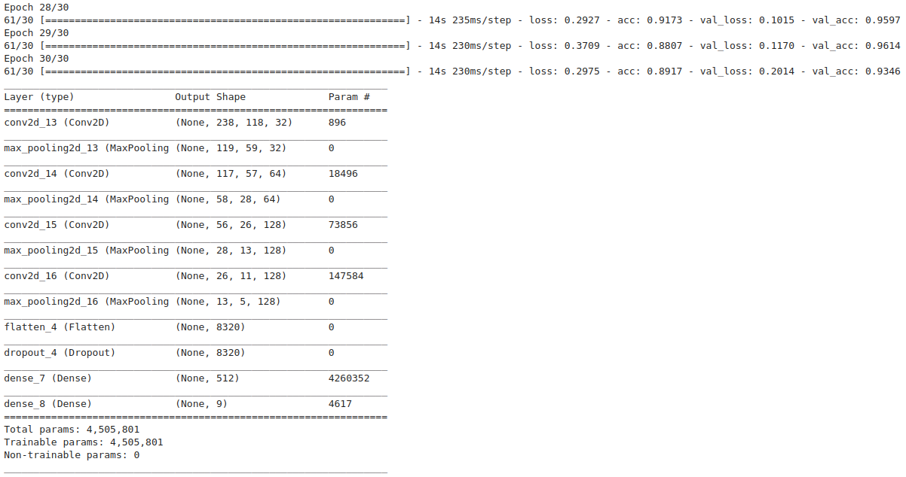
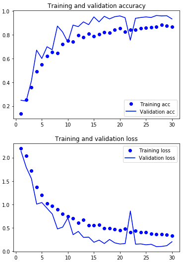

# 摘要

本文记录了人民币识别完整代码，在笔记本上运行效果。

GPU:2G

数据集地址：【练习赛】[TinyMind人民币面值及编码识别](https://www.tinymind.cn/competitions/47)

完整代码地址：[https://blog.porterpan.top/RMBRecognition/](https://blog.porterpan.top/RMBRecognition/)

<center>



</center>

- [x] Edit By Porter, 积水成渊,蛟龙生焉。

<!-- more -->

## 步骤一、数据的整理

```python
import os,shutil

face_value_label = open('./RMB_data_set/train_face_value_label.csv','r')

start_dir = './RMB_data_set/train_data/' #数据原始目录
target_dir = './RMB_data_set/mkdir_train_data/'      #数据最终目录

dictionary = {'0.1':'A','0.2':'B','0.5':'C','1':'D','2':'E','5':'F','10':'G','50':'H','100':'I'}
#采用合理的名字给文件进行命名

lable_lists = face_value_label.readlines()
si = 0
if os.path.isdir(target_dir) == False:
    os.mkdir(target_dir)
    #如果没有目标目录，就创建一个目录

max_num = len(os.listdir(start_dir))
#获得初始文件夹中图片的数量

for li in lable_lists:
    li = li[:-1]
    name_label = li.split(',')
    if name_label[0] == 'name':
        continue #第一行数据是无效数据，不进行处理
    if os.path.isfile('{0}/{1}'.format(start_dir,name_label[0])) == True:
        
        if os.path.isdir('{0}label_{1}'.format(target_dir,dictionary[name_label[1].strip()])) == False:
#             print('{0}{1}'.format(start_dir,name_label[0]))
            os.mkdir('{0}label_{1}'.format(target_dir,dictionary[name_label[1].strip()]))
        shutil.copy('{0}{1}'.format(start_dir,name_label[0]),'{0}label_{1}/{2}'.format(target_dir,dictionary[name_label[1].strip()],name_label[0]))
        #创建文件夹并移动文件
        si += 1 #记录次数
        progress = (si / max_num) * 100
        progress = round(progress,1)
        #progress = si / len(os.listdir('./val_data_test/'))
        if progress % 10 == 0:
            print('成功复制{0},进度：{1}%'.format(name_label[0],progress))
            #打印复制进度

```

## 步骤二、模型代码的编写

```python
from keras import layers
from keras import models
from keras.utils.vis_utils import plot_model
import matplotlib.pyplot as plt
#设置文件目录

#训练集
trainDir = './RMB_train_dataset/train/'      #数据最终目录
# trainDir ='H:/face_value_check/train_data/'

#验证集
# valDir = 'H:/face_value_check/val_data/'
valDir = './RMB_train_dataset/validation/'      #数据最终目录

#创建模型
model = models.Sequential()
model.add(layers.Conv2D(32, (3, 3), activation='relu',input_shape=(240, 120, 3)))
#卷积层，输出空间的维数为32,也可以说是输出特征图的深度为32，提取信息的窗口大小(3,3),卷积核的大小也为(3,3)
#激活函数relu,输入图片大小(150,150,3)
model.add(layers.MaxPooling2D((2, 2)))
#池化层，窗口大小为(2,2)，缩小特征图的尺寸
model.add(layers.Conv2D(64, (3, 3), activation='relu'))
model.add(layers.MaxPooling2D((2, 2)))
model.add(layers.Conv2D(128, (3, 3), activation='relu'))
model.add(layers.MaxPooling2D((2, 2)))
model.add(layers.Conv2D(128, (3, 3), activation='relu'))
model.add(layers.MaxPooling2D((2, 2)))
model.add(layers.Flatten())
#扁平层,将多维的输入转化为一维的输出
model.add(layers.Dropout(rate=0.5))
#这个层是可以删掉的，主要用来防止过拟合，放着也没事
model.add(layers.Dense(512, activation='relu'))
#全连接层，将提取的特征组合，得出结果
model.add(layers.Dense(9, activation='softmax'))
#因为要得出九个结果所以最后要输出九个数

#设置损失函数，优化器，模型在训练和测试时的性能指标
from keras import optimizers

model.compile(loss='categorical_crossentropy',#因为是多标签分类，所以使用categorical_crossentropy
  optimizer=optimizers.RMSprop(lr=1e-4),#这里可以设置学习率
  metrics=['acc'])

#配置图片生成器
from keras.preprocessing.image import ImageDataGenerator
#将图片像素缩小为[0,1]之间的浮点数

#本次人民币面值特征比较明显，而且会摆的整整齐齐的让你识别，数据也比较多，所以不用数据增强
train_datagen = ImageDataGenerator(
    rescale=1./255,
    rotation_range=40,#图像随机旋转的最大角度
    width_shift_range=0.2,#图片在水平位置上偏移的最大百分比值
    height_shift_range=0.2,#数值位置上
    shear_range=0.2,#随机错位切换的角度
    zoom_range=0.2,#图片随机缩放的范围
    horizontal_flip=True)#随机将一半的图片进行水平翻转

#验证集的数据不能增强
val_datagen = ImageDataGenerator(rescale=1./255)

#创建图片生成器
train_generator = train_datagen.flow_from_directory(
     trainDir,#图片地址
     target_size=(240, 120),#将图片调整为(150,150)大小
     batch_size=10,#设置批量数据的大小为20
     class_mode='categorical')#设置返回标签的类型

val_generator = val_datagen.flow_from_directory(
     valDir,
     target_size=(240, 120),
     batch_size=10,
     class_mode='categorical')

# print(valDir,trainDir)
# while True:
#     a=0
#拟合模型
history = model.fit_generator(
  train_generator,
  steps_per_epoch=30,#迭代进入下一轮次需要抽取的批次
  epochs=30,#数据迭代的轮数
  validation_data=val_generator,
  validation_steps=30)#验证集用于评估的批次

#保存模型
model.save('RMBRecongnition.h5')
model.summary()

#画出结果
import matplotlib.pyplot as plt

#history.history中就只有这四个值，分别是准确度，验证集准确度，损失，验证集损失
acc = history.history['acc']
val_acc = history.history['val_acc']
loss = history.history['loss']
val_loss = history.history['val_loss']
epochs = range(1, len(acc) + 1)

#画两个图，分别是正确率和损失
#正确率
plt.figure(1)
plt.plot(epochs, acc, 'bo', label='Training acc')
plt.plot(epochs, val_acc, 'b', label='Validation acc')
plt.title('Training and validation accuracy')
plt.legend()
plt.savefig('acc1.png')
plt.show()
#验证损失
plt.figure(2)
plt.plot(epochs, loss, 'bo', label='Training loss')
plt.plot(epochs, val_loss, 'b', label='Validation loss')
plt.title('Training and validation loss')
plt.legend()
plt.savefig('loss1.png')
plt.show()
```





## 步骤三、模型的加载
```python
# %matplotlib inline#在jupyter 内部显示图片
import matplotlib
# matplotlib.use('Agg')
import os
from keras.models import load_model
import numpy as np
from PIL import Image
import cv2

import matplotlib.pyplot as plt

min_side = 150

def process_image(img):
    size = img.shape
    h, w = size[0], size[1]
    #长边缩放为min_side 
    scale = max(w, h) / float(min_side)
    new_w, new_h = int(w/scale), int(h/scale)
    resize_img = cv2.resize(img, (new_w, new_h))
    # 填充至min_side * min_side
    if new_w % 2 != 0 and new_h % 2 == 0:
        top, bottom, left, right = (min_side-new_h)/2, (min_side-new_h)/2, (min_side-new_w)/2 + 1, (min_side-new_w)/2
    elif new_h % 2 != 0 and new_w % 2 == 0:
        top, bottom, left, right = (min_side-new_h)/2 + 1, (min_side-new_h)/2, (min_side-new_w)/2, (min_side-new_w)/2
    elif new_h % 2 == 0 and new_w % 2 == 0:
        top, bottom, left, right = (min_side-new_h)/2, (min_side-new_h)/2, (min_side-new_w)/2, (min_side-new_w)/2
    else:
        top, bottom, left, right = (min_side-new_h)/2 + 1, (min_side-new_h)/2, (min_side-new_w)/2 + 1, (min_side-new_w)/2
    pad_img = cv2.copyMakeBorder(resize_img, int(top), int(bottom), int(left), int(right), cv2.BORDER_CONSTANT, value=[0,0,0]) #从图像边界向上,下,左,右扩的像素数目
    #print pad_img.shape
    #cv2.imwrite("after-" + os.path.basename(filename), pad_img)
    return pad_img

#加载模型h5文件
model = load_model("RMBRecongnition.h5")
model.summary()
#规范化图片大小和像素值
images_1 = r'./public_test_data/0A2MIKHN.jpg'

input = cv2.imread(images_1)
# input = process_image(input)
input = cv2.resize(input, (150, 150))
input = cv2.cvtColor(input, cv2.COLOR_BGR2RGB)

plt.figure("dog")
plt.imshow(input)
plt.show()

pre_x = np.expand_dims(input, axis=0)
#调用函数，规范化图片
# pre_x = get_inputs(images)
#预测
pre_y = model.predict(pre_x)
print(pre_y)
print("预测结果输出：")
#  classes=['1Jiao', '2Jiao', '5Jiao', '2Jiao', '1Yuan', '2Yuan', '5Yuan', '10Yuan', '50Yuan', '100Yuan'],
# if pre_y[0] >0.5:
#     print("识别结果：狗狗")
# else:
#     print("识别结果：猫猫")

```

## 步骤四、模型的应用

```python
# -*- coding: utf-8 -*-

"""
Module implementing RMBRecognition.
"""

from PyQt5.QtCore import pyqtSlot
from PyQt5.QtWidgets import QDialog, QFileDialog
from PyQt5 import QtCore, QtGui, QtWidgets

from Ui_RMBRecognition import Ui_RMBRecognition

import os
from keras.models import load_model
import numpy as np
import cv2


class RMBRecognition(QDialog, Ui_RMBRecognition):
    """
    Class documentation goes here.
    """
    def __init__(self, parent=None):
        """
        Constructor
        
        @param parent reference to the parent widget
        @type QWidget
        """
        super(RMBRecognition, self).__init__(parent)
        self.setupUi(self)
        self.image_resize_target = 240
        self.model = load_model("../RMBRecongnition.h5")

    def process_image(self, img):
        min_side = self.image_resize_target
        size = img.shape
        h, w = size[0], size[1]
        # 长边缩放为min_side
        scale = max(w, h) / float(min_side)
        new_w, new_h = int(w / scale), int(h / scale)
        resize_img = cv2.resize(img, (new_w, new_h))
        # 填充至min_side * min_side
        if new_w % 2 != 0 and new_h % 2 == 0:
            top, bottom, left, right = (min_side - new_h) / 2, (min_side - new_h) / 2, (min_side - new_w) / 2 + 1, (
                        min_side - new_w) / 2
        elif new_h % 2 != 0 and new_w % 2 == 0:
            top, bottom, left, right = (min_side - new_h) / 2 + 1, (min_side - new_h) / 2, (min_side - new_w) / 2, (
                        min_side - new_w) / 2
        elif new_h % 2 == 0 and new_w % 2 == 0:
            top, bottom, left, right = (min_side - new_h) / 2, (min_side - new_h) / 2, (min_side - new_w) / 2, (
                        min_side - new_w) / 2
        else:
            top, bottom, left, right = (min_side - new_h) / 2 + 1, (min_side - new_h) / 2, (min_side - new_w) / 2 + 1, (
                        min_side - new_w) / 2
        pad_img = cv2.copyMakeBorder(resize_img, int(top), int(bottom), int(left), int(right), cv2.BORDER_CONSTANT,
                                     value=[0, 0, 0])  # 从图像边界向上,下,左,右扩的像素数目

        return pad_img

    @pyqtSlot()
    def on_pushButton_clicked(self):
        """
        Slot documentation goes here.
        """
        self.label_result.setText("识别结果： ")

        images_1, filetype = QFileDialog.getOpenFileName(self, "选取文件", "./",
                                                         "Image Files(*.jpg *.png *.jpeg *.ico)")  # 设置文件扩展名过滤,注意用双分号间隔
        pixmap = QtGui.QPixmap(images_1)
        self.label_origin_image_dis.setPixmap(pixmap.scaled(240, 120))

        input = cv2.imread(images_1)
        # input = self.process_image(input)
        input = cv2.resize(input, (120, 240))
        input = cv2.cvtColor(input, cv2.COLOR_BGR2RGB)
        pre_x = np.expand_dims(input, axis=0)
        pre_y = self.model.predict(pre_x)
        print(pre_y)
        print("预测结果输出：")

        # index_get = np.argwhere(pre_y[0]==1.)[0][0]
        index_get = np.argmax(pre_y[0])
        # print(np.argwhere(pre_y[0] == 1.))
        print(index_get)
        if(index_get == 0):
            out_label = "识别结果：1角"
        elif(index_get == 1):
            out_label = "识别结果：2角"
        elif (index_get == 2):
            out_label = "识别结果：5角"
        elif (index_get == 3):
            out_label = "识别结果：1元"
        elif (index_get == 4):
            out_label = "识别结果：2元"
        elif (index_get == 5):
            out_label = "识别结果：5元"
        elif (index_get == 6):
            out_label = "识别结果：10元"
        elif (index_get == 7):
            out_label = "识别结果：50元"
        elif (index_get == 8):
            out_label = "识别结果：100元"
        else:
            out_label = "识别结果：未识别"
        print(out_label)
        self.label_result.setText(out_label)

        # if pre_y[0] > 0.5:
        #     print("识别结果：狗狗")
        #     self.label_result.setText("识别结果：狗狗")
        # else:
        #     print("识别结果：猫猫")
        #     self.label_result.setText("识别结果：猫猫")

if __name__ == "__main__":
    import sys
    app = QtWidgets.QApplication(sys.argv)
    ui = RMBRecognition()
    icon = QtGui.QIcon()
    icon.addPixmap(QtGui.QPixmap("ico.png"), QtGui.QIcon.Normal, QtGui.QIcon.Off)
    ui.setWindowIcon(icon)
    ui.show()
    sys.exit(app.exec_())
```


