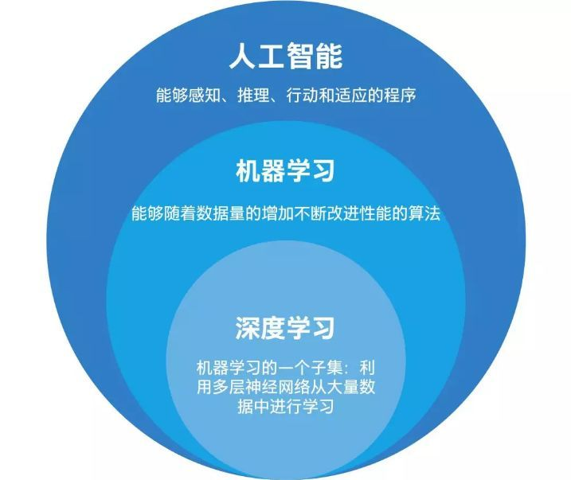
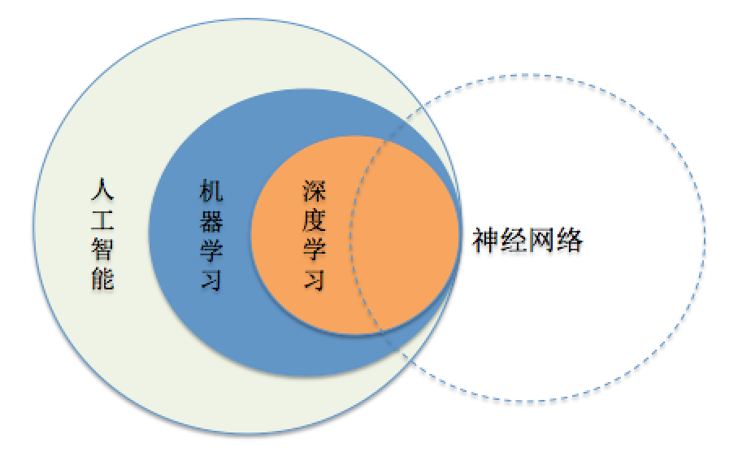
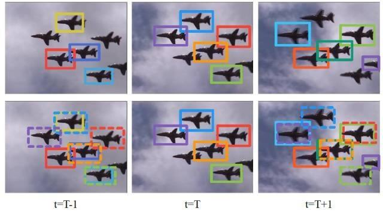
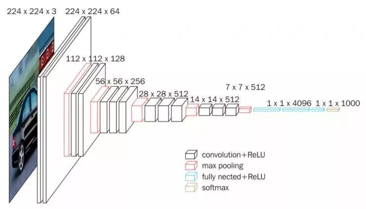
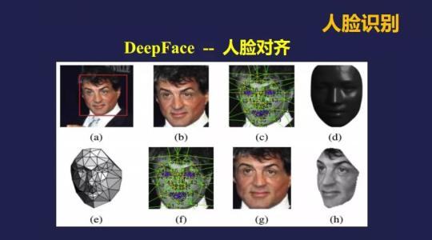
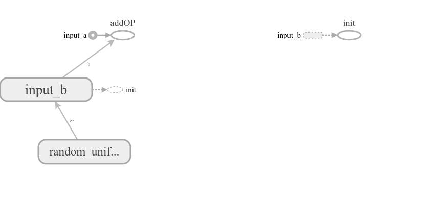

# ??

???????<<TensorFlow ??google??????>>???????, ???????????????????????????????????tensorflow????1.94?

```python
Python 3.5.6 |Anaconda, Inc.| (default, Aug 26 2018, 21:41:56) 
Type 'copyright', 'credits' or 'license' for more information
IPython 6.5.0 -- An enhanced Interactive Python. Type '?' for help.
PyDev console: using IPython 6.5.0

Python 3.5.6 |Anaconda, Inc.| (default, Aug 26 2018, 21:41:56) 
[GCC 7.3.0] on linux
In[2]: import tensorflow as tf
In[3]: tf.__version__
Out[3]: '1.9.0'
```

?????????????????????github??????github[??????](https://github.com/porterpan/tensorflow-tutorial)

- [x] Edit By Porter, ????,?????

<!-- more -->

## ??????





### ???????

- ?????
- ????
- ??????
- ????

???????????????????????

?????????????????????????????????????????AlexNet ???????ILSVRC(ImageNet LargeScale Visual Recongnition Challenge)???.





????????LFW(Labeled Faces in the Wild)?????????????DeepID2 ????99.47%?????

- ????????????????


??????????????



- ?????????

???????TIMIT????????????????(gaussian mixture model, GMM)?????21.7%?????????????17.9%. 

?2012?????????????????????????????????????????20%,


- ??????

??????????????????????????????????????????????????????????????????

- ????

AlphaGo ?????????????????????????????AlphaGo?????????????????????????????????????????????????DeepMind????????????????????????????2?API

> ?????????????????????????????????????????????????????????????????????????????????????????????????????

## TensorFlow????

?????[tensorflow????](https://www.tensorflow.org/install)

```python 
import tensorflow as tf

a = tf.constant([1.0, 2.0], name="a")
b = tf.constant([2.0, 3.0], name="b")

result = a + b

sess = tf.Session()

sess.run(result)
print(a, b, result)
```

?TensorFlow???????????????????????????????????????????result???????????(session), ??????????(session)??????

## TensorFlow??

### TensorFlow ????

TensorFlow???????Tensor?Flow?tensor?????????????????Flow???????????????????????????TensorFlow????????????????????

### TensorFlow ??????

????????????tensor a?????????a.graph????

[tf.get_default_graph](https://www.tensorflow.org/api_docs/python/tf/get_default_graph)
???????????
```python
tf.get_default_graph()

Defined in tensorflow/python/framework/ops.py.

Returns the default graph for the current thread.

The returned graph will be the innermost graph on which a Graph.as_default() context has been entered, or a global default graph if none has been explicitly created.

NOTE: The default graph is a property of the current thread. If you create a new thread, and wish to use the default graph in that thread, you must explicitly add a with g.as_default(): in that thread's function.

Returns:
The default Graph being used in the current thread.
```

???????????????????????????????

```python
print(a.graph is tf.get_default_graph())
```

???true????????????????????????

TensorFlow????tf.Grap?????????????????????????????????????????????????????

> ?????????????????????????????????????????????????????????????????????????????????????????????????????????????????????????????????????????????????????????????????????????????????????????????????????????????????????????????????????????????????????????????????????????????

[tf.Graph](https://www.tensorflow.org/api_docs/python/tf/Graph)
?????????,??????????????????tensorflow????????

Class Graph
Defined in tensorflow/python/framework/ops.py.

A TensorFlow computation, represented as a dataflow graph.

A Graph contains a set of tf.Operation objects, which represent units of computation; and tf.Tensor objects, which represent the units of data that flow between operations.

A default Graph is always registered, and accessible by calling tf.get_default_graph. To add an operation to the default graph, simply call one of the functions that defines a new Operation:

```python
c = tf.constant(4.0)
assert c.graph is tf.get_default_graph()
```

Another typical usage involves the tf.Graph.as_default context manager, which overrides the current default graph for the lifetime of the context:

```python
g = tf.Graph()
with g.as_default():
  # Define operations and tensors in `g`.
  c = tf.constant(30.0)
  assert c.graph is g
```

### ???TensorFlow ???

```python
import tensorflow as tf
a = tf.constant([1.0,2.0,3.0], name='input_a')
b = tf.Variable(tf.random_uniform([3]), name='input_b')
add = tf.add_n([a, b], name='addOP')

with tf.Session() as sess:
    sess.run(tf.global_variables_initializer())
    writer = tf.summary.FileWriter("./logs", sess.graph)
    print(sess.run(add))
writer.close()
```

???????????????tensorflow??????

```python
tensorboard --logdir=logs
```
--logdir=logs??logs????????????

?????????

```python
porter@porter-Aspire:~/??/????/MNIST$ tensorboard --logdir=logs
W0417 10:54:21.140615 Reloader tf_logging.py:120] Found more than one graph event per run, or there was a metagraph containing a graph_def, as well as one or more graph events.  Overwriting the graph with the newest event.
W0417 10:54:21.153187 Reloader tf_logging.py:120] Found more than one graph event per run, or there was a metagraph containing a graph_def, as well as one or more graph events.  Overwriting the graph with the newest event.
W0417 10:54:21.153477 Reloader tf_logging.py:120] Found more than one metagraph event per run. Overwriting the metagraph with the newest event.
TensorBoard 1.9.0 at http://porter-Aspire:6006 (Press CTRL+C to quit)

```
??????????http://porter-Aspire:6006???????????????



什么


