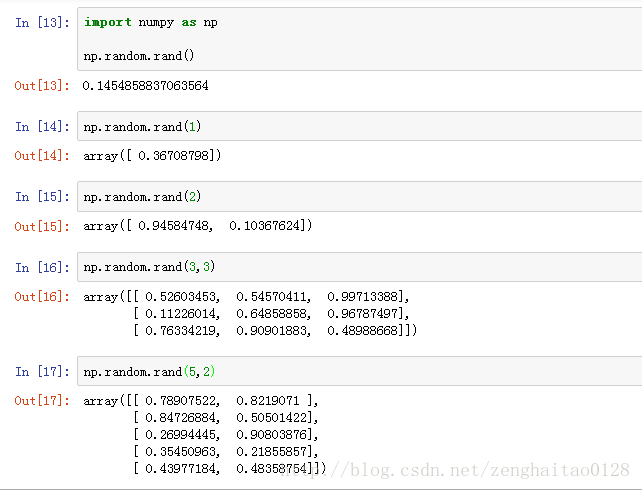
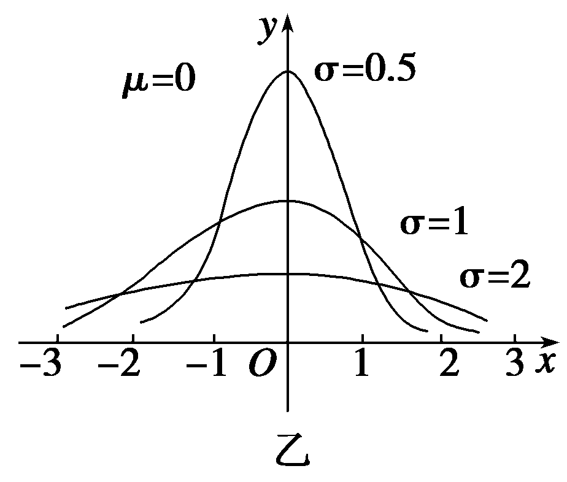
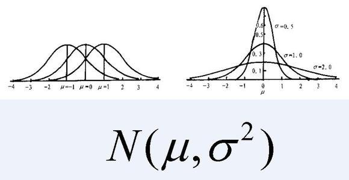
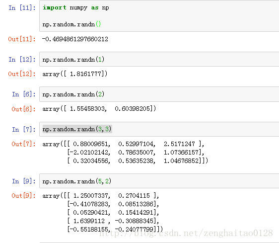
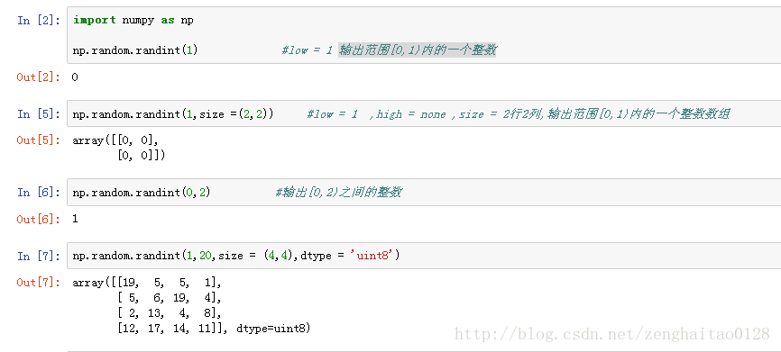

# 摘要

本节主要是学习numpy的函数调用，主要是基础的学习路线，包括简单的实例笔记等。

<!-- TOC -->

- [摘要](#摘要)
        - [np.random.rand()函数](#nprandomrand函数)
            - [语法：](#语法)
        - [np.random.randn()函数](#nprandomrandn函数)
            - [语法：](#语法-1)
        - [np.random.randint()函数](#nprandomrandint函数)
            - [语法：](#语法-2)
    - [np堆叠数组](#np堆叠数组)
        - [numpy.vstack(tup)](#numpyvstacktup)
            - [语法：](#语法-3)
        - [numpy.stack()](#numpystack)

<!-- /TOC -->


- [x] Edit By Porter, 积水成渊,蛟龙生焉。

<!-- more -->

### np.random.rand()函数

#### 语法：
- np.random.rand(d0,d1,d2……dn)

> 注：使用方法与np.random.randn()函数相同 

- 返回值：

通过本函数可以返回一个或一组服从“0~1”均匀分布的随机样本值。随机样本取值范围是[0,1)，不包括1。 




### np.random.randn()函数

#### 语法：
- np.random.randn(d0,d1,d2……dn) 

1) 当函数括号内没有参数时，则返回一个浮点数； 

2) 当函数括号内有一个参数时，则返回秩为1的数组，不能表示向量和矩阵； 

3) 当函数括号内有两个及以上参数时，则返回对应维度的数组，能表示向量或矩阵； 

4) np.random.standard_normal（）函数与np.random.randn()类似，但是np.random.standard_normal（）
的输入参数为元组（tuple）. 

5) np.random.randn()的输入通常为整数，但是如果为浮点数，则会自动直接截断转换为整数。

- 返回值：

通过本函数可以返回一个或一组服从标准正态分布的随机样本值。

- 特点：

标准正态分布是以0为均值、以1为标准差的正态分布，记为N($\mu, \sigma$)～（0，1）。对应的正态分布曲线如下所示，即 



更为具体的示意图如下



代码输出效果如下



### np.random.randint()函数

#### 语法：
- numpy.random.randint(low, high=None, size=None, dtype=’l’) 

- 输入： 

low—–为最小值 

high—-为最大值 

size—–为数组维度大小 

dtype—为数据类型，默认的数据类型是np.int。 

- 返回值： 

返回随机整数或整型数组，范围区间为[low,high），包含low，不包含high； 

high没有填写时，默认生成随机数的范围是[0，low）



---

## np堆叠数组

- stack()，hstack()，vstack()函数

### numpy.vstack(tup)

#### 语法：

np.vstack((a,b))

- Parameters:

tup : sequence of ndarrays

The arrays must have the same shape along all but the first axis. 1-D arrays must have the same length.

- Returns:	

stacked : ndarray

The array formed by stacking the given arrays, will be at least 2-D.

```python
>>> a = np.array([[1], [2], [3]])
>>> b = np.array([[2], [3], [4]])
>>> np.vstack((a,b))
array([[1],
       [2],
       [3],
       [2],
       [3],
       [4]])
```

### numpy.stack()


