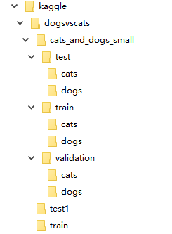
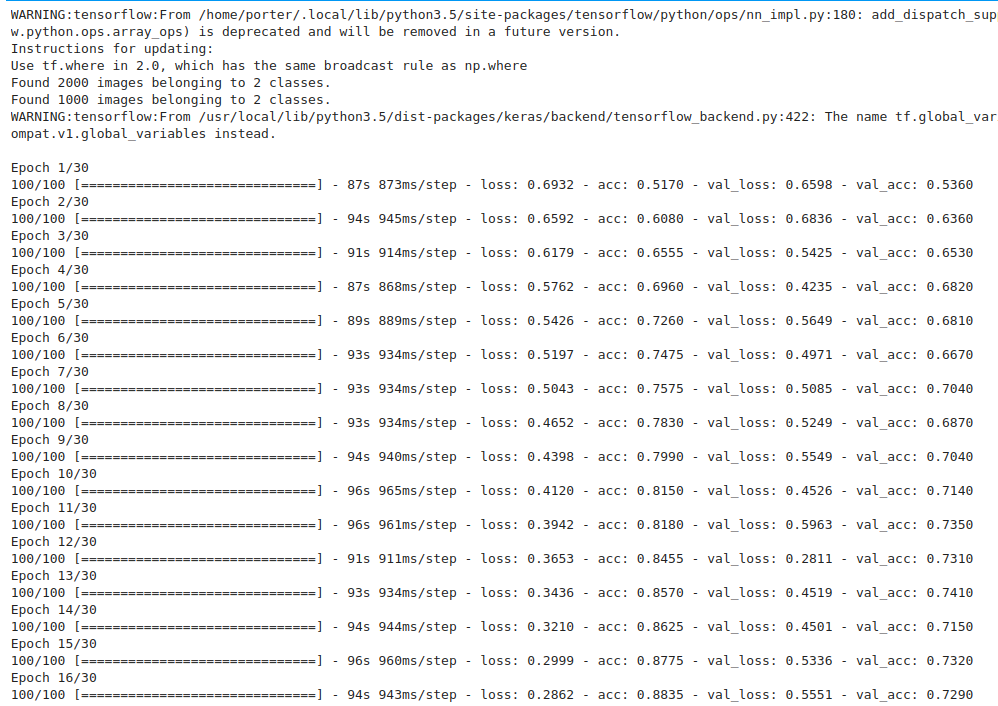
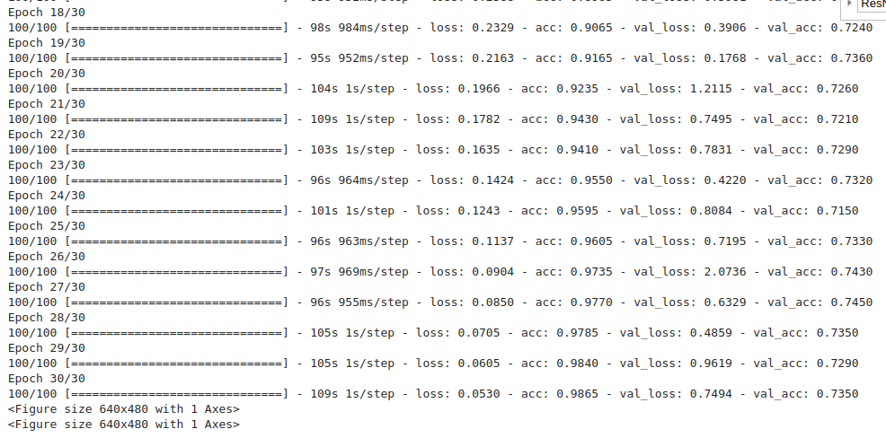
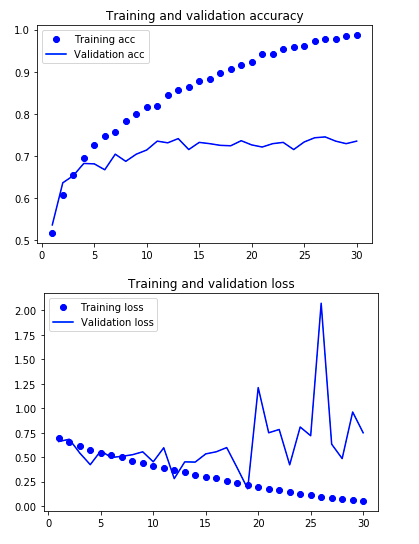

# 摘要

本节主要是学习keras的相关模型搭建，通过猫狗分类来进一步学习keras

<center>


</center>

### 样本数据预处理

- 将数据集中的train压缩包解压
- 得到train文件夹，并将该文件夹中的样本数据分为3部分train,validation,test
- 每部分的样本都包括dog和cat文件夹（都来自train的解压包数据）

### 训练神经网络

- 三层卷积神经网络
- 2层全连接网络
- 数据增强手段
- 开始模型训练

### 使用模型

- 保存模型训练参数
- 根据前面的训练模型，搭建可识别的网络
- 随便选择一个test文件夹中的图片
- 输出，猫和狗的类名


- [x] Edit By Porter, 积水成渊,蛟龙生焉。

<!-- more -->

## 第一部分 样本数据预处理

样本的获取地址：[https://www.kaggle.com/c/dogs-vs-cats/data](https://www.kaggle.com/c/dogs-vs-cats/data)

将train 文件夹中的样本数据分成如下图所示的训练样本和验证和测试三种样本类



具体的代码如下：

```python
import os, shutil

# 数据集解压之后的目录
original_dataset_dir = './train/'
# 存放小数据集的目录
base_dir = './train_data/cats_and_dogs_small'
os.mkdir(base_dir)

# 建立训练集、验证集、测试集目录
train_dir = os.path.join(base_dir, 'train')
os.mkdir(train_dir)
validation_dir = os.path.join(base_dir, 'validation')
os.mkdir(validation_dir)
test_dir = os.path.join(base_dir, 'test')
os.mkdir(test_dir)

# 将猫狗照片按照训练、验证、测试分类
train_cats_dir = os.path.join(train_dir, 'cats')
os.mkdir(train_cats_dir)

train_dogs_dir = os.path.join(train_dir, 'dogs')
os.mkdir(train_dogs_dir)

validation_cats_dir = os.path.join(validation_dir, 'cats')
os.mkdir(validation_cats_dir)

validation_dogs_dir = os.path.join(validation_dir, 'dogs')
os.mkdir(validation_dogs_dir)

test_cats_dir = os.path.join(test_dir, 'cats')
os.mkdir(test_cats_dir)

test_dogs_dir = os.path.join(test_dir, 'dogs')
os.mkdir(test_dogs_dir)

# 切割数据集
fnames = ['cat.{}.jpg'.format(i) for i in range(1000)]
for fname in fnames:
    src = os.path.join(original_dataset_dir, fname)
    dat = os.path.join(train_cats_dir, fname)
    shutil.copyfile(src, dat)

fnames = ['cat.{}.jpg'.format(i) for i in range(1000, 1500)]
for fname in fnames:
    src = os.path.join(original_dataset_dir, fname)
    dat = os.path.join(validation_cats_dir, fname)
    shutil.copyfile(src, dat)

fnames = ['cat.{}.jpg'.format(i) for i in range(1500, 2000)]
for fname in fnames:
    src = os.path.join(original_dataset_dir, fname)
    dat = os.path.join(test_cats_dir, fname)
    shutil.copyfile(src, dat)

fnames = ['dog.{}.jpg'.format(i) for i in range(1000)]
for fname in fnames:
    src = os.path.join(original_dataset_dir, fname)
    dat = os.path.join(train_dogs_dir, fname)
    shutil.copyfile(src, dat)

fnames = ['dog.{}.jpg'.format(i) for i in range(1000, 1500)]
for fname in fnames:
    src = os.path.join(original_dataset_dir, fname)
    dat = os.path.join(validation_dogs_dir, fname)
    shutil.copyfile(src, dat)

fnames = ['dog.{}.jpg'.format(i) for i in range(1500, 2000)]
for fname in fnames:
    src = os.path.join(original_dataset_dir, fname)
    dat = os.path.join(test_dogs_dir, fname)
    shutil.copyfile(src, dat)

```


## 第二部分 开始搭建模型和训练模型参数

代码如下：

```python
from keras import layers
from keras import models
import matplotlib.pyplot as plt
from keras import optimizers
from keras.preprocessing.image import ImageDataGenerator

train_dir = r'./train_data/cats_and_dogs_small/train/'
validation_dir = r'./train_data/cats_and_dogs_small/validation/'


model = models.Sequential()
model.add(layers.Conv2D(32, (3, 3), activation='relu', input_shape=(150, 150, 3)))
model.add(layers.MaxPool2D((2, 2)))

model.add(layers.Conv2D(64, (3, 3), activation='relu'))
model.add(layers.MaxPool2D((2, 2)))

model.add(layers.Conv2D(128, (3, 3), activation='relu'))
model.add(layers.MaxPool2D((2, 2)))

model.add(layers.Conv2D(128, (3, 3), activation='relu'))
model.add(layers.MaxPool2D((2, 2)))

model.add(layers.Flatten())
model.add(layers.Dense(512, activation='relu'))
model.add(layers.Dense(1, activation='sigmoid'))

model.compile(loss='binary_crossentropy', optimizer=optimizers.RMSprop(lr=1e-4), metrics=['acc'])


# 调整像素值
train_datagen = ImageDataGenerator(rescale=1./255)
test_datagen = ImageDataGenerator(rescale=1./255)

train_generator = train_datagen.flow_from_directory(
    directory=train_dir,
    target_size=(150, 150),
    batch_size=20,
    class_mode='binary')

validation_generator = test_datagen.flow_from_directory(
    directory=validation_dir,
    target_size=(150, 150),
    batch_size=20,
    class_mode='binary')

history = model.fit_generator(
    train_generator,
    steps_per_epoch=100,
    epochs=30,
    validation_data=validation_generator,
    validation_steps=50)

model.save('cats_and_dogs_small_1.h5')

acc = history.history['acc']
val_acc = history.history['val_acc']
loss = history.history['loss']
val_loss = history.history['val_loss']

epochs = range(1, len(acc) + 1)
plt.plot(epochs, acc, 'bo', label='Training acc')
plt.plot(epochs, val_acc, 'b', label='Validation acc')
plt.title('Training and validation accuracy')
plt.legend()

plt.figure()

plt.plot(epochs, loss, 'bo', label='Training loss')
plt.plot(epochs, val_loss, 'b', label='Validation loss')
plt.title('Training and validation loss')
plt.legend()

plt.show()

```

训练过程的图片如下图：






