# 马尔科夫链

## 摘要：

状态空间中经过从一个状态到另一个状态的转换的随机过程，需要具备“无记忆”的性质：下一状态的概率分布只能由当前状态决定，在时间序列中它前面的事件均与之无关。这种特定类型的“无记忆性”称作马尔可夫性质。

### 一、常见的马尔可夫过程：

(1) 独立随机过程为马尔可夫过程。

(2) 独立增量过程为马尔可夫过程：没{X(t)，t∈[0，+∞)}为一独立增量过程，且有P(X(0)=x0)=1，x0为常数，则X(t)为马尔可夫过程。

(3) 泊松过程为马尔可夫过程。

(4) 维纳过程为马尔可夫过程。

(5) 质点随机游动过程为马尔可夫过程。


## 二、模型的创立条件

* 无后效性---只与前一时刻状态相关和其他历史时刻无关。

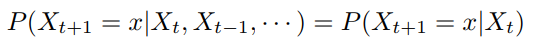

图2-1 马尔科夫表示式

* 系统平稳性---平稳分布（马尔可夫链的）具有某种不变（或者说平稳）性质的概率分布。

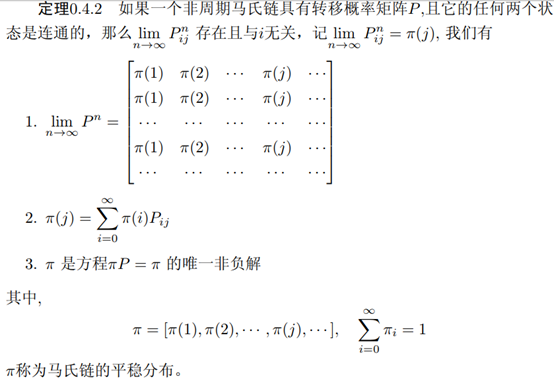

图2-2 马尔科夫平稳分布表示式

### 2.1 无后效性

状态空间中经过从一个状态到另一个状态的转换的随机过程。该过程要求具备“无记忆”的性质：下一状态的概率分布只能由当前状态决定，在时间序列中它前面的事件均与之无关。这种特定类型的“无记忆性”称作马尔可夫性质。马尔科夫链作为实际过程的统计模型具有许多应用。

在马尔可夫链的每一步，系统根据概率分布，可以从一个状态变到另一个状态，也可以保持当前状态。状态的改变叫做转移，与不同的状态改变相关的概率叫做转移概率。随机漫步就是马尔可夫链的例子。随机漫步中每一步的状态是在图形中的点，每一步可以移动到任何一个相邻的点，在这里移动到每一个点的概率都是相同的（无论之前漫步路径是如何的）。

--------------------- 
作者：bitcarmanlee 
来源：CSDN 
原文：https://blog.csdn.net/bitcarmanlee/article/details/82819860 
版权声明：本文为博主原创文章，转载请附上博文链接！

### 2.2 平稳分布概念

* 平稳分布是一种概率分布。平稳分布（马尔可夫链的）具有某种不变（或者说平稳）性质的概率分布。

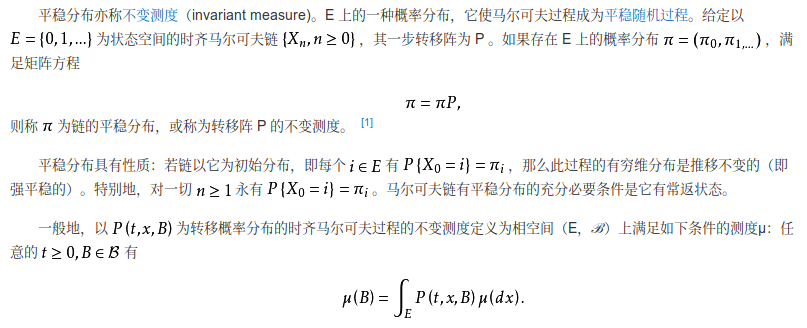

图2-3 平稳分布，百度百科解释

## 三、马尔科夫相关的例子

直接看理论是有点头痛的，但是接下来直接上例子，学习致用，在应用中学习。

### 3.1 马尔科夫股市模型实例

假设股市三种状态：牛市（Bull market）, 熊市（Bear market）和横盘（Stagnant market），每一个状态都以一定的概率转化到下一个状态。

#### 3.1 题设

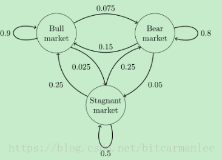

图3-1 股市概率转移状态图

比如，牛市以0.025的概率转化到横盘的状态。这个状态概率转化图可以以矩阵的形式表示。如果我们定义矩阵阵P某一位置P(i, j)的值为P(j|i)， **即从状态i变为状态j的概率** 。另外定义牛市、熊市、横盘的状态分别为0、1、2，这样我们得到了马尔科夫链模型的状态转移矩阵为：

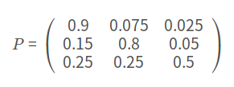

图3-2 马尔科夫状态转移概率矩阵

当这个状态转移矩阵P确定以后，整个股市模型就已经确定！

#### 3.1.1 用计算结果说明马尔科夫的性质（无后效性，和系统平稳性）

* 步骤一、假设初始状态：t0​=[0.1,0.2,0.7]，然后算之后的状态。
* 步骤二、计算方法是用这个初始的状态分布概率向量(t0)点乘我们的马尔科夫状态转移概率矩阵(P)。
* 如图2-2 所说的，当P^n --> 会趋向一个稳定的转移概率矩阵

Python 代码验证：

```Python
import numpy as np
def markov(): 
    init_array = np.array([0.1, 0.2, 0.7]) 
    transfer_matrix = np.array([[0.9, 0.075, 0.025], 
                                [0.15, 0.8, 0.05], 
                                [0.25, 0.25, 0.5]]) 
    restmp = init_array for i in range(25): 
        res = np.dot(restmp, transfer_matrix) 
        print i, "\t", 
        res restmp = res 
markov()
```
执行以上代码后，输出结果，如图所示

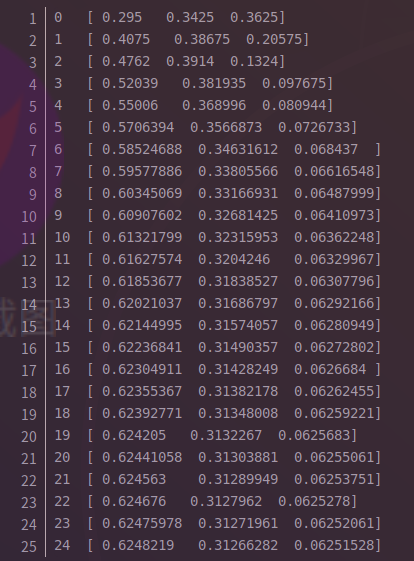

图3-3 马尔科夫股市代码输出

从第18次开始，状态就开始收敛至[0.624,0.312,0.0625]。最终数字上略有不同，只是计算机浮点数运算造成的罢了。

如果我们换一个初始状态t0​，比如[0.2,0.3.0.5]，继续运行上面的代码，只是将init_array变一下，最后结果为：

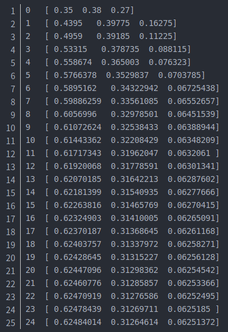

到第18次的时候，又收敛到了[0.624,0.312,0.0625]!
这个转移矩阵就厉害了。不管我们的初始状态是什么样子的，只要状态转移矩阵不发生变化，当n→∞时，最终状态始终会收敛到一个固定值。

#### 3.1.2 后续接着代码验证 图2-2 马尔科夫平稳分布表示式（3点）

我们也看看这个状态转移矩阵P的25(本是n->∞幂次方) 幂次方有什么有意思的地方？

```Python
def matrixpower(): 
    transfer_matrix = np.array([[0.9, 0.075, 0.025], 
                                [0.15, 0.8, 0.05], 
                                [0.25, 0.25, 0.5]]) 
    restmp = transfer_matrix 
    for i in range(25): 
        res = np.dot(restmp, transfer_matrix) 
        print i, "\t", res 
        restmp = res 
matrixpower()
```

执行以上代码

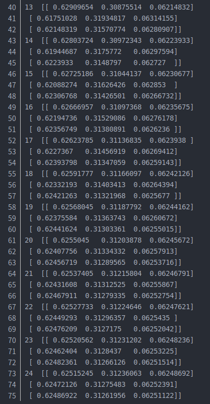

发现了，从第20次开始，结果开始收敛，并且每一行都为[0.625,0.312,0.0625]!

再次验证了图2.2的定理0.4.2的 

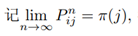

-----

#### 3.1.2 马尔科夫的人类上中下阶层分布模型

假设，社会学家把人按其经济状况分为3类：下层，中层，上层，我们用1,2,3表示这三个阶层。社会学家发现决定一个人的收入阶层最重要的因素就是其父母的收入阶层。如果一个人的收入属于下层类别，则它的孩子属于下层收入的概率为0.65，属于中层收入的概率为0.28，属于上层收入的概率为0.07。从父代到子代，收入阶层转移概率如下


* 我们用P表示这个转移矩阵，则

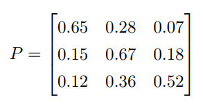

* 假设第1代人的阶层比例为


* 则前10代人的阶层分布如下

> 第二代人是第一代任PI0，点乘以P（转移概率），
第三代人是第二代人点乘以P

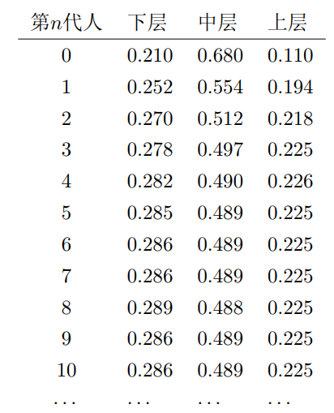

我们可以看到，在相同的转移矩阵作用下，状态变化最终会趋于平稳。对于第n代人的阶层分布，我们有

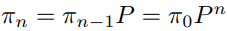

从表达式上我们可以看到，π是一维向量，P是两维矩阵，P进行足够多次自乘后，值趋于**稳定**。

#### 3.1.3 马尔科夫的人类农村转城市人口分布模型

假设城市化进程中，农村人转移为城市人的概率为0.5，城市人转移为农村人的概率为0.1。

| 人口|农村人|城市人|
|:----:|:----:|:----:|
|农村人| 0.5| 0.5|
|城市人| 0.1| 0.9|

假设一开始有100个农村人，0个城市人，每代转移人数矩阵如下

|代数|农村人|城市人|农村人转移为城市人|城市人转移为农村人|
|:------|:------|:------|:------|:------|
|1|100|0|50|0|
|2|50|50|25|5|
|3|30|70|15|7|
|4|22|78|11|8|
|5|19|81|10|8|
|6|17|83|8|8|
|7|17|83|8|8|

可以看到，城市化进程中马尔科夫平稳状态就是农村人转移为城市人的速度等于城市人转移为农村人的速度。对于上述转移矩阵P，平稳分布为农村人17%，城市人83%。如果我们可以得到当前中国城市化转移矩阵P，我们就可以算出中国最终城市化率大概为多少（这里不考虑P的变化）。同时如果我们知道了中国城市化人口比例，我们就能知道城市化进程还可以持续多少代人。

----

## 四、总结

### 4.1 马尔科夫的平稳随机性

* 非周期马氏链：马氏链转移要收敛，就一定不能是周期性的。不做特别处理，我们处理的问题基本上都是非周期性的

* 存在概率转移矩阵P，任意两个状态是连通的，如上，例题中的每个不同的阶层人的角色通过某种方式，他们之间是可以相互转化，前后转化的两种状态是联通的可以转化的，底层人士可以转化成中层等。

> 不论初始状态是什么，经过足够多次概率转移后，会存在一个稳定的状态π。
> 概率转移矩阵自乘足够多次后，每行值相等。即

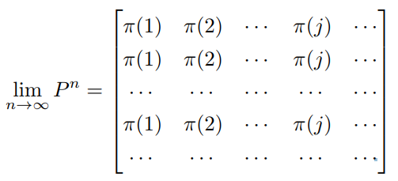

* 显然，由于马氏链稳定后，所有状态转移到状态j的概率之和稳定。

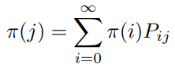

* 则π为马氏链稳定状态，并且π是方程π=πP的唯一非负解。结合上面结论，很明显。

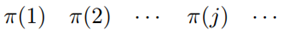


