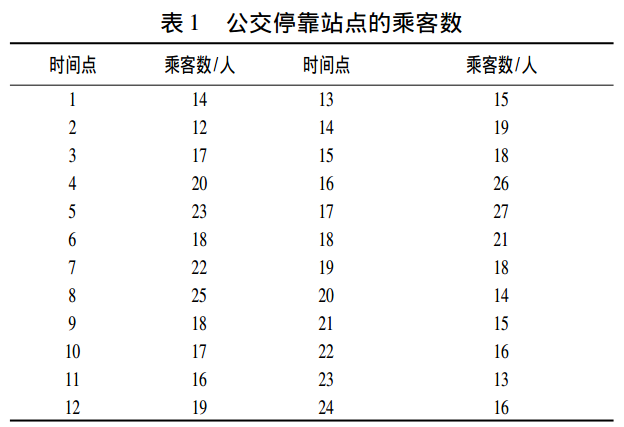
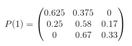
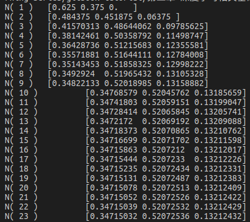
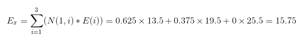
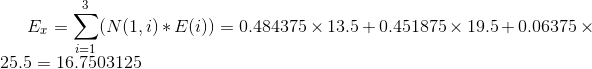
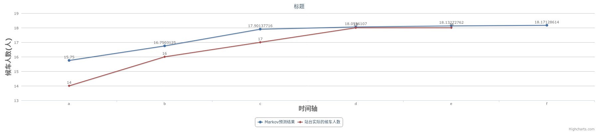
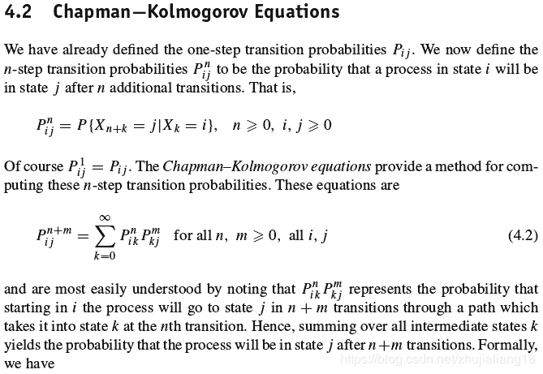
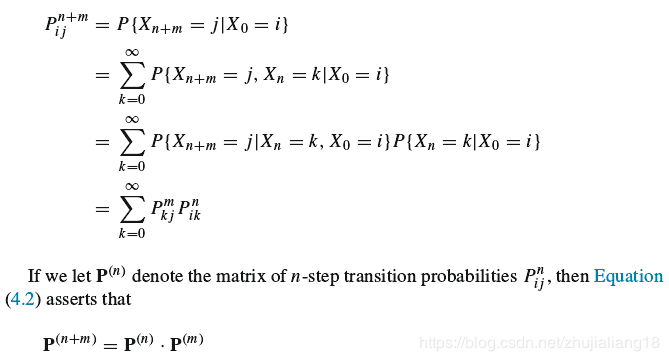
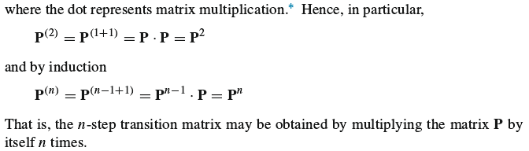

- [x] Edit By Porter, 积水成渊,蛟龙生焉。

# 摘要

本篇文章笔记总结来自网络和书本，引用部分都有来源，内容主要介绍马尔科夫相关实际应用搞得入门例子，很简单，但是能说明马尔科夫的原理相关。

文章同步于: [我的gitbook](https://porter.gitbook.io/)

<!-- more -->

# 马尔科夫简单模型预测实战笔记


## 一、基于马尔可夫链的公交停靠站乘客数预测

### 1.1 题设

* 假设站点乘客数的状态具有马尔可夫性，当某一时刻有公交车停靠时， 会有一些乘客上车， 则下一时刻车辆到达时停靠站的乘客数与这一时刻剩余的乘客相关， 这一特征符合了马尔可夫链的马尔可夫性，同时在任意时刻的候车乘客只与上一时刻的乘客数相关， 而与候车时间无关。----满足马尔科夫。

* 数据

> 以该停靠站点的候车乘客数为统计对象， 按照离散时间， 在状态转移中将以时间间隔为五分钟而对停靠站点的乘客数进行计数。以工作日某一天的上午8∶ 00 ～ 10∶ 00 的两小时为统计的时间段， 其中第一组数据为时刻 8∶05 时的乘客数， 可得到 24 组数据。如下图所示：



图1-1 8-10点的24组数据

由表 1 可知， 该站点的乘客数区间为［12， 27］，为保证预测的准确性， 根据建模步骤可将站点的乘客数分为 3 种状态， 即状态空间为( E1， E2， E3 ) ， 其中 E1 表示乘客数为 11 ～ 16， E2 表示乘客数为 17 ～22， E3 表示乘客数为 23 ～ 28， 因此有乘客数状态空间的频数分布， 如表 2 所示。

* 于是得到对应上表的如下状态分布表

表二

| 时间点|乘客人数|时间表|乘客人数|时间表|乘客人数|时间表|乘客人数|
|:---|:---|:---:|:---:|---:|---:|:---:|:---:|
|1 |E1|7 |E2|13|E1|9|E2|
|2 |E1|8 |E3|14|E2|20|E1|
|3 |E2|9 |E2|15|E2|21|E1|
|4 |E2|10|E2|16|E3|22|E1|
|5 |E2|11|E1|17|E3|22|E1|
|6 |E2|12|E2|18|E2|24|E1|

于是可以得到状态转移频次表如下表所示：

表三

|单位(人) |E1|E2|E3|
|:---|:---:|:---:|:---:|
|E1|5 |3 |0 |
|E2|3 |7 |2 |
|E3|0 |2 |1 |


### 1.2 计算模型

根据马尔可夫变量的特征， 结合变量状态转移概率矩阵， 对站点乘客数的预测步骤如下:

统计时需注意: 引起乘客数状态变化的转入包括下车后仍留在站点候车的乘客; 引起乘客数状态变化的转出则包括经过停靠车辆后上车的乘客， 则有表 1。

由表二可统计得到如下信息：

|  |E1|E2|E3|
|:---:|:---:|:---:|:---:|
|当前统计总数(人)|8|12|3|

由此可得到表三对应的转移概率矩阵，如下

| 转移概率 |E1 |E2 |E3|
|:---:|:---:|:---:|:---:|
|E1 |5/8|3/8|0/8|
|E2 |3/12|7/12|2/12|
|E3 |0/3|2/3|1/3|

即：

| 转移概率 |E1 |E2 |E3|
|:---:|:---:|:---:|:---:|
|E1 |0.625|0.375|0|
|E2 |0.25|0.58|0.17|
|E3 |0|0.67|0.33|



* 设初始时刻的状态分布为10点的时刻。由于10点出行人数是14人，在E1(11~16)之间，故设出事时刻的概率分布为:

N(0)=(1, 0, 0)

由N(1)=N(0).*P(1)=(0.625, 0.375, 0)

```Python
import numpy as np
def markov(): 
    init_array = np.array([1, 0, 0]) 
    transfer_matrix = np.array([[0.625, 0.375, 0], 
                                [0.25, 0.58, 0.17], 
                                [0, 0.67, 0.33]]) 
    restmp = init_array 
    for i in range(25): 
        res = np.dot(restmp, transfer_matrix) 
        print('N(',i+1,')', "\t", res ) 
        restmp = res 
  
markov()
```



> N(0), 代表10：00的乘客数。N(1)代表10:05分的乘客数.N(2)代表10:10分的乘客数，以此类推。

* 取上面设定的状态范围（11~16）， （17-22）， （18~28），分别对上面的取值区间做中值得到13.5， 19.5， 25.5； 

- 设 E1=13.5, E2=19.5, E3=25.5.

由10:05分的站点乘客数量状态分布，N(1)=[0.625, 0.375, 0],和E=[13.5, 19.5, 25.5]可求得10:05的期望值Ex

$$
E_{x}=\sum_{i=1}^{3} (N(1,i)*E(i)) = 0.625\times 13.5 + 0.375\times19.5 + 0\times25.5 = 15.75
$$



> 在概率论和统计学中，数学期望(mean)（或均值，亦简称期望）是试验中每次可能结果的概率乘以其结果的总和，是最基本的数学特征之一。它反映随机变量平均取值的大小。

即，在10:05的时刻，车站人数最可能有15.75个人在等车。

同理在10:10分，N(2)=[0.484375, 0.451875, 0.06375], 则此时刻（10:05），车站最可能（该时刻的期望值）出现的候车人数经计算为： 16.7503125（人），具体计算过程如下：

$$
E_{x}=\sum_{i=1}^{3} (N(1,i)*E(i)) 
     = 0.484375\times 13.5 + 0.451875\times19.5 + 0.06375\times25.5 
     = 16.7503125     
$$

* 推荐下[在线Latex公式编辑网站](https://www.codecogs.com/latex/eqneditor.php)



10:15时刻，10:20时刻，10:25时刻，......计算方法一次类推，于是可得到整个时间段站台候车人数的预测表，如下表：

|时刻| 状态|转移率|站台乘客数预测值|站台人数实际值|
|:---|:---|:---|:---|:---|
|      |E1 |0.625 |--- |--- |
|10:05 |E2 |0.375 |15.75 |14 |
|      |E3 |0 |--- |--- |
|---|---|---|---|---|
|      |E1 |0.484375 |--- |--- |
|10:10 |E2 |0.50358792 |16.7503125 |16 |
|      |E3 |0.09785625 |--- |--- |
|---|---|---|---|---|
|      |E1 |0.38142461 |--- |--- |
|10:15 |E2 |0.50358792 |17.90137716 |17 |
|      |E3 |0.11498747 |--- |--- |
|---|---|---|---|---|
|      |E1 |0.36428736 |--- |--- |
|10:20 |E2 |0.51215683 |18.0556107 |18 |
|      |E3 |0.12355581 |--- |--- |
|---|---|---|---|---|
|      |E1 |0.35571881 |--- |--- |
|10:25 |E2 |0.51644111 |18.13272762 |18 |
|      |E3 |0.12784008 |--- |--- |
|---|---|---|---|---|
|      |E1 |0.35143453 |--- |--- |
|10:30 |E2 |0.51858325 |18.17128614 |18 |
|      |E3 |0.12998222 |--- |--- |

* 以上的基于马尔科夫的模型预测和实际值的趋势图如下图所示：



图像在线生成：[推荐下在线绘图做表的网站](http://charts.udpwork.com/)

> 预测结果表明在马尔可夫链理论下的预测会受到时间长短的影响， 在短时间内的统计， 预测结果与实际值间的误差较为明显， 当统计量足够多时， 预测的趋势会更加符合实际情况。

* [C-K方程( Chapman- Kolmogorov方程)-马尔可夫链定义如下:](https://blog.csdn.net/zhujialiang18/article/details/80745878)








### 参考文献：
[1]刘哲华.基于马尔可夫链的公交停靠站乘客数预测[J].黑龙江交通科技,2018,41(11):155-157.


## 二、最佳经营策略应用

