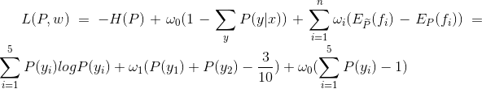

# 2.1.2 隐马尔科夫HMM

在讲HMM前先看看什么是熵的概念

## 一、什么是熵(Entropy)

信息熵的概念这个得从 **热熵** 开始说起，信熵是香农老先生从热力学引进来的，为了表示把信息中排除了冗余后的平均信息量称为“信息熵”。

- 热力学中的热熵是表示分子状态混乱程度的物理量。香农用信息熵的概念来描述信源的不确定度。


### 1.1 热力学中--热熵

从能量角度来看,熵定律意味着自然进行的能量转化过程总是由有序度高的能量向有序度低的能量转化,这个过程必定朝着熵增加的方向进行。

高温物体所有分子的平均能量要高于低温物体,所以相接触时总是从高温物体向低温物体传递热量,因为碰撞使它们的状态向平衡过渡,系统才会稳定;

热熵是向着熵增大的方向进行。从宇宙形成到地球诞生以及地球生命的形成,热熵一直有缓慢变大的趋势。


#### 热熵改变是指在某个空间内热量分布的变化。

- 1、在热力学中熵是对热量状态的描述，空间内热量分布差异越大则熵越小，做功的能力越强；空间内热量分布差异越小则熵越大，做功的能力越弱。热熵改变是指在某个空间内热量分布的变化，熵越大则热量分布的差异越小。正常情况下熵会从小到大的变化，最终熵达到最大而呈热寂。

- 2、根据热力学第二定律，作为一个“孤立”的系统，宇宙的熵会随着时间的流逝而增加，由有序向无序，当宇宙的熵达到最大值时，宇宙中的其他有效能量已经全数转化为热能，所有物质温度达到热平衡。这种状态称为热寂。这样的宇宙中再也没有任何可以维持运动或是生命的能量存在。
- 3、热熵改变的本质是热量分布由有序向无序发展，所以也可以看成系统混乱程度的改变。
- 4、熵最初是根据热力学第二定律引出的一个反映自发过程不可逆性的物质状态参量。热力学第二定律是根据大量观察结果总结出来的规律，有下述表述方式：热量总是从高温物体传到低温物体，不可能作相反的传递而不引起其他的变化；功可以全部转化为热，但任何热机不能全部地，连续不断地把所接受的热量转变为功；在孤立系统中，实际发生过程总使整个系统的熵值增大，此即熵增原理。 
> 简单总结：热熵是熵增的过程，热量由有序的状态，转移，或是机械能，或是向其他低温物体转移，产生的影响是，最终达到系统平衡的目的，但也使得整个系统不再是以前清晰的状态，相反是变成了另一种混乱的状态，可以这样白话理解。

### 1.2 信息论中的信息熵--信熵

- 香农用信息熵的概念来描述信源的不确定度。

#### 信息量

信息量：一个事件发生的概率越小，信息量越大，所以信息量应该为概率的减函数，对于相互独立的两个事有p(xy)=p(x)p(y)，对于这两个事件信息量应满足h(xy)=h(x)+h(y)，那么信息量应为对数函数：


#### 信息熵

根据Charles H. Bennett对Maxwell's Demon的重新解释，对信息的销毁是一个不可逆过程，所以销毁信息是符合热力学第二定律的。而产生信息，则是为系统引入负（热力学）熵的过程。所以信息熵的符号与热力学熵应该是相反的。

* 假设离散随机变量X的概率分布为P(x)，则其熵为：


H(x) = E[I(xi)] = E[ log(2,1/p(xi)) ] = -∑p(xi)log(2,p(xi)) (i=1,2,..n)

其中，x表示随机变量，与之相对应的是所有可能输出的集合，定义为符号集,随机变量的输出用x表示。P(x)表示输出概率函数。**变量的不确定性越大，熵也就越大** ，把它搞清楚所需要的信息量也就越大.

能量角度，高温向低温转变，一般是熵增的过程；而信息论中，为了最大可能接收到正确的（发出==收到）的信息，我们处理（优化）系统，是一种熵减的过程，信熵越小，系统有用信息量越大。

信息熵：**信息的基本作用就是消除人们对事物的不确定性** 。多数粒子组合之后，在它似像非像的形态上押上有价值的数码，具体地说，这就是一个在博弈对局中现象信息的混乱。

#### 举个例子

-(p1*log(2,p1) + p2 * log(2,p2) +　．．．　+p32 *log(2,p32))，其中，p1，p2 ，　．．．，p32 分别是这 32 个球队夺冠的概率。香农把它称为“信息熵” (Entropy)，一般用符号 H 表示，单位是比特。


有兴趣的读者可以推算一下当 32 个球队夺冠概率相同时，对应的信息熵等于五比特。有数学基础的读者还可以证明上面公式的值不可能大于五。因为得冠军的频率相同代表整个系统信息量最小。


熵是随机变量不确定性的度量，不确定性越大，熵值就越大；若随机变量退化成定值，熵为0。均匀分布(信熵最大)是“最不确定”的分布。

熵最早来原于物理学. 德国物理学家鲁道夫·克劳修斯首次提出熵的概念，用来表示任何一种能量在空间中分布的均匀程度，能量分布得越均匀，熵就越大。

> 总结：香农，描述一个信息系统的时候就借用了熵的概念，这里熵表示的是这个信息系统的平均信息量(平均不确定程度),信熵越小，系统信息不确定程度越低，反之，系统信息输出越混乱，有用信息越不容易被确认。

### 1.3 联合熵

联合熵是一集变量之间不确定性的衡量手段。两个变量和的联合信息熵定义为：


- 一集变量的联合熵大于或等于这集变量中任一个的独立熵。

 

- 少于独立熵的和

 

这表明，两个变量关联之后不确定性会增大，但是又由于相互有制约关系，不确定小于单独两个变量的不确定度之和。

### 1.4 条件熵

- 条件熵H(X|Y) = H(X,Y) - H(Y)

> X在条件Y下的条件熵

 

条件熵 H(Y|X) 表示在已知随机变量 X 的条件下随机变量 Y 的不确定性。条件熵 H(Y|X) 定义为 X 给定条件下 Y 的条件概率分布的熵对  X 的数学期望：

证明如下：


条件熵 H(Y|X) 相当于联合熵 H(X,Y) 减去单独的熵 H(X)，即


举个例子，比如环境温度是低还是高，和我穿短袖还是外套这两个事件可以组成联合概率分布 H(X,Y)，因为两个事件加起来的信息量肯定是大于单一事件的信息量的。假设 H(X) 对应着今天环境温度的信息量，由于今天环境温度和今天我穿什么衣服这两个事件并不是独立分布的，所以在已知今天环境温度的情况下，我穿什么衣服的信息量或者说不确定性是被减少了(条件熵减少，联合熵是不变)。当已知 H(X) 这个信息量的时候，H(X,Y) 剩下的信息量就是条件熵：

H(Y|X)=H(X,Y)−H(X)

### 1.5 相对熵与互信息

- 相对熵 (Relative entropy)，也称KL散度 (Kullback–Leibler divergence)

 设p(x),q(x)是X中取值的两个概率分布，则p对q的相对熵是：


性质： 

- 1、如果 p(x) 和 q(x) 两个分布相同，那么相对熵等于0
- 2、 ,相对熵具有不对称性。大家可以举个简单例子算一下。
- 3、DKL(p||q)≥0 证明如下（利用Jensen不等式https://en.wikipedia.org/wiki/Jensen%27s_inequality）：


因为：


所以：


总结：相对熵可以用来衡量两个概率分布之间的差异，上面公式的意义就是求 p 与 q 之间的对数差在 p 上的期望值。

> 相对熵，两者相同，那么相对熵等于0，两者差距越大，则相对熵值越大。

#### 互信息

两个随机变量X，Y的联合分布与独立分布乘积的相对熵，即：


### 1.6 交叉熵 (Cross entropy)

熵的公式：
$$
H(p)=-\displaystyle\sum_{x}p(x)logp(x)
$$

相对熵的公式：

$$
H(p,q)=\displaystyle\sum _{x}p(x)log\frac{1}{q(x)}=-\sum _{x}p(x)logq(x)
$$

所以有：

$$
D_{KL}(p||q)=H(p,q)-H(p)
$$

> 当用非真实分布 q(x) 得到的平均码长比真实分布 p(x) 得到的平均码长多出的比特数就是相对熵）

> 并且当 H(p) 为常量时（注：在机器学习中，训练数据分布是固定的），最小化相对熵 DKL(p||q) 等价于最小化交叉熵 H(p,q) 也等价于最大化似然估计（具体参考Deep Learning 5.5）。

> 在机器学习中，我们希望在训练数据上模型学到的分布 P(model) 和真实数据的分布  P(real) 越接近越好，所以我们可以使其相对熵最小。

- 信息熵是衡量随机变量分布的混乱程度，是随机分布各事件发生的信息量的期望值，随机变量的取值个数越多，状态数也就越多，信息熵就越大，混乱程度就越大。当随机分布为均匀分布时，熵最大；信息熵推广到多维领域，则可得到联合信息熵；条件熵表示的是在 X 给定条件下，Y 的条件概率分布的熵对 X
的期望。
- 相对熵可以用来衡量两个概率分布之间的差异。
- 交叉熵可以来衡量在给定的真实分布下，使用非真实分布所指定的策略消除系统的不确定性所需要付出的努力的大小。

* 几种熵的关系：


## 二、[最大熵模型](https://www.cnblogs.com/hgl0417/p/6693656.html)

* 最大熵模型在形式上是最漂亮的统计模型，而在实现上是最复杂的模型之一。最大熵模型，可以说是集简与繁于一体，形式简单，实现复杂。值得一提的是，在Google的很多产品中，比如机器翻译，都直接或间接地用到了最大熵模型。 

* 达拉皮垂兄弟等科学家在那里，用于最大熵模型和其他一些先进的数学工具对股票预测，获得了巨大的成功。(值得一提的是，信息处理的很多数学手段，包括隐含马尔可夫模型、子波变换、贝叶斯网络等等，在华尔街多有直接的应用。由此可见，数学模型的作用)。

我们平常说的最大熵模型，只是运用最大熵思想的多分类模型，最大熵的思想却是一种通用的思维方法。所以，理解最大熵模型只需要搞清楚两件事就可以：

- 最大熵思想是什么
- 最大熵模型是如何运用最大熵思想的

### 2.1 最大熵思想

我们知道，分类模型有判别模型和生成模型两种，判别模型是要学习一个条件概率分布 P(y|x)。
**举例说明** ，设：x是病人身体指标，体温、血压、血糖，y是各种可能的疾病，可简化为小病、中病、大病三种。

现在，我们有一个样本x1={体温：30，血压：160，血糖：60}，那么P(y|x1)就是一个概率分布，该分布的值就是上面简化的三种，小病、中病、大病。可能的概率分布如下所示：

|之前参考样本\病况|小病| 	中病| 	大病|
|:---:|:---:|:---:|:---:|
|假设之前有和X1一样的情况有1/2的患者为小病，则此时的最大熵参考样本为|1/2 	|1/4 	|1/4|
|先前12个人和X1一样，结果有3个小病，4个中病的患者，则5个大病|1/4 	|1/3 	|5/12|
|无先前参考样本，假设取最大熵的概率|1/3 	|1/3 	|1/3|

> 当然，这样的分布有无数种，上面只是举例说明而已。那么，问题来了，在这无数种概率分布中，哪一个才是好的呢？

- 1、也就是说我们没有过往的经验可以参考，那么，就直接选一个熵最大的分布就是，也就是上面表格中的第三个分布，因为均匀分布总是同类分布中熵最大的分布。

- 2、如果查看以往病例后，我们得到一个经验，指标x1={体温：30，血压：160，血糖：60}有1/2的概率是小病，于是我们有了一定的经验知识，此时，最好的分布就是符合这个经验知识的前提下，熵最大的分布，显然，第一个分布就是最好的分布。

- 以上，我们就是运用了 **最大熵的思想** 。总结来说，最大熵的思想是，当你要猜一个概率分布时，如果你对这个分布一无所知，那就猜熵最大的均匀分布，如果你对这个分布知道一些情况，那么，就猜满足这些情况的熵最大的分布。

### 2.2 运用最大熵思想来做多分类问题

* 最大熵原理认为，学习概率模型时，在所有可能的概率模型（分布）中，上最大的模型是最好 的模型。 

假设离散随机变量X的概率分布是P(X)，则其熵是：


熵取值范围为（当且仅当X是均匀分布时右边的等号成立）：


* 直观的，最大熵原理认为，要选择的概率模型首先必须要满足已有的事实，即约束条件后，对那些不确定的部分进行等可能概率分配。最大熵原理通过熵的最大化来表示为约束部分等可能性。

* 最大熵定义


### 2.3 最大熵的例题解说

题：假设随机变量X有5个取值{A,B,C,D,E}, 要估计取各个值的概率P(A),P(B),P(C),P(D),P(E). 假设约束条件如下：


> 满足上述两个约束条件的可能取值任然很多，于是在求最大熵的过程中，为了得到最大熵，认为为约束的概率分布为等概率分布（等概率分布能确定为最大熵）

解：有约束条件和概率分布知识可知,

$$
min -H(P) = \sum_{i=1}^{5}P(y_{i})logP(y_{i})
$$


```latex
s.t. P(y_{1})+P(y_{2})=\widetilde{P(y_{1})}+\widetilde{P(y_{2})}=\frac{3}{10}
```


```
\sum_{i=1}^{5}P(y_{i}) = \sum_{i=1}^{5}\widetilde{P(y_{i})}=1
```


> 其中带波浪的是实际经验分布概率函数。

* 引进拉格朗日乘子、 。由上面的约束条件得到的三个方程式结合拉格朗日乘子得到如下拉格朗日函数L(P,w)的表达式。

```latex
L(P,w)=-H(P)+\omega _{0}(\sum_{y}^{ })P(y|x))+\sum_{i=1}^{n}\omega_{1}(E_{\widetilde{P}}(f_{i})-E_{P}(f_{i}))=\sum_{x,y}\widetilde{P(x)}P(y|x)logP(y|x)+\omega_{0}(1-\sum_{y}^{ }P(y|x))+\sum_{i=1}^{n}\omega_1(\sum_{x,y}\widetilde{P(x,y)}-\sum_{x,y}^{ }\widetilde{P(x)}P(y|x)f_{i}(x,y))
```


带入题干信息可得如下的拉格朗日函数对应本题的表达式：

```
L(P,w)=-H(P)+\omega_{0}(1-\sum_{y}^{ }P(y|x))+\sum_{i=1}^{n}\omega_{i}(E_{\widetilde{P}}(f_{i})-E_{P}(f_{i}))=\sum_{i=1}^{5}P(y_{i})logP(y_{i})+\omega_{1}(P(y_{1})+P(y_{2})-\frac{3}{10})+\omega_{0}(\sum_{i=1}^{5}P(y_{i})-1)
```
这里只有3个限制条件，所以带入三个变量w得：



* 原始问题和对偶问题

根据拉格朗日函数（Ｌ)的对偶性，可以通过求解Ｌ(w)函数的对偶最优化问题得到我们原是函数（Ｌ(p))的最优解。即：


即，对于构造的Ｌ函数，求Ｐ的最小值问题对应ｗ参数的最大值最优解问题，Ｐ是要求的原始问题。Ｐ是原始问题的对偶问题的求解函数变量。

接下来开始求解了原始问题和对偶问题的最优解问题，步骤如下：

* 第一步先将原始问题（Ｐ参数的Ｌ函数）的最优解换化出来，即


* 令各偏导数等于0，解得：


于是，


* 第二步，将原始问题对应的对偶问题（ｗ参数，对应Ｌ函数的最优解）的最优解解出来，即

$$
L(P_{w},w)
$$

关于$$w$$的极大化问题。

$$
\max_{\omega}L(P_{w},w)=-2e^{-w_{1}-w_{0}-1}-3e^{-w_{1}-1}-\frac{3}{10}w_{1}-w_{0}
$$

分别求$$L(P_{w},w)$$关于$$w_{0},w_{1}$$的偏导数并令其为0，得到：

$$
e^{-w_{1}-w_{0}-1}=\frac{3}{20}
,e^{-w_{0}-1}=\frac{7}{30}
$$

于是得到所要求的概率分布为：

$$
P(y_{1})=P(y_{2})=\frac{3}{20}
,P(y_{3})=P(y_{4})=P(y_{5})=\frac{7}{30}
$$


----
**追加** ：此处记录下拉格朗日函数的相关性质：

* 拉格朗日中值定理：

如果函数f(x)满足：
（1）在闭区间[a, b]上连续；
（2）在开区间[a, b]内可导；
那么在开区间(a, b)内至少有一点  使等式  成立。

* 拉格朗日差值法：

1、两点确定一条直线，这条直线就是线性插值

2、  ，这个P（）函数就是线性插值函数

为了和后面公式进行对比，上面公式可以转化为下面表达式，


这两个都是叫做线性插值的基函数 .

得到的插值效果如下：


> 线性插值仅仅利用两个节点信息，精确度很低，故接下来讲二次差值(考察曲线问题)

3、拉格朗日二次插值

如果按照线性插值的形式，以每3个相邻点做插值，就得到了二次插值(3个点：xi,xi+1,xi+2)：


得到的曲线效果是：


二次插值在每段二次曲线内是光滑的，但在每条曲线的连接处其光滑性可能甚至比线性插值还差。二次插值只适合3个节点的情形，当节点数超过3个时，就需要分段插值了。

4、拉格朗日多项式插值


>   一个n次的拉格朗日插值函数可以绘制经过(n+1)个节点的曲线，但运算量非常大。而且在次数比较高时，容易产生剧烈的震荡（龙格现象）。所以要选择位置特殊的节点（比如切比雪夫多项式的零点）进行插值，或使用多个次数较低的拉格朗日函数分段插值。（关于拉格朗日多项式和龙格现象，详见维基百科链接）

使用4次拉格朗日多项式分段插值：


如果直接使用20次的拉格朗日插值，得到的图像如下：


等，更多的插值，[请参考这里] [数值分析（拟合、插值和逼近）之数据插值方法（线性插值、二次插值、Cubic插值、埃米尔特、拉格朗日多项式插值、牛顿插值、样条插值](https://blog.csdn.net/eric_e/article/details/79499617)

----


## 三、HMM（隐马尔可夫模型）