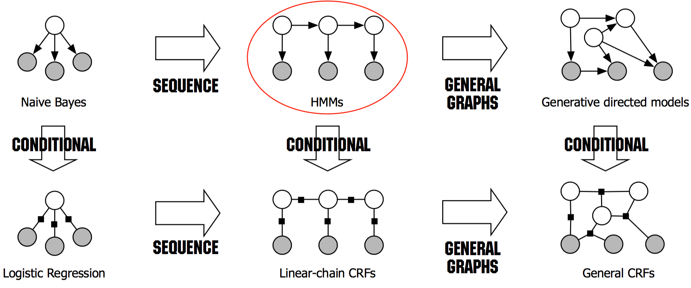

 Edit By Porter, 聚水渊，聚少成多，涓涓长流。

# 摘要

本篇文章笔记总结来自网络和书本，引用部分都有来源，内容主要介绍隐马尔科夫HMM相关实际应用搞得入门例子，很简单，但是能说明隐马尔科夫HMM的原理相关。

文章同步于: [我的gitbook](https://porter.gitbook.io/)

<!-- more -->

# HMM（隐马尔可夫模型）

隐马尔可夫模型是一种统计模型，用来描述一个含有隐含未知参数的马尔可夫过程。其难点是从可观察的参数中确定该过程的隐含参数。然后利用这些参数来作进一步的分析，例如模式识别。

是在被建模的系统被认为是一个马尔可夫过程与未观测到的（隐藏的）的状态的统计马尔可夫模型。

本文简述的是离散情况下的隐马尔可夫模型.

## 一、贝叶斯公式

定义：假设以硬币的例子，从5角和1元的一堆硬币中，随意取出一枚硬币，然后然我们猜这枚硬币是5角还是1元。假设允许我们称这枚硬币的重量x（单位：g），(但是不允许我们直接看硬币，一般1元是比5角重的)。现在应考察在一直这枚硬币的重量x的情况下硬币属于各类（5角还是一元)的概率，分别记$$P(\omega_{1}|x)$$,(知重量为x时，是5角的概率),$$P(\omega_{2}|x)$$, (知重量为x时，是一元的概率)，这种概率成为后验概率（我们需要求的）。这时的决策为：如果$$P(\omega_{1}|x)>P(\omega_{2}|x)$$,则$$x \epsilon \omega_{1} $$; 反之，则$$x \epsilon \omega_{2} $$

* 最终我们要的就是这个决策。

概率论中的贝叶斯公式：

$$
P(\omega_{i}|x)=\frac{p(x,\omega_{i})}{p(\omega_{i})}=\frac{p|\omega_{i}P(\omega_{i})}{p(x)} ,i=1,2
$$

|分布|表示|$$x \epsilon \left \{ \omega_{1},\omega_{2} \right \}$$|
|:---:|:---:|:---|
|类条件概率：|$$p(x\mid \omega_{i})$$|表示得到硬币结果是$$\omega_{i}$$条件下，得到x的概率密度|
|后验概率：|$$P(\omega_{i}\mid x)$$ |在重量为x，的条件下，得到是哪种硬币（5/1）的概率 |
|先验概率：|$$P(\omega_{i})$$ |根据之前的经验，得到5角和1元各自取得的概率|
|硬币重量概率密度函数:|$$p(x)$$|硬币重量的概率密度函数|
|联合概率密度：|$$p(x,\omega_{i})$$|在重量不同条件下，每种情况对应的取得不同硬币结果的联合概率|

$$
P(Q_{i}|O)=\frac{P(O,Q_{i})}{P(O)}=\frac{P(O|Q_{i})P(Q)}{P(O)}
$$

$$
P(Q_{i}|O)=\frac{P(O,Q_{i})}{P(O)}=\frac{P(O|Q_{i})P(Q)}{P(O)}
$$

$$P(Q_{i}|O)$$ ,后验概率，$$P(O,Q_{i})$$ ,表示O与Q的联合概率密度；P(O)表示两类所有的概率密度； P(Q_{i})是先验概率；$$P(O|Q_{i})$$是第i类状态随机序列的类条件概率密度

> 贝叶斯决策：在类条件概率密度和鲜艳概率已知（或可估计）的情况下，通过贝叶斯公式比较样本属于两类的后验概率，将类别决策为后验概率大的一类，这样做的目的是为了使总体错误率最小。

一条隐藏的马尔可夫链生成的 **状态随机序列** (State sequence, 图中的白色节点) $$Q=(q_{1},q_{2},.....,q_{T})$$是**不可观测的**，并记所有可能状态的集合为$$S={S_{1},S_{2},.....,S_{N}}$$;由它们产生一个**可观测的观测随机序列**（observation sequence，图示的深色节点）$$O=(o_{1},o_{2},......,o_{T})$$, 并记所有可能观测的集合为$$V={v_{1},v_{2},......,v_{M}}$$。

序列的值可以看作是随时刻产生的，每个时刻对应着序列的一个值。所以HMM是个双重随机过程（doubly embedded stochastic process），一个是状态转移，另一个是由状态释放出观测值。在序列标注（Sequence labelling）任务中，模型就是需要对状态序列进行标注。

