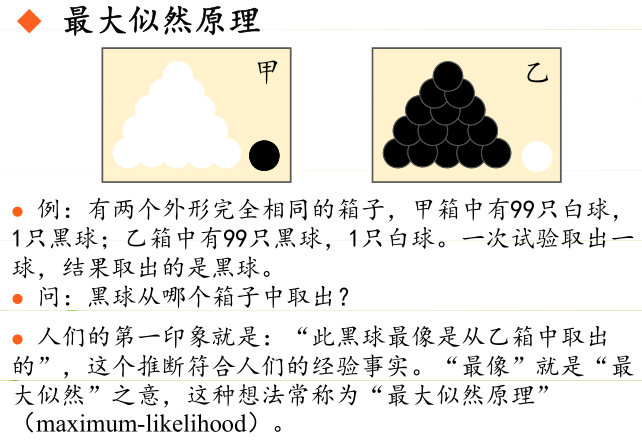

## 摘要

极大似然估计,

<!-- TOC -->

- [摘要](#摘要)
    - [原理：](#原理)
    - [举个例子](#举个例子)
- [贝叶斯的参数估计](#贝叶斯的参数估计)
    - [先验概率的极大似然估计](#先验概率的极大似然估计)
    - [条件概率极大似然估计](#条件概率极大似然估计)
- [参考](#参考)

<!-- /TOC -->

### 原理：

- 极大似然估计是建立在极大似然原理的基础上的一个统计方法，是概率论在统计学中的应用。

- 极大似然估计提供了一种给定观察数据来评估模型参数的方法，即：“模型已定，参数未知”。

- 通过若干次试验，观察其结果，利用试验结果得到某个参数值能够使样本出现的概率为最大，则称为极大似然估计。

- [x] Edit By Porter, 积水成渊,蛟龙生焉。

<!-- more -->

### 举个例子

由于样本集中的样本都是独立同分布，可以只考虑一类样本集D，来估计参数向量θ。记已知的样本集为：

$$D={x_{1}, x_{2},..., x_{N}}$$

似然函数（linkehood function）：联合概率密度函数$P(D|\theta )$称为相对于$${x_{1}, x_{2},..., x_{N}}$$的$\theta$的似然函数。

$$
l(\theta)=P(D|\theta)=P(x_{1}, x_{2},...,x_{N}|\theta)=\prod _{i=1}^{N}P(x_{i}|\theta)
$$

  如果 $\hat{\theta}$是参数空间中能使似然函数$l(\theta)$最大的θ值，$\hat{\theta}$则应该是“最可能”的参数值，那么 $\hat{\theta}$ 就是θ的极大似然估计量。它是样本集的函数，记作：

  $$\hat{\theta}=d(x_{1},x_{2},...,xx_{N})=d(D)$$

  $$\theta(x_{1},x_{2},...,xx_{N})$$,称为极大似然估计值

## 贝叶斯的参数估计

### 先验概率的极大似然估计

$$
P(Y=c_{k})=\frac{\sum_{N}^{i=1}I(y_{i}=c_{k})}{N},k=1,2,...,K
$$

I 为指示函数，上式的分子，表示$y_{i}=c_{k}$时的统计次数，分母表示一共有多少个样本。

### 条件概率极大似然估计

$$
P(X^{j}=a_{jl}|Y=c_{k})=\frac{\sum_{i=1}^{N}I(x_{i}^{j}=a_{jl},y_{i}=c_{k})}{\sum_{i=1}^{N}I(y_{i}=c_{k})}, j=1,2,...,n;l=1,2,..,S_{j};k=1,2,...,K
$$

<iframe height=498 width=100%  src="//player.bilibili.com/player.html?aid=14846640&cid=24190212&page=1"  scrolling="no" border="0" frameborder="no" framespacing="0" allowfullscreen="true"> </iframe>

## 参考

参考文献1：[鹏大大大-CSDN](https://blog.csdn.net/qq_39355550/article/details/81809467)
参考文档来源2:[李航-极大似然估计]()

