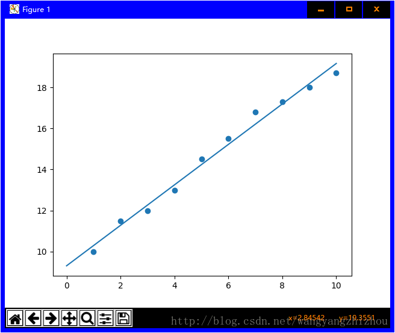

- [x] Edit By Porter, 积水成渊,蛟龙生焉。

# 摘要

本篇文章笔记总结来自网络和书本，引用部分都有来源，内容主要介绍线性回归相关基础相关实际应用搞得入门例子，很简单，但是能说明线性回归相关基础的原理相关。

文章同步于: [我的gitbook](https://porter.gitbook.io/)

<!-- more -->

# LinearRegression算法

> [学习参考来源](https://baijiahao.baidu.com/s?id=1613474944612061421&wfr=spider&for=pc)

# 一、最小二乘法的拟合原理


最小二乘法定义如上图所示，但是初看可能会有点懵，上面的表示是啥意思，好接下来总结下我的理解

最小二乘法（又称最小平方法）是一种数学优化技术，除了能拟合直线还能拟合曲线问题。

> 书中截取部分如果可以这样理解$$\alpha_{i}$$，如果是二次项的话$$y=\alpha_{1} x^{2}+\alpha_{2} x + \alpha_{3} $$，知道了吧，就是一个二项式子中的待解参数。


本文为了推导和笔记的简单化，直接以拟合直线 $$f(x;a,b): y=ax+b$$

## 1.1 代数推导：

- [1]. 假设拟合直线 $$f(x;a,b): y=ax+b$$
- [2]. 已经由n个样本$$(x_{n}, y_{n})$$
- [3]. 误差$$e_{i}=y_{i}-(ax_{i}+b)$$
- [4]. 当$$S = \sum_{i=1}^{n} e_{i}^{2}$$为最小值时，即得到的a,b参数就是最小二乘法得到的解.


如何求解这些参数（a，b）

$$\frac{\partial S}{\partial b}=-2(\sum_{i=1}^{n}y_{i}-nb-a\sum_{i=1}^{n}x_{i})$$

$$\frac{\partial S}{\partial a}=-2(\sum_{i=1}^{n}x_{i}y_{i}-b\sum_{i=1}{n}x_{i}-a\sum_{i=1}^{n}x_{i}^{2})$$

分别令上式中对a,b求偏导数的有点等于0,以此求取对a,b的最值.有：$$n\bar x=\sum_{i=1}^{n}x_i,n\bar y=\sum_{i=1}^{n}y_i$$

得到：

$$a=\frac {\sum_{i=1}^{n}({x_i-\bar x})(y_i-\bar y)}  {\sum_{i=1}^{n}({x_i-\bar x})^2}$$

$$b=\bar y-a\bar x$$

$$a=\frac {n\sum_{}^{}{x_iy_i}-\sum_{}^{}{x_i}\sum_{}^{}{y_i}}  {n\sum_{}^{}{x_i}^2-(\sum_{}^{}{x_i})^2}$$

$$b=\frac {\sum_{}^{}{x_i}^2\sum_{}^{}{y_i}-\sum_{}^{}{x_i}\sum_{}^{}{x_iy_i}}  {n\sum_{}^{}{x_i}^2-(\sum_{}^{}{x_i})^2}$$

### 1.1.1 代数推导的代码实现


```python
import numpy as np
import matplotlib.pyplot as plt

def calcAB(x,y):
    n = len(x)
    sumX,sumY,sumXY,sumXX =0,0,0,0
    for i in range(0,n):
        sumX  += x[i]
        sumY  += y[i]
        sumXX += x[i]*x[i]
        sumXY += x[i]*y[i]
    a = (n*sumXY -sumX*sumY)/(n*sumXX -sumX*sumX)
    b = (sumXX*sumY - sumX*sumXY)/(n*sumXX-sumX*sumX)
    return a,b,

xi = [1,2,3,4,5,6,7,8,9,10]
yi = [10,11.5,12,13,14.5,15.5,16.8,17.3,18,18.7]
a,b=calcAB(xi,yi)
print("y = %10.5fx + %10.5f" %(a,b))
x = np.linspace(0,10)
y = a * x + b
plt.plot(x,y)
plt.scatter(xi,yi)
plt.show()
```

## 1.2 矩阵推导

对于$$y=ax+b$$,转为向量的形式为
$$
W=\begin{bmatrix}
w_0\\
w_1
\end{bmatrix},X=\begin{bmatrix}
1\\
x_1
\end{bmatrix}
$$

于是：
$$y=w_1x_1+w_0=W^TX$$

损失函数为:

$$
L=\frac{1}{n}\sum_{i=1}^{n}(y_n-(W^TX)^2)=\frac{1}{n}(y-XW)^T(y-XW)
$$

最后可化为

$$\frac{1}{n}X^TW^TXW-\frac{2}{n}X^TW^Ty+\frac{1}{n}y^Ty$$

令偏导为0

$$\frac{\partial L}{\partial W}=\frac{2}{n}X^TXW-\frac{2}{n}X^Ty=0$$

另外：

$$(X^TX)^{-1}X^TX=E,EW=W$$,则

$$(X^TX)^{-1}X^TXW=(X^TX)^{-1}X^Ty,W=(X^TX)^{-1}X^Ty$$

### 1.2.1 代码实现：

```python
import numpy as np
import matplotlib.pyplot as plt

x = [1,2,3,4,5,6,7,8,9,10]
y = [10,11.5,12,13,14.5,15.5,16.8,17.3,18,18.7]

A = np.vstack([x,np.ones(len(x))]).T

a,b = np.linalg.lstsq(A,y)[0]
print("y = %10.5fx + %10.5f" %(a,b))
x = np.array(x)
y = np.array(y)

plt.plot(x,y,'o',label='data',markersize=10)
plt.plot(x,a*x+b,'r',label='line')
plt.show()
```
拟合的效果（蓝线）




## 1.3 小结


# 二、线性回归

线性回归的目的是找到一个与这些数据最为温和的线性函数，用来预测或者分类，主要解决线性问题。
一般来说，线性回归问题都可以通过最小二乘法来求出方程。线性回归属于监督学习,因此方法和监督学习应该一样，先给一个训练集，根据这个训练集学习出一个线性函数，然后测试这个函数训练的好不好（拟合是否恰当）。Cost Function 越小的函数，说明训练数据拟合程度越好。

* 线性回归，通过数据集的线性组合来预测函数：

$$f(x)=\omega_{1}x_{1}+\omega_{2}x_{2}+\omega_{3}x_{3}+...+\omega_{d}x_{d}+b$$

一般向量形式写为：

$$f(x)=\omega^{T}x+b$$

其中的$$\omega=(\omega_{1};\omega_{2};\omega_{2};...\omega_{d})$$

$$x_{1},x_{2},...x_{k}$$是一组独立的预测变量

$$\omega_{1},\omega_{2},...\omega_{k}$$为模型从训练数据中学习得到的参数，或称赋予每个变量的权值。

b是一个学习到的参数，这个现行函数中的常量也称模型的偏置（Bias）

* 根据输入属性可分为一元，二元......多元线性回归。

多元数据集的定义如下：

$$D=\left [ x_{i,j}, y_{i}\right ]$$，其中i,表示数据集第i位序列的值，而j则表示在第i位x的属性是j种属性，即数据集中，x(i,j)，i维行，j维纵坐标的矩阵。

即数据集j元的属性矩阵表示为：
$$
\begin{bmatrix}
x_{1,1} & x_{1,2} & ... & x_{1,j-1} & x_{1,j}\\ 
x_{2,1} & x_{2,2} & ... & x_{2,j-1} & x_{2,j}\\ 
... & ... & ... & ... & ...\\ 
x_{i,1} & x_{i,2} & ... & x_{i,j-1} & x_{i,j}
\end{bmatrix}
$$

比如3元的表示一个西瓜好坏，【hue, root,  echo】，加入预测函数的参数已经求得$$\omega=\left [ 0.2, 0.5, 0.3 \right ],b=1$$，则好瓜（good)函数$$f_{good}(x)=0.2 \cdot x_{hue}+0.5 \cdot x_{root}+0.3 \cdot x_{echo}+1$$

## 2.1 一元线性回归

* 输入属性只有一个的情况，称一元线性回归

> 属性：

这里考虑一元的情况则数据集为： $$D=\left [ x_{i}, y_{i}\right ]_{i=1}^{m} $$,即上面矩阵表示的j元数据集中j=1，现在我们来尝试一元的线性回归。

- [1] 假设我们预测函数形式：$$f(x_{i})=\omega x_{i}+b_{i}$$,使得$$f(x_{i})\approx y_{i}$$.

接下来我们引入上面的最小二乘法求参数$$\omega , b$$.

- [2] 假设最小均方误差函数为：

$$e_{\omega^*,b^*}=arg_{(\omega,b)}min \sum_{i=1}^{m}(f(x_{i})-y_{i})^2 $$

- [3] 对上式e的函数分别对$$\omega,b$$求偏导，对偏导结果赋值0，求$$\omega,b$$值。

- [4] 偏导数

$$\frac{\partial E_{\omega,b}}{\partial \omega}=2(\omega\sum_{i=1}^{m}x_{i}^{2}-\sum_{i=1}^{m}(y_{i}-b)x_{i})$$

$$\frac{\partial E_{\omega,b}}{\partial b}=2(mb-\sum_{i=1}^{m}(y_{i} - \omega x_{i}))$$

- [5] 上一步骤中的偏导数都设为零，以此来求得$$\omega , b$$.

$$\omega = \frac{\sum_{i=1}^{m} y_{i}(x_{i}-\bar{x})}{\sum_{i=1}^{m}x_{i}^{2}-\frac{1}{m}(\sum_{i=1}^{m}x_{i})^2}$$

$$b=\frac{1}{m}\sum_{i=1}^{m}(y_{i}-\omega x_{i}),\bar{x}=\frac{1}{m}\sum_{i=1}^{m}x_{i}$$,$$\bar{x}$$为序列x的均值。

> 这里一元的线性回归，用最小二乘法求解的参数估计，称为线性回归模型的最小二乘法“参数估计”(parameter estimation).


## 2.2 多元线性回归

类似一元，但是求解 估计的参数矩阵$$\omega, b$$，就需要全部看成矩阵的求解方法求出。见最小二乘法矩阵推导那一节，不再具体推推导了，在2.1节基础上明白线性回归，多元回归思想即可明白。