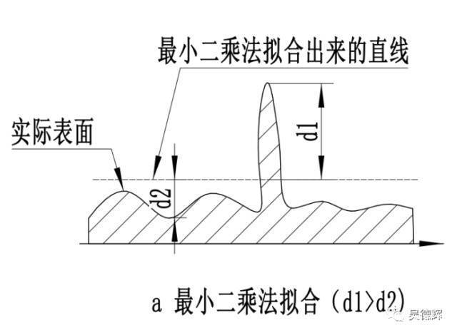

# LinearRegression算法

> [学习参考来源](https://baijiahao.baidu.com/s?id=1613474944612061421&wfr=spider&for=pc)

## 一、最小二乘法的拟合原理


最小二乘法定义如上图所示，但是初看可能会有点懵，上面的表示是啥意思，好接下来总结下我的理解

最小二乘法（又称最小平方法）是一种数学优化技术，除了能拟合直线还能拟合曲线问题。

> 书中截取部分如果可以这样理解$$\alpha_{i}$$，如果是二次项的话$$y=\alpha_{1} x^{2}+\alpha_{2} x + \alpha_{3} $$，知道了吧，就是一个二项式子中的待解参数。


本文为了推导和笔记的简单化，直接以拟合直线 $$f(x;a,b): y=ax+b$$

## 1.1 代数推导：

- [1]. 假设拟合直线 $$f(x;a,b): y=ax+b$$
- [2]. 已经由n个样本$$(x_{n}, y_{n})$$
- [3]. 误差$$e_{i}=y_{i}-(ax_{i}+b)$$
- [4]. 当$$S = \sum_{i=1}^{n} e_{i}^{2}$$为最小值时，即得到的a,b参数就是最小二乘法得到的解。

如何求解这些参数（a，b）

$$\frac{\partial S}{\partial b}=-2(\sum_{i=1}^{n}y_{i}-nb-a\sum_{i=1}^{n}x_{i})$$

$$\frac{\partial S}{\partial a}=-2(\sum_{i=1}^{n}x_{i}y_{i}-b\sum_{i=1}{n}x_{i}-a\sum_{i=1}^{n}x_{i}^{2})$$

分别令上式中对a,b求偏导数的有点等于0,以此求取对a,b的最值.有：$$n\bar x=\sum_{i=1}^{n}x_i,n\bar y=\sum_{i=1}^{n}y_i$$

得到：

$$a=\frac {\sum_{i=1}^{n}({x_i-\bar x})(y_i-\bar y)}  {\sum_{i=1}^{n}({x_i-\bar x})^2}$$

$$b=\bar y-a\bar x$$

$$a=\frac {n\sum_{}^{}{x_iy_i}-\sum_{}^{}{x_i}\sum_{}^{}{y_i}}  {n\sum_{}^{}{x_i}^2-(\sum_{}^{}{x_i})^2}$$

$$b=\frac {\sum_{}^{}{x_i}^2\sum_{}^{}{y_i}-\sum_{}^{}{x_i}\sum_{}^{}{x_iy_i}}  {n\sum_{}^{}{x_i}^2-(\sum_{}^{}{x_i})^2}$$

### 1.1.1 代数推导的代码实现


```python
import numpy as np
import matplotlib.pyplot as plt

def calcAB(x,y):
    n = len(x)
    sumX,sumY,sumXY,sumXX =0,0,0,0
    for i in range(0,n):
        sumX  += x[i]
        sumY  += y[i]
        sumXX += x[i]*x[i]
        sumXY += x[i]*y[i]
    a = (n*sumXY -sumX*sumY)/(n*sumXX -sumX*sumX)
    b = (sumXX*sumY - sumX*sumXY)/(n*sumXX-sumX*sumX)
    return a,b,

xi = [1,2,3,4,5,6,7,8,9,10]
yi = [10,11.5,12,13,14.5,15.5,16.8,17.3,18,18.7]
a,b=calcAB(xi,yi)
print("y = %10.5fx + %10.5f" %(a,b))
x = np.linspace(0,10)
y = a * x + b
plt.plot(x,y)
plt.scatter(xi,yi)
plt.show()
```

## 1.2 矩阵推导

对于$$y=ax+b$$,转为向量的形式为
$$
W=\begin{bmatrix}
w_0\\
w_1
\end{bmatrix},X=\begin{bmatrix}
1\\
x_1
\end{bmatrix}
$$

于是：
$$y=w_1x_1+w_0=W^TX$$

损失函数为:

$$
L=\frac{1}{n}\sum_{i=1}^{n}(y_n-(W^TX)^2)=\frac{1}{n}(y-XW)^T(y-XW)
$$

最后可化为

$$\frac{1}{n}X^TW^TXW-\frac{2}{n}X^TW^Ty+\frac{1}{n}y^Ty$$

令偏导为0

$$\frac{\partial L}{\partial W}=\frac{2}{n}X^TXW-\frac{2}{n}X^Ty=0$$

另外：

$$(X^TX)^{-1}X^TX=E,EW=W$$,则

$$(X^TX)^{-1}X^TXW=(X^TX)^{-1}X^Ty,W=(X^TX)^{-1}X^Ty$$

### 1.2.1 代码实现：

```python
import numpy as np
import matplotlib.pyplot as plt

x = [1,2,3,4,5,6,7,8,9,10]
y = [10,11.5,12,13,14.5,15.5,16.8,17.3,18,18.7]

A = np.vstack([x,np.ones(len(x))]).T

a,b = np.linalg.lstsq(A,y)[0]
print("y = %10.5fx + %10.5f" %(a,b))
x = np.array(x)
y = np.array(y)

plt.plot(x,y,'o',label='data',markersize=10)
plt.plot(x,a*x+b,'r',label='line')
plt.show()
```
拟合的效果（蓝线）


## 1.3 小结




