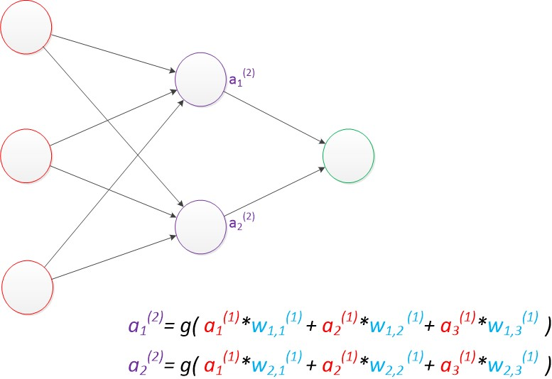
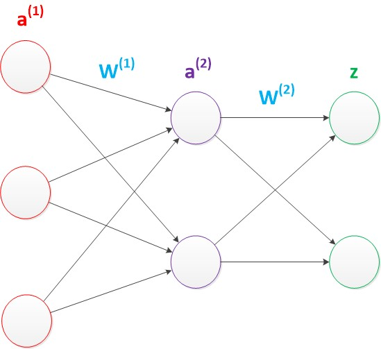

# 摘要

本文主要记录神经网络相关的基础知识

- [x] Edit By Porter, 积水成渊,蛟龙生焉。

<!-- more -->

# 一、神经网络

神经网络是一种模拟人脑的神经网络以期能够实现类人工智能的机器学习技术。

对于神经元的研究由来已久，1904年生物学家就已经知晓了神经元的组成结构。

　　一个神经元通常具有多个树突，主要用来接受传入信息；而轴突只有一条，轴突尾端有许多轴突末梢可以给其他多个神经元传递信息。轴突末梢跟其他神经元的树突产生连接，从而传递信号。这个连接的位置在生物学上叫做“突触”。

## 1.1 神经元

### 1.1.1 让我们来看一个经典的神经网络。

这是一个包含三个层次的神经网络。

红色的是输入层，绿色的是输出层，紫色的是中间层（也叫隐藏层）。

输入层有3个输入单元，隐藏层有4个单元，输出层有2个单元。

后文中，我们统一使用这种颜色来表达神经网络的结构。

### 1.1.2 在开始介绍前，有一些知识可以先记在心里

- 设计一个神经网络时，输入层与输出层的节点数往往是固定的，中间层则可以自由指定；

- 神经网络结构图中的拓扑与箭头代表着预测过程时数据的流向，跟训练时的数据流有一定的区别；

- 结构图里的关键不是圆圈（代表“神经元”），而是连接线（代表“神经元”之间的连接）。每个连接线对应一个不同的权重（其值称为权值），这是需要训练得到的。

### 1.1.3 神经元结构

神经元模型是一个包含输入，输出与计算功能的模型。输入可以类比为神经元的树突，而输出可以类比为神经元的轴突，计算则可以类比为细胞核。

下图是一个典型的神经元模型：包含有3个输入，1个输出，以及2个计算功能。注意中间的箭头线。这些线称为“连接”。每个上有一个“权值”。

连接是神经元中最重要的东西。每一个连接上都有一个权重。

一个神经网络的训练算法就是让权重的值调整到最佳，以使得整个网络的预测效果最好。

我们使用a来表示输入，用w来表示权值。一个表示连接的有向箭头可以这样理解：在初端，传递的信号大小仍然是a，端中间有加权参数w，经过这个加权后的信号会变成a*w，因此在连接的末端，信号的大小就变成了a*w。

在其他绘图模型里，有向箭头可能表示的是值的不变传递。而在神经元模型里，每个有向箭头表示的是值的加权传递。

如果我们将神经元图中的所有变量用符号表示，并且写出输出的计算公式的话，就是下图。

可见z是在输入和权值的线性加权和叠加了一个函数g的值。<strong>在MP模型里，函数g是sgn函数，也就是取符号函数。这个函数当输入大于0时，输出1，否则输出0。</strong>

下面对神经元模型的图进行一些扩展。首先将sum函数与sgn函数合并到一个圆圈里，代表神经元的内部计算。其次，把输入a与输出z写到连接线的左上方，便于后面画复杂的网络。最后说明，一个神经元可以引出多个代表输出的有向箭头，但值都是一样的。

　　神经元可以看作一个计算与存储单元。计算是神经元对其的输入进行计算功能。存储是神经元会暂存计算结果，并传递到下一层。

当我们用“神经元”组成网络以后，描述网络中的某个“神经元”时，我们更多地会用“单元”（unit）来指代。同时由于神经网络的表现形式是一个有向图，有时也会用“节点”（node）来表达同样的意思。 

### 1.1.4 神经元模型的使用可以这样理解

　　我们有一个数据，称之为样本。样本有四个属性，其中三个属性已知，一个属性未知。我们需要做的就是通过三个已知属性预测未知属性。

　　具体办法就是使用神经元的公式进行计算。三个已知属性的值是a1，a2，a3，未知属性的值是z。z可以通过公式计算出来。

　　这里，已知的属性称之为特征，未知的属性称之为目标。假设特征与目标之间确实是线性关系，并且我们已经得到表示这个关系的权值w1，w2，w3。那么，我们就可以通过神经元模型预测新样本的目标。

## 1.2 单层神经网络（感知器）

1958年，计算科学家Rosenblatt提出了由两层神经元组成的神经网络。他给它起了一个名字--“感知器”（Perceptron）

感知器是当时首个可以学习的人工神经网络。

### 1.2.1 感知器模型结构

在原来MP模型的“输入”位置添加神经元节点，标志其为“输入单元”。其余不变，于是我们就有了下图：从本图开始，我们将权值w1, w2, w3写到“连接线”的中间。

　　在“感知器”中，有两个层次。分别是输入层和输出层。输入层里的“输入单元”只负责传输数据，不做计算。输出层里的“输出单元”则需要对前面一层的输入进行计算。

我们把需要计算的层次称之为“计算层”，并把拥有一个计算层的网络称之为“单层神经网络”。有一些文献会按照网络拥有的层数来命名，例如把“感知器”称为两层神经网络。但在本文里，我们根据计算层的数量来命名。

假如我们要预测的目标不再是一个值，而是一个向量，例如[2,3]。那么可以在输出层再增加一个“输出单元”。

可以看到，z1的计算跟原先的z并没有区别。

我们已知一个神经元的输出可以向多个神经元传递，因此z2的计算公式如下图。

可以看到，z2的计算中除了三个新的权值：w4，w5，w6以外，其他与z1是一样的。整个网络的输出如下图。

目前的表达公式有一点不让人满意的就是：w4，w5，w6是后来加的，很难表现出跟原先的w1，w2，w3的关系。

　　因此我们改用二维的下标，用wx,y来表达一个权值。下标中的x代表后一层神经元的序号，而y代表前一层神经元的序号（序号的顺序从上到下）。

　　例如，w1,2代表后一层的第1个神经元与前一层的第2个神经元的连接的权值（这种标记方式参照了Andrew Ng的课件）。根据以上方法标记，我们有了下图。

如果我们仔细看输出的计算公式，会发现这两个公式就是线性代数方程组。因此可以用矩阵乘法来表达这两个公式。

　　例如，输入的变量是[a1，a2，a3]T（代表由a1，a2，a3组成的列向量），用向量a来表示。方程的左边是[z1，z2]T，用向量z来表示。

　　系数则是矩阵W（2行3列的矩阵，排列形式与公式中的一样）。

　　于是，输出公式可以改写成：

$$g(W * a) = z;$$

这个公式就是神经网络中从前一层计算后一层的矩阵运算。

### 1.2.2 效果

与神经元模型不同，感知器中的权值是通过训练得到的。因此，根据以前的知识我们知道，感知器类似一个逻辑回归模型，可以做线性分类任务。

我们可以用决策分界来形象的表达分类的效果。决策分界就是在二维的数据平面中划出一条直线，当数据的维度是3维的时候，就是划出一个平面，当数据的维度是n维时，就是划出一个n-1维的超平面。

下图显示了在二维平面中划出决策分界的效果，也就是感知器的分类效果。

> 感知器只能做简单的线性分类任务。

## 1.3 两层神经网络（多层感知器）

Minsky说过单层神经网络无法解决异或问题。但是当增加一个计算层以后，两层神经网络不仅可以解决异或问题，而且具有非常好的非线性分类效果。不过两层神经网络的计算是一个问题，没有一个较好的解法。

1986年，Rumelhar和Hinton等人提出了反向传播（Backpropagation，BP）算法，解决了两层神经网络所需要的复杂计算量问题，从而带动了业界使用两层神经网络研究的热潮。目前，大量的教授神经网络的教材，都是重点介绍两层（带一个隐藏层）神经网络的内容。 

　　这时候的Hinton还很年轻，30年以后，正是他重新定义了神经网络，带来了神经网络复苏的又一春。

### 1.3.1 两层神经网络的结构（多层感知器）

Minsky说过单层神经网络无法解决异或问题。但是当增加一个计算层以后，两层神经网络不仅可以解决异或问题，而且具有非常好的非线性分类效果。不过两层神经网络的计算是一个问题，没有一个较好的解法。

两层神经网络除了包含一个输入层，一个输出层以外，还增加了一个中间层。此时，中间层和输出层都是计算层。我们扩展上节的单层神经网络，在右边新加一个层次（只含有一个节点）。

现在，我们的权值矩阵增加到了两个，我们用上标来区分不同层次之间的变量。

例如$$a_{x} ^{(y)}$$代表第y层的第x个节点。$$z_{1},z_{2}$$变成了$$a_{1} ^{(2)} , a_{2} ^{(2)}$$。下图给出了$$a_{1} ^{(2)} , a_{2} ^{(2)}$$的计算公式。

计算最终输出z的方式是利用了中间层的$$a_{1} ^{(2)}, a_{2} ^{(2)}$$和第二个权值矩阵计算得到的，如下图。

假设我们的预测目标是一个向量，那么与前面类似，只需要在“输出层”再增加节点即可。

我们使用向量和矩阵来表示层次中的变量。$$a_{1} , a_{2} , z $$是网络中传输的向量数据。$$W^{(1)}, W^{(2)}$$是网络的矩阵参数。如下图。

使用矩阵运算来表达整个计算公式的话如下：

$$g(W^{(1)} * a^{(1)}) = a^{(2)}; g(W^{(2)} * a^{(2)}) = z;$$

上面写的全是权重w但还未引入偏置。下面我们接着写偏置

　由此可见，使用矩阵运算来表达是很简洁的，而且也不会受到节点数增多的影响（无论有多少节点参与运算，乘法两端都只有一个变量）。因此神经网络的教程中大量使用矩阵运算来描述。

　　需要说明的是，至今为止，我们对神经网络的结构图的讨论中都没有提到偏置节点（bias unit）。事实上，这些节点是默认存在的。它本质上是一个只含有存储功能，且存储值永远为1的单元。在神经网络的每个层次中，除了输出层以外，都会含有这样一个偏置单元。正如线性回归模型与逻辑回归模型中的一样。

　　偏置单元与后一层的所有节点都有连接，我们设这些参数值为向量b，称之为偏置。如下图。

可以看出，偏置节点很好认，因为其没有输入（前一层中没有箭头指向它）。有些神经网络的结构图中会把偏置节点明显画出来，有些不会。一般情况下，我们都不会明确画出偏置节点。 

　　在考虑了偏置以后的一个神经网络的矩阵运算如下：

$$g(W^{(1)} * a^{(1)}+b^{(1)}) = a^{(2)}; g(W^{(2)} * a^{(2)}+b^{(1)}) = z;$$

　　需要说明的是，在两层神经网络中，我们不再使用sgn函数作为函数g，而是使用平滑函数sigmoid作为函数g。我们把函数g也称作激活函数（active function）。

　　事实上，神经网络的本质就是通过参数与激活函数来拟合特征与目标之间的真实函数关系。初学者可能认为画神经网络的结构图是为了在程序中实现这些圆圈与线，但在一个神经网络的程序中，既没有“线”这个对象，也没有“单元”这个对象。实现一个神经网络最需要的是线性代数库。

## 1.4 多层神经网络（深度学习）

### 1.4.1 多层神经网络的结构（深度学习）

我们延续两层神经网络的方式来设计一个多层神经网络。

　　在两层神经网络的输出层后面，继续添加层次。原来的输出层变成中间层，新加的层次成为新的输出层。所以可以得到下图。

依照这样的方式不断添加，我们可以得到更多层的多层神经网络。公式推导的话其实跟两层神经网络类似，使用矩阵运算的话就仅仅是加一个公式而已。

　　在已知输入$$a^{(1)}$$，参数$$W^{(1)},W^{(2)},W^{(3)}$$的情况下，输出z的推导公式如下：
$$
g(W^{(1)} * a^{(1)}) = a^{(2)}; 

g(W^{(2)} * a^{(2)}) = a^{(3)};

g(W^{(3)} * a^{(3)}) = z;
$$

多层神经网络中，输出也是按照一层一层的方式来计算。从最外面的层开始，算出所有单元的值以后，再继续计算更深一层。只有当前层所有单元的值都计算完毕以后，才会算下一层。有点像计算向前不断推进的感觉。所以这个过程叫做“正向传播”。

下面讨论一下多层神经网络中的参数。

首先我们看第一张图，可以看出$$W^{(1)}$$中有6个参数，$$W^{(2)}$$中有4个参数，$$W^(3)$$中有6个参数，所以整个神经网络中的参数有16个（这里我们不考虑偏置节点，下同）。

　　假设我们将中间层的节点数做一下调整。第一个中间层改为3个单元，第二个中间层改为4个单元。

　　经过调整以后，整个网络的参数变成了33个。

虽然层数保持不变，但是第二个神经网络的参数数量却是第一个神经网络的接近两倍之多，从而带来了更好的表示（represention）能力。表示能力是多层神经网络的一个重要性质，下面会做介绍。

　　在参数一致的情况下，我们也可以获得一个“更深”的网络。

上图的网络中，虽然参数数量仍然是33，但却有4个中间层，是原来层数的接近两倍。这意味着一样的参数数量，可以用更深的层次去表达。

### 1.4.2 多层神经网络的效果（深度学习）

与两层层神经网络不同。多层神经网络中的层数增加了很多。

　　增加更多的层次有什么好处？更深入的表示特征，以及更强的函数模拟能力。

　　更深入的表示特征可以这样理解，随着网络的层数增加，每一层对于前一层次的抽象表示更深入。在神经网络中，每一层神经元学习到的是前一层神经元值的更抽象的表示。例如第一个隐藏层学习到的是“边缘”的特征，第二个隐藏层学习到的是由“边缘”组成的“形状”的特征，第三个隐藏层学习到的是由“形状”组成的“图案”的特征，最后的隐藏层学习到的是由“图案”组成的“目标”的特征。通过抽取更抽象的特征来对事物进行区分，从而获得更好的区分与分类能力。

　　关于逐层特征学习的例子，可以参考下图。

更强的函数模拟能力是由于随着层数的增加，整个网络的参数就越多。而神经网络其实本质就是模拟特征与目标之间的真实关系函数的方法，更多的参数意味着其模拟的函数可以更加的复杂，可以有更多的容量（capcity）去拟合真正的关系。

　　通过研究发现，在参数数量一样的情况下，更深的网络往往具有比浅层的网络更好的识别效率。这点也在ImageNet的多次大赛中得到了证实。从2012年起，每年获得ImageNet冠军的深度神经网络的层数逐年增加，2015年最好的方法GoogleNet是一个多达22层的神经网络。

　　在最新一届的ImageNet大赛上，目前拿到最好成绩的MSRA团队的方法使用的更是一个深达152层的网络！关于这个方法更多的信息有兴趣的可以查阅ImageNet网站。

### 1.4.3 多层神经网络的训练（深度学习）

在单层神经网络时，我们使用的激活函数是sgn函数。到了两层神经网络时，我们使用的最多的是sigmoid函数。而到了多层神经网络时，通过一系列的研究发现，ReLU函数在训练多层神经网络时，更容易收敛，并且预测性能更好。因此，目前在深度学习中，最流行的非线性函数是ReLU函数。ReLU函数不是传统的非线性函数，而是分段线性函数。其表达式非常简单，就是y=max(x,0)。简而言之，在x大于0，输出就是输入，而在x小于0时，输出就保持为0。这种函数的设计启发来自于生物神经元对于激励的线性响应，以及当低于某个阈值后就不再响应的模拟。

　　在多层神经网络中，训练的主题仍然是优化和泛化。当使用足够强的计算芯片（例如GPU图形加速卡）时，梯度下降算法以及反向传播算法在多层神经网络中的训练中仍然工作的很好。目前学术界主要的研究既在于开发新的算法，也在于对这两个算法进行不断的优化，例如，增加了一种带动量因子（momentum）的梯度下降算法。　

　　在深度学习中，泛化技术变的比以往更加的重要。这主要是因为神经网络的层数增加了，参数也增加了，表示能力大幅度增强，很容易出现过拟合现象。因此正则化技术就显得十分重要。目前，Dropout技术，以及数据扩容（Data-Augmentation）技术是目前使用的最多的正则化技术。

文章参考来源：[计算机的潜意识](https://www.cnblogs.com/subconscious/p/5058741.html)