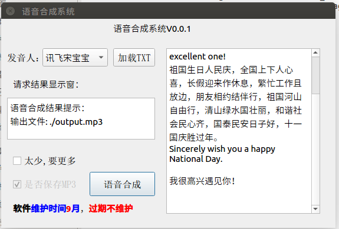
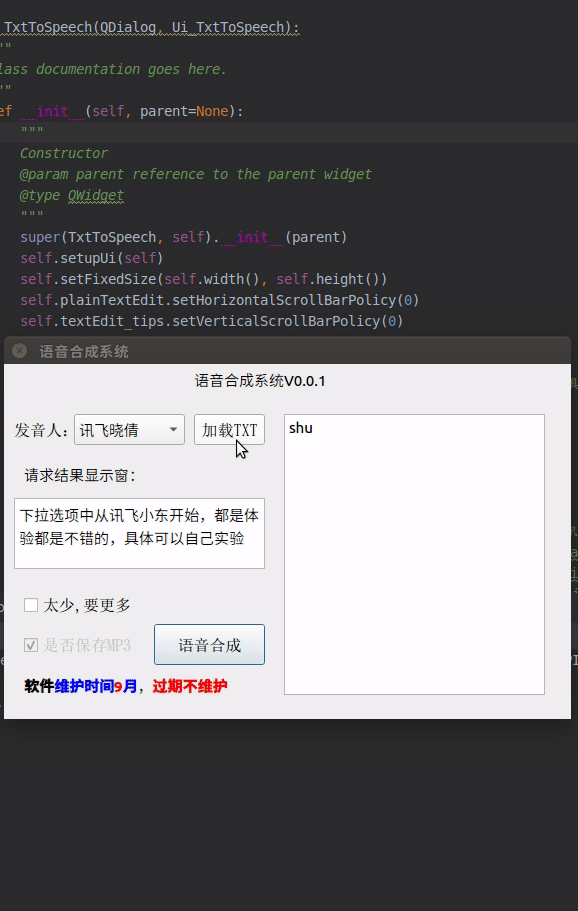
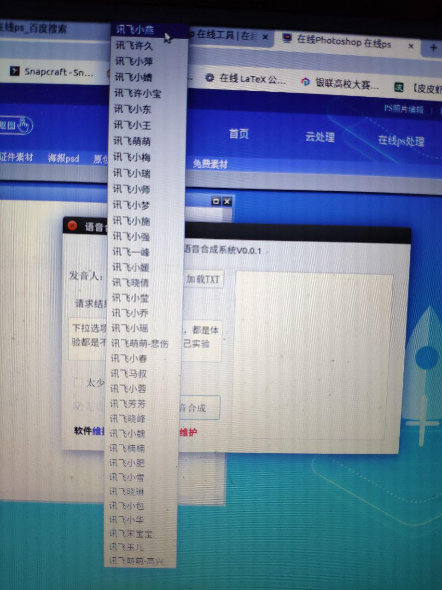

# 摘要

本软件是基于Qt5开发的，实现的功能是文本转语音合成的功能。

操作步骤：

- [v] 加载TXT
- [v] 选择发音人
- [v] 点击语音合成

或者

- [v] 直接编辑最右边文本框
- [v] 选择发音人
- [v] 点击语音合成



<!-- more -->

## 软件的整体演示效果

软件的整体的操作流程如下gif所示




语音合成的效果，随机演示效果声音如下：

<audio controls="controls">  <source src="../image6/output.mp3" type="audio/mpeg" />  </audio>

## 代码讲解

以下代码为选择发音人的列表



```python
self.voice_name_selecct = {
        '讯飞小燕': 'xiaoyan', '讯飞许久': 'aisjiuxu','讯飞小萍': 'aisxping', '讯飞小婧': 'aisjinger',
        '讯飞许小宝': 'aisbabyxu','讯飞小东': 'x_xiaodong', '讯飞小王': 'x_xiaowang','讯飞萌萌': 'x_mengmengneutral',
        '讯飞宁宁': 'x_ningning','讯飞小南': 'x_xiaonan', '讯飞玲姐姐': 'x_xiaoling', '讯飞小坤': 'x_xiaokun',
        '讯飞小梅': 'x_xiaomei', '讯飞小瑞': 'x_xiaonuo_novel', '讯飞小师': 'x_xiaoshi_cts', '讯飞小梦': 'x_xiaomeng',
        '讯飞小施': 'x_xiaoshi', '讯飞小强': 'x_xiaoqiang', '讯飞一峰': 'x_yifeng', '讯飞小媛': 'x_xiaoyuan',
        '讯飞晓倩': 'x_xiaoqian', '讯飞小莹': 'x_xiaoying', '讯飞小乔': 'x_xiaoqiao', '讯飞小瑶': 'x_xiaoyao',
        '讯飞萌萌-悲伤': 'x_mengmengsad', '讯飞小春': 'x_mengchun', '讯飞马叔': 'x_laoma', '讯飞小蓉': 'x_xiaorong',
        '讯飞芳芳': 'x_xiaofang', '讯飞晓峰': 'x_xiaofeng', '讯飞小魏': 'x_xiaowei', '讯飞楠楠': 'x_nannan',
        '讯飞小肥': 'x_xiaofei', '讯飞小雪': 'x_xiaoxue', '讯飞晓琳': 'x_xiaolin', '讯飞小包': 'x_xiaobao',
        '讯飞小华': 'x_xiaoyang_story', '讯飞宋宝宝': 'x_xiaosong', '讯飞玉儿': 'x_yuer', '讯飞萌萌-高兴': 'x_mengmenghappy'
        }
```

以下代码为软件背景发音的代码段

```python
@pyqtSlot()
    def on_pushButton_hec_clicked(self):
        """
        Slot documentation goes here.
        """
        # # TODO: not implemented yet
        # raise NotImplementedError
        print("语音合成")
        yuyin_app = yuyi_hec()
        str_voice_name = self.comboBox_voice_name.currentText()
        InText_neirong = self.plainTextEdit.toPlainText().strip()
        print("zhi:", str_voice_name)
        if not InText_neirong:
            print("空文本警告")
            self.label_tips.setText("空文本警告,非法请求！")
            return 0
        else:
            self.label_tips.setText("请求结果显示窗：")
        yuyin_app.yuyinhec(InText_neirong, self.voice_name_selecct[str_voice_name])
        self.textEdit_tips.setText("语音合成结果提示：\n"+yuyin_app.Erro_Tips)
        #os.system('./output.mp3')
        file = r'./output.mp3'
        try:
            pygame.mixer.init()
            track = pygame.mixer.music.load(file)

            pygame.mixer.music.play()
        except:
            self.textEdit_tips.setText("错误代码：\n"+yuyin_app.Erro_Tips)
        # time.sleep(5)
        # pygame.mixer.music.stop()

```

## API的调用

```python
class yuyi_hec(object):
    def __init__(self):
        # API请求地址、API KEY、APP ID等参数，提前填好备用
        self.api_url = "http://api.xfyun.cn/v1/service/v1/tts"
        self.API_KEY = "38f30ffa5f297b12bb271e164736cd49"
        self.APP_ID = "5d82345d"
        self.OUTPUT_FILE = "./output.mp3"    # 输出音频的保存路径，请根据自己的情况替换
        # TEXT = "苟利国家生死以，岂因祸福避趋之"
        self.TEXT = "教育数据挖掘是一种这些数据，wake，orange是4种工具。周德清小姐姐, you are so cute, and you roommate is extremely  the excellent one!"
        self.Erro_Tips = ""
    # 发送HTTP POST请求
    def getBody(self, text):
        data = {'text': text}
        return data
    def yuyinhec(self,InText,str_voice_name):
        # 构造输出音频配置参数
        Param = {
            "auf": "audio/L16;rate=16000",  # 音频采样率
            "aue": "lame",  # 音频编码，raw(生成wav)或lame(生成mp3)
            "voice_name": str_voice_name,# "x_xiaowei",  # x_xiaowei
            "speed": "50",  # 语速[0,100]
            "volume": "77",  # 音量[0,100]
            "pitch": "50",  # 音高[0,100]
            "engine_type": "aisound"  # 引擎类型。aisound（普通效果），intp65（中文），intp65_en（英文）
        }
```

其中比较重要的是如下三条秘钥的代码,对应着你的账号中的秘钥地址

```python
        self.api_url = "http://api.xfyun.cn/v1/service/v1/tts"
        self.API_KEY = "38f30ffa5f297b12bb271e164736cd49"
        self.APP_ID = "5d82345d"
        self.OUTPUT_FILE = "./output.mp3"    # 输出音频的保存路径，请根据
```


