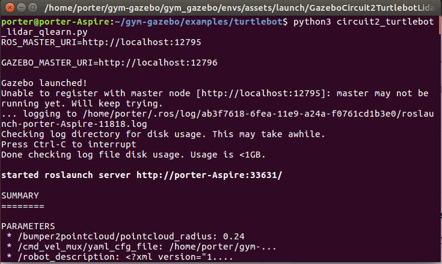
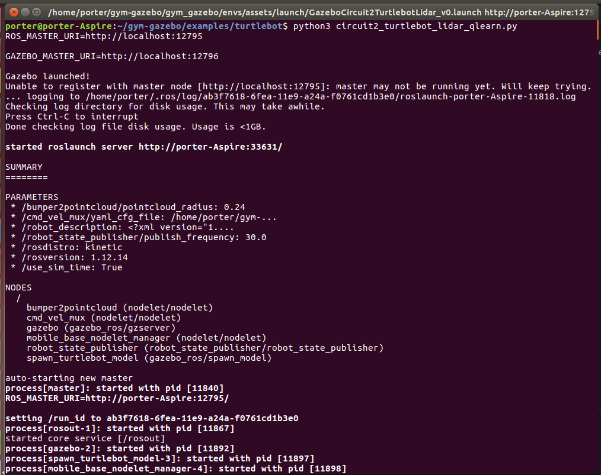
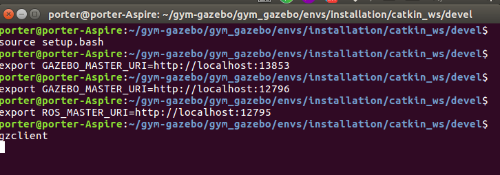

## 目录

本节会安装以下内容

<!-- TOC -->

- [目录](#目录)
- [第一步：bash turtlebot_setup.bash](#第一步bash-turtlebot_setupbash)
    - [Running an environment](#running-an-environment)
    - [Run any of the examples available in examples/. E.g.:](#run-any-of-the-examples-available-in-examples-eg)
- [第二步：source setup_turtlebot.bash](#第二步source-setup_turtlebotbash)
    - [source](#source)
    - [进行expert操作](#进行expert操作)
- [第三步：eg export ROS_MASTER_URI=http://localhost:12795](#第三步eg-export-ros_master_urihttplocalhost12795)
    - [第二步和第三步操作方法的截图](#第二步和第三步操作方法的截图)
- [第四步：gzclient](#第四步gzclient)
- [五 最终效果](#五-最终效果)
    - [Display reward plot](#display-reward-plot)
    - [Killing background processes](#killing-background-processes)

<!-- /TOC -->

- [x] Edit By Porter, 积水成渊,蛟龙生焉。 

<!-- more -->


## 第一步：bash turtlebot_setup.bash

### Running an environment
Load the environment variables corresponding to the robot you want to launch. E.g. to load the Turtlebot:
```bash
cd gym_gazebo/envs/installation
bash turtlebot_setup.bash
```

Note: all the setup scripts are available in gym_gazebo/envs/installation

### Run any of the examples available in examples/. E.g.:

```bash
cd examples/turtlebot
python3 circuit2_turtlebot_lidar_qlearn.py
```



## 第二步：source setup_turtlebot.bash

- 我的source bash文件是setup.bash不是setup_turtlebot.bash，所以我的是source setup.bash

### source

```bash
cd /home/porter/gym-gazebo/gym_gazebo/envs/installation/catkin_ws/devel
source setup.bash
```

### 进行expert操作

首先第一步：bash turtlebot_setup.bash过后，终端会有如下的提示


得到有用的终端输出信息
```bash
porter@porter-Aspire:~/gym-gazebo/examples/turtlebot$ python3 circuit2_turtlebot_lidar_qlearn.py
ROS_MASTER_URI=http://localhost:12795

GAZEBO_MASTER_URI=http://localhost:12796

Gazebo launched!
Unable to register with master node [http://localhost:12795]: master may not be running yet. Will keep trying.
... logging to /home/porter/.ros/log/ab3f7618-6fea-11e9-a24a-f0761cd1b3e0/roslaunch-porter-Aspire-11818.log
Checking log directory for disk usage. This may take awhile.
Press Ctrl-C to interrupt
Done checking log file disk usage. Usage is <1GB.

started roslaunch server http://porter-Aspire:33631/
```

## 第三步：eg export ROS_MASTER_URI=http://localhost:12795

```bash
export ROS_MASTER_URI=http://localhost:12795 # 和上面的端口号一致
export GAZEBO_MASTER_URI=http://localhost:12796 # 和上面的端口号一致
```

### 第二步和第三步操作方法的截图



## 第四步：gzclient

执行如下命令打开gazebo
```bash
gzclient
```

## 五 最终效果


### Display reward plot
Display a graph showing the current reward history by running the following script:

```bash
cd /home/porter/gym-gazebo/
cd examples/utilities
python3 display_plot.py
```

HINT: use --help flag for more options.

### Killing background processes

Sometimes, after ending or killing the simulation gzserver and rosmaster stay on the background, make sure you end them before starting new tests.

We recommend creating an alias to kill those processes.

```bash
echo "alias killgazebogym='killall -9 rosout roslaunch rosmaster gzserver nodelet robot_state_publisher gzclient'" >> ~/.bashrc
```

参考来源：https://github.com/erlerobot/gym-gazebo/tree/master#installation