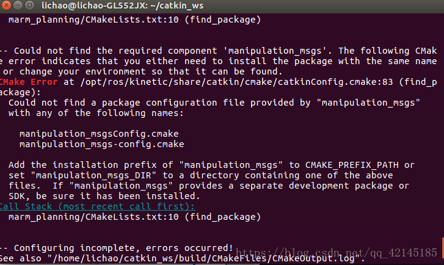
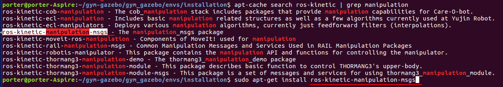
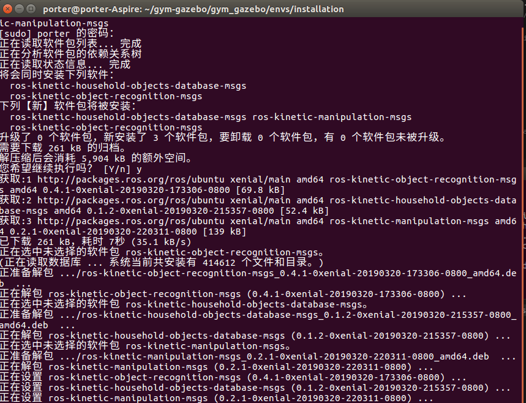
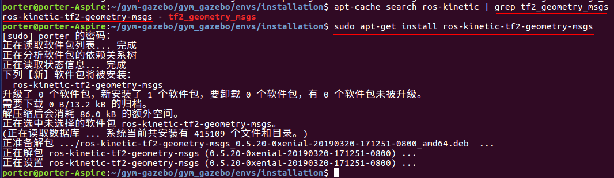

## 目录

本节会安装以下内容

- Kinetic 
- ubuntu16
- gazebo8
- gym
- python3.5
- opencv3
- 安装 gazebo_ros_pkgs
- gym-gazebo

本节笔记主要记录ubuntu16 下安装gym-gazebo，包括其依赖的软件包安装。

我的代码仓库: https://github.com/porterpan/gym-gazebo

建议直接clone 我的软件仓库安装(直接适应kinetic版本安装不会出现警告和编译出错终止，当然可能会应为你的ros功能包缺失出错,这时只需要手动安装缺失的ros功能包，删除catkin_ws，再重复上次的安装过程即可)

```bash
cd ~
git clone -b master https://github.com/porterpan/gym-gazebo
```

> 实在官方的仓库中修改了: ~/gym-gazebo/gym_gazebo/envs/installation/gazebo.repos 文件内容.使整个安装适应ROS kinetic 环境。当然过程中如果缺ros功能包，需要自己额外安装功能包的。

> 缺失ros功能包会在编译时出现make error 红色的， 解决办法见[ROS 中功能包的安装与查询](#ros-中功能包的安装与查询) 部分的方法安装好，然后remove -rf 安装路径中的catkin_ws 文件夹，然后重新上一步操作安装即可。

<!-- TOC -->

- [目录](#目录)
- [第一部分安装gym-gazebo](#第一部分安装gym-gazebo)
    - [下载安装文件](#下载安装文件)
    - [安装依赖环境](#安装依赖环境)
        - [Basic requirements:](#basic-requirements)
        - [[Install Sophus](https://github.com/stonier/sophus/tree/release/0.9.1-kinetic)](#install-sophushttpsgithubcomstoniersophustreerelease091-kinetic)
    - [安装gym-gazebo](#安装gym-gazebo)
        - [Dependencies and libraries](#dependencies-and-libraries)
        - [install Theano](#install-theano)
        - [install Keras](#install-keras)
    - [Try it out (turtlebot simple env)](#try-it-out-turtlebot-simple-env)
        - [Agent dependencies:](#agent-dependencies)
    - [Run the environment with a sample agent:](#run-the-environment-with-a-sample-agent)
- [第二部分：附录](#第二部分附录)
    - [ROS 中功能包的安装与查询](#ros-中功能包的安装与查询)
        - [1.查询当前安装完成的所有包文件](#1查询当前安装完成的所有包文件)
        - [2.查询ros的所有功能包](#2查询ros的所有功能包)
    - [安装错误解决](#安装错误解决)
        - [错误1：](#错误1)
        - [问题2](#问题2)
        - [问题3：](#问题3)
    - [gazebo.repos　内容修改](#gazeborepos　内容修改)

<!-- /TOC -->

- [x] Edit By Porter, 积水成渊,蛟龙生焉。 

<!-- more -->

## 第一部分安装gym-gazebo

### 下载安装文件

```bash
cd ~ #进入home目录
git clone -b master https://github.com/porterpan/gym-gazebo
```

### 安装依赖环境

#### Basic requirements:

- [ROS Kinetic](http://wiki.ros.org/kinetic/Installation/Ubuntu#Installation-1) (/rosversion: 1.12.7) (安装选择这个sudo apt-get install ros-kinetic-desktop, 不要全装不然后面装gazebo8会相对麻烦点)

---
> 进入ROS官网的安装界面：http://wiki.ros.org/ROS/Installation

> 选择需要的版本 Kinetic 和系统平台，我们用的是 ubuntu 16.04
按照指导进行安装，这里注意要选择安装 ros-kinetic-desktop 版本，不要选 ros-kinetic-desktop-full，前者不包含 Gazebo ，后者包含了 Gazebo 7。后边安装 Gazebo 8 的时候还需要卸载掉，比较麻烦。
按照完 ROS 测试一下，在命令行中输入如下命令，看能否正常启动 ros master ：

> 作者：isl_qdu
链接：https://www.jianshu.com/p/2b4c68b9caaf
来源：简书
简书著作权归作者所有，任何形式的转载都请联系作者获得授权并注明出处。

---

- [Gazebo 8.1.1](http://gazebosim.org/tutorials?cat=install&tut=install_ubuntu&ver=8.0) , 进入选择手动安装，不要选择Default installation: one-liner安装方式，否则会给你安装默认最新版本的gazebo.
- Python 3.5.2 (# I have yet to find out why though, because all the standard ROS stuff is in Python 2)

---

- [OpenCV3, installed from sources for Python 3， pip3](https://pypi.org/project/opencv-python/3.3.0.10/#history) 或者手动安装(git clone https://github.com/Itseez/opencv.git)

---

- 安装 gazebo_ros_pkgs

---

> 前边安装的 ROS 与 Gazebo 是完全独立的两部分，要使他们之间互相通讯，还需要安装 gazebo_ros_pkgs 包。

> 进入官网安装界面：http://gazebosim.org/tutorials?tut=ros_installing

> 按照指导安装即可。我一般选择用 A: Install Pre-Built Debians 方式安装。需要注意的是，如果用如下命令安装报错：
```bash
sudo apt-get install ros-kinetic-gazebo-ros-pkgs ros-kinetic-gazebo-ros-control
```
则需要指明 Gazebo 版本，将命令改为：
```bash
sudo apt-get install ros-kinetic-gazebo8-ros-pkgs ros-kinetic-gazebo8-ros-control
```
就可以解决问题。

测试。安装结束，用如下命令测试：
```bash
roscore  # 启动 ros master
rosrun gazebo_ros gazebo  # 用 rosrun 方式启动 Gazebo
```
> 作者：isl_qdu
链接：https://www.jianshu.com/p/2b4c68b9caaf
来源：简书
简书著作权归作者所有，任何形式的转载都请联系作者获得授权并注明出处。

---

- [OpenAI gym安装](http://gym.openai.com/docs/)

---

#### [Install Sophus](https://github.com/stonier/sophus/tree/release/0.9.1-kinetic)
```bash
cd ~
git clone https://github.com/stonier/sophus -b release/0.9.1-kinetic
cd sophus
mkdir build
cd build
cmake ..
make
sudo make install
echo "## Sophus installed ##\n"
```
---
### 安装gym-gazebo

```bash
cd ~
Gazebo gym
git clone -b master https://github.com/erlerobot/gym-gazebo
cd gym-gazebo
sudo pip2 install -e .
```

#### Dependencies and libraries
```bash
sudo pip3 install h5py
sudo apt-get install python3-skimage
```

#### install Theano
```bash 
cd ~/
git clone git://github.com/Theano/Theano.git
cd Theano/
sudo python3 setup.py develop
```

#### install Keras
```bash
sudo pip3 install keras
```

### Try it out (turtlebot simple env)

- Issues:

> spacenav_node not compiling. CATKIN_IGNOREd.
wiimote not compiling. CATKIN_IGNOREd.
kobuki_qtestsuite not compiling. CATKIN_IGNOREd.

#### Agent dependencies:
```bash
# make sure to switch to bash, because the installation script 
# hasn't been converted to ZSH yet
# and if you run it from ZSH the environmental variables 
# that are set during the script's execution aren't preserved
cd gym_gazebo/envs/installation
./setup_kinetic.bash	
./turtlebot_setup.bash
```

### Run the environment with a sample agent:

```bash
# only execute this while still in the same bash as last step
cd ../../../examples/scripts_turtlebot/
python circuit2_turtlebot_lidar_qlearn.py
```

The result should look like this (after a few seconds):

```dash
... (messages about ROS and Gazebo starting up, until finally:) ...
[ INFO] [1508869124.880487247, 81.480000000]: GazeboRosKobuki plugin ready to go! [mobile_base]
EP: 1 - [alpha: 0.2 - gamma: 0.8 - epsilon: 0.9] - Reward: -87     Time: 0:00:05
EP: 2 - [alpha: 0.2 - gamma: 0.8 - epsilon: 0.9] - Reward: -155     Time: 0:00:05
EP: 3 - [alpha: 0.2 - gamma: 0.8 - epsilon: 0.9] - Reward: -165     Time: 0:00:05
EP: 4 - [alpha: 0.2 - gamma: 0.8 - epsilon: 0.89] - Reward: -156     Time: 0:00:06
EP: 5 - [alpha: 0.2 - gamma: 0.8 - epsilon: 0.89] - Reward: -162     Time: 0:00:06
EP: 6 - [alpha: 0.2 - gamma: 0.8 - epsilon: 0.89] - Reward: -161     Time: 0:00:07
EP: 7 - [alpha: 0.2 - gamma: 0.8 - epsilon: 0.89] - Reward: -167     Time: 0:00:07
EP: 8 - [alpha: 0.2 - gamma: 0.8 - epsilon: 0.89] - Reward: -166     Time: 0:00:08
EP: 9 - [alpha: 0.2 - gamma: 0.8 - epsilon: 0.89] - Reward: -154     Time: 0:00:08
EP: 10 - [alpha: 0.2 - gamma: 0.8 - epsilon: 0.89] - Reward: -157     Time: 0:00:09
```


## 第二部分：附录

### ROS 中功能包的安装与查询

#### 1.查询当前安装完成的所有包文件
```bash
 rospack  list
```
- 可以看到所有的ROS功能包都在/opt/ros/kinetic/share目录下，所以也可以使用如下命令查询
```bash
cd /opt/ros/kinetic/share/
or
roscd turtlesim/
cd ..
```
#### 2.查询ros的所有功能包
```bash
 apt-cache search ros-kinetic
```
- 或者说在不知道要安装功能包的确切名字的情况下找到目标包
```bash
 apt-cache search ros-kinetic | grep rqt-
```
> 通过管道线 与grep命令， 输出与关键字rqt-相关的行

- 再或者下述安装命令与Tab键结合
```bash
sudo apt-get install ros-kinetic-rqt-
```
> 系统输出相应提示。
前述所有内容中，rospack list  与sudo apt-get install ros-kinetic-rqt- +Tab键使用最方便。

---
### 安装错误解决

#### 错误1：

- 错误1：错误提示：
> 在moveit编译时找不到manipulation_msgsConfig.cmake manipulation_msgs-config.cmake文件
```bash
Could not find the required component 'manipulation_msgs'. The following CMake error indicates that you either need to install the package with the same name or change your environment so that it can be found.
CMake Error at /opt/ros/kinetic/share/catkin/cmake/catkinConfig.cmake:83 (find_package):
  Could not find a package configuration file provided by "manipulation_msgs"
  with any of the following names:

    manipulation_msgsConfig.cmake
    manipulation_msgs-config.cmake
--------------------- 
作者：pd很不专业 
来源：CSDN 
原文：https://blog.csdn.net/qq_42145185/article/details/80975975 
版权声明：本文为博主原创文章，转载请附上博文链接！
```


- 错误1：解决：

搜索这个功能包



能找到这个ros-kinetic-manipulation-msgs 包
```bash
sudo apt-get install ros-kinetic-manipulation-msgs 
```

> 对ros安装对应的manipulation_msgsConfig包, 完成安装后重新去编译一下你的moveit包就行了。



----
#### 问题2

- 错误二：错误提示：

```bash
" CMake Error at /opt/ros/kinetic/share/catkin/cmake/catkinConfig.cmake:83 (find_package): Could not find a package configuration file provided by "tf2_geometry_msgs" with any of the following names:

tf2_geometry_msgsConfig.cmake
tf2_geometry_msgs-config.cmake

Add the installation prefix of "tf2_geometry_msgs" to CMAKE_PREFIX_PATH or set "tf2_geometry_msgs_DIR" to a directory containing one of the above files. If "tf2_geometry_msgs" provides a separate development package or SDK, be sure it has been installed."
```
- 错误二：解决：

先搜索这个需要安装的ros功能包

```bash
apt-cache search ros-kinetic | grep tf2_geometry_msgs
```
发现存在这个包
```bash
porter@porter-Aspire:~/gym-gazebo/gym_gazebo/envs/installation$ apt-cache search ros-kinetic | grep tf2_geometry_msgs
ros-kinetic-tf2-geometry-msgs - tf2_geometry_msgs
```
执行这个功能包的安装
```bash
porter@porter-Aspire:~/gym-gazebo/gym_gazebo/envs/installation$ sudo apt-get install ros-kinetic-tf2-geometry-msgs
[sudo] porter 的密码： 
正在读取软件包列表... 完成
正在分析软件包的依赖关系树       
正在读取状态信息... 完成       
下列【新】软件包将被安装：
  ros-kinetic-tf2-geometry-msgs
升级了 0 个软件包，新安装了 1 个软件包，要卸载 0 个软件包，有 0 个软件包未被升级。
需要下载 0 B/13.2 kB 的归档。
解压缩后会消耗 86.0 kB 的额外空间。
正在选中未选择的软件包 ros-kinetic-tf2-geometry-msgs。
(正在读取数据库 ... 系统当前共安装有 415109 个文件和目录。)
正准备解包 .../ros-kinetic-tf2-geometry-msgs_0.5.20-0xenial-20190320-171251-0800_amd64.deb  ...
正在解包 ros-kinetic-tf2-geometry-msgs (0.5.20-0xenial-20190320-171251-0800) ...
正在设置 ros-kinetic-tf2-geometry-msgs (0.5.20-0xenial-20190320-171251-0800) ...
porter@porter-Aspire:~/gym-gazebo/gym_gazebo/envs/installation$
```


---

#### 问题3：

- 问题3：错误提示

CMake Error at /opt/ros/kinetic/share/catkin/cmake/catkin_workspace.cmake:95 (message):

```bash
WARNING: Metapackage "ecl_tools" must buildtool_depend on catkin.
WARNING: Metapackage "ecl_tools" should not have other dependencies besides a buildtool_depend on catkin and run_depends.
WARNING: Metapackage "ecl_lite" must buildtool_depend on catkin.
WARNING: Metapackage "ecl_lite" should not have other dependencies besides a buildtool_depend on catkin and run_depends.
Packages "mav_msgs" not found in the workspace

```

- 问题3：解决

出现这个错误的原因是ecl升级，或这和你当前安装的ros版本不对应。造成了cmake版本比配。出错，方法是

打开gazebo.repos,修改如下部分：
```bash
ecl_lite: 
type: git 
url: https://github.com/stonier/ecl_lite 
version: release/0.61-indigo-kinetic 
ecl_navigation: 
type: git 
url: https://github.com/stonier/ecl_navigation 
version: devel 
ecl_tools: 
type: git 
url: https://github.com/stonier/ecl_tools 
version: release/0.61-indigo-kinetic 
```
(将ecl_core、 ecl_lite 和ecl_tools 的版本号（version）改成： release/0.61-indigo-kinetic）

**不过最终解决还是建议你如果也是安装ros kenitic 直接复制我后面附录的gazebo.repos内容替换掉之前的**

路径：

vim ~/gym-gazebo/gym_gazebo/envs/installation/gazebo.repos 

---

### gazebo.repos　内容修改

gazebo.repos 修改后的文件内容，使适应kinetic环境，进行安装。

```shell
repositories:
  ar_track_alvar:
    type: git
    url: https://github.com/ros-perception/ar_track_alvar
    version: kinetic-devel
  mav_comm:
    type: git
    url: https://github.com/ethz-asl/mav_comm.git
    version: master
  catkin_simple:
    type: git
    url: https://github.com/catkin/catkin_simple.git
    version: master
  control_toolbox:
    type: git
    url: https://github.com/ros-controls/control_toolbox.git
    version: kinetic-devel
  ecl_core:
    type: git
    url: https://github.com/stonier/ecl_core
    version: release/0.61-indigo-kinetic
  ecl_lite:
    type: git
    url: https://github.com/stonier/ecl_lite
    version: release/0.61-indigo-kinetic
  ecl_navigation:
    type: git
    url: https://github.com/stonier/ecl_navigation
    version: release/0.60-indigo-kinetic
  ecl_tools:
    type: git
    url: https://github.com/stonier/ecl_tools
    version: release/0.61-indigo-kinetic
  driver_base:
    type: git
    url: https://github.com/ros-drivers/driver_common.git
    version: indigo-devel
  gazebo_ros_pkgs:
    type: git
    url: https://github.com/ros-simulation/gazebo_ros_pkgs
    version: kinetic-devel
  hector_gazebo:
    type: git
    url: https://github.com/tu-darmstadt-ros-pkg/hector_gazebo/
    version: kinetic-devel
  image_common:
    type: git
    url: https://github.com/ros-perception/image_common.git
    version: hydro-devel
  joystick_drivers:
    type: git
    url: https://github.com/ros-drivers/joystick_drivers.git
    version: master
  kobuki:
    type: git
    url: https://github.com/yujinrobot/kobuki
    version: kinetic
  kobuki_core:
    type: git
    url: https://github.com/yujinrobot/kobuki_core
    version: kinetic
  kobuki_desktop:
    type: git
    url: https://github.com/yujinrobot/kobuki_desktop
    version: kinetic
  kobuki_msgs:
    type: git
    url: https://github.com/yujinrobot/kobuki_msgs
    version: kinetic
  navigation:
    type: git
    url: https://github.com/ros-planning/navigation
    version: kinetic-devel
  pcl_ros:
    type: git
    url: https://github.com/ros-perception/perception_pcl.git
    version: kinetic-devel
  realtime_tools:
    type: git
    url: https://github.com/ros-controls/realtime_tools
    version: kinetic-devel
  ros_control:
    type: git
    url: https://github.com/ros-controls/ros_control
    version: kinetic-devel
  roslint:
    type: git
    url: https://github.com/ros/roslint
    version: master
  turtlebot:
    type: git
    url: https://github.com/turtlebot/turtlebot
    version: kinetic
  turtlebot_create:
    type: git
    url: https://github.com/turtlebot/turtlebot_create
    version: master
  turtlebot_simulator:
    type: git
    url: https://github.com/turtlebot/turtlebot_simulator
    version: indigo
  xacro:
    type: git
    url: https://github.com/ros/xacro
    version: kinetic-devel
  yocs_msgs:
    type: git
    url: https://github.com/yujinrobot/yocs_msgs
    version: release/0.6-kinetic
  yujin_ocs:
    type: git
    url: https://github.com/yujinrobot/yujin_ocs
    version: kinetic
```