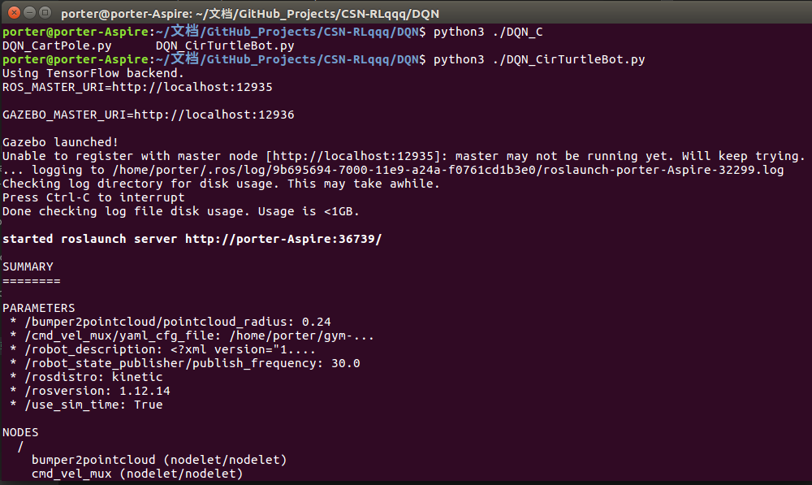
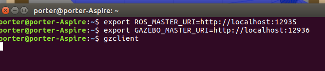
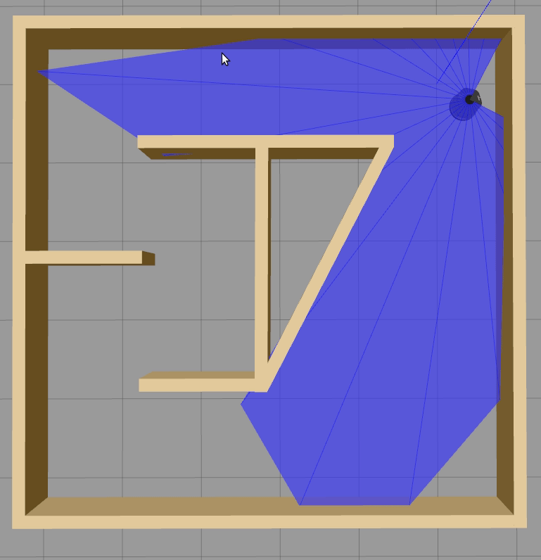

## 基于DQN的gym_gazebo运行代码演示

<!-- TOC -->

- [基于DQN的gym_gazebo运行代码演示](#基于dqn的gym_gazebo运行代码演示)
- [下载算法包](#下载算法包)
- [运行脚本](#运行脚本)
- [终端效果](#终端效果)
- [export　端口环境添加](#export　端口环境添加)
- [运行ＧＵＩ效果](#运行ｇｕｉ效果)

<!-- /TOC -->

- [x] Edit By Porter, 积水成渊,蛟龙生焉。 

<!-- more -->

## 下载算法包

```bash
git clone https://github.com/ipa-bfb-sc/CSN-RL
cd ./CSN-RL
```

## 运行脚本

```bash
cd ~/文档/GitHub_Projects/CSN-RLqqq/DQN
python3 ./DQN_CirTurtleBot.py
```

##　终端效果

```bash
porter@porter-Aspire:~/文档/GitHub_Projects/CSN-RLqqq/DQN$ python3 ./DQN_C
DQN_CartPole.py      DQN_CirTurtleBot.py  
porter@porter-Aspire:~/文档/GitHub_Projects/CSN-RLqqq/DQN$ python3 ./DQN_CirTurtleBot.py 
Using TensorFlow backend.
ROS_MASTER_URI=http://localhost:12935

GAZEBO_MASTER_URI=http://localhost:12936

Gazebo launched!
Unable to register with master node [http://localhost:12935]: master may not be running yet. Will keep trying.
... logging to /home/porter/.ros/log/9b695694-7000-11e9-a24a-f0761cd1b3e0/roslaunch-porter-Aspire-32299.log
Checking log directory for disk usage. This may take awhile.
Press Ctrl-C to interrupt
Done checking log file disk usage. Usage is <1GB.

started roslaunch server http://porter-Aspire:36739/

SUMMARY
========
```



## export　端口环境添加

此时不会出gazebo，要查看实时的效果，运行如下命令

```bash
porter@porter-Aspire:~$ export ROS_MASTER_URI=http://localhost:12935
porter@porter-Aspire:~$ export GAZEBO_MASTER_URI=http://localhost:12936
porter@porter-Aspire:~$ gzclient
```



如果不成功，执行

```bash
porter@porter-Aspire:~$ cd /home/porter/gym-gazebo/gym_gazebo/envs/installation/catkin_ws/devel
porter@porter-Aspire:~/gym-gazebo/gym_gazebo/envs/installation/catkin_ws/devel$  source setup.bash
porter@porter-Aspire:~$ export ROS_MASTER_URI=http://localhost:12935
porter@porter-Aspire:~$ export GAZEBO_MASTER_URI=http://localhost:12936
porter@porter-Aspire:~$ gzclient
```

## 运行ＧＵＩ效果

